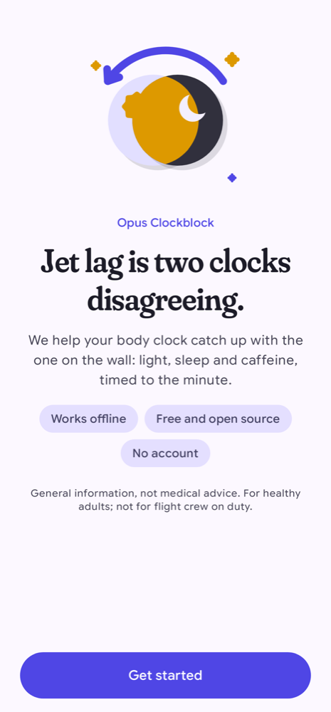
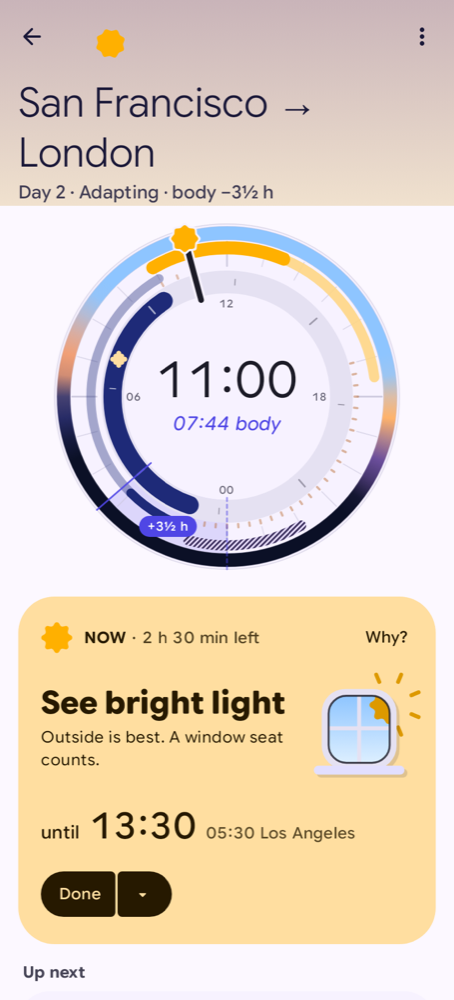
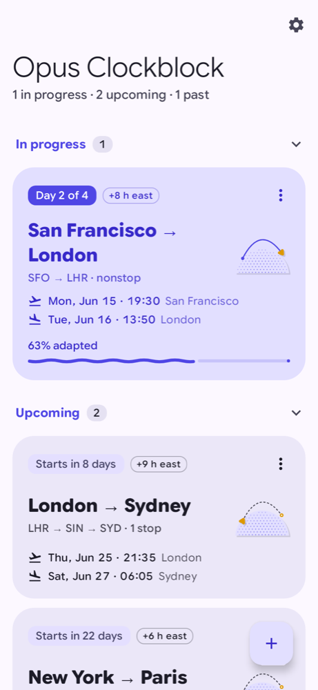
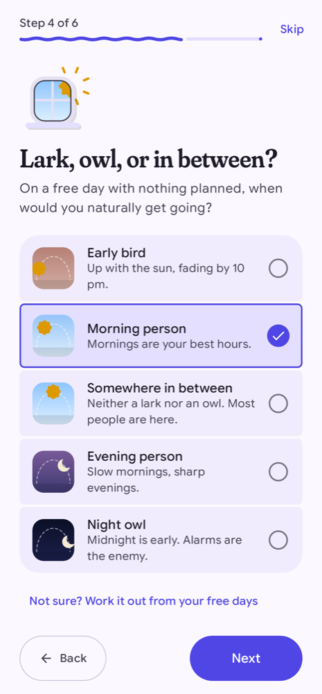
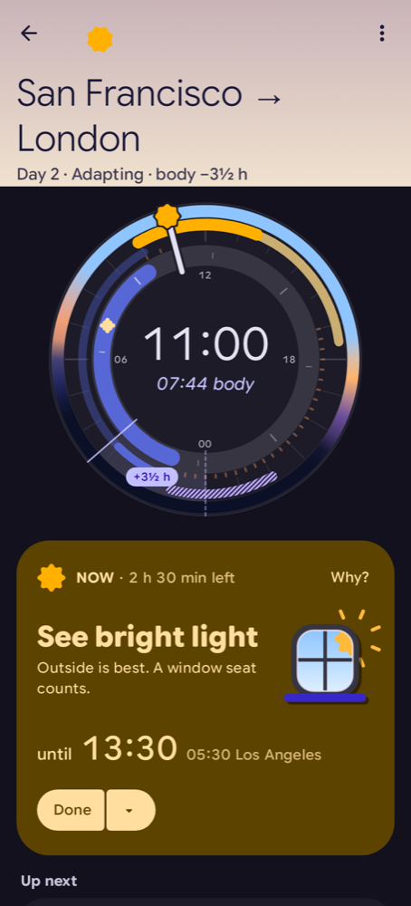
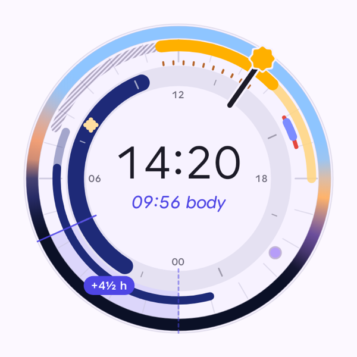

<p align="center">
  
</p>

<h1 align="center">Opus Clockblock</h1>

<p align="center">
  <strong>Open-source, fully offline jet lag planner for Android.</strong><br />
  Light, sleep and caffeine, timed to the minute, from published circadian science. No account, no network, no tracking.
</p>

<p align="center">
  <a href="LICENSE"></a>
  
  
  
</p>

<p align="center">
  
  
  
  
  
</p>

---

Jet lag is two clocks disagreeing: the one on the wall and the one in your body. Opus Clockblock builds a plan
that nudges your body clock towards your destination, then tells you, minute by minute, what to do about light,
sleep, naps and caffeine. It's a free, transparent alternative to commercial jet lag apps such as Timeshifter,
and everything runs on your phone.

## Features

- **A plan for every trip.** Multi-leg trips with layovers, typed in by hand with an offline airport and time
  zone search (no network, ever). Short trips can stay on home time instead of adapting.
- **The Two Clocks dial.** Local time and your body clock on one instrument: light windows, sleep, the jet lag
  wedge between the two clocks, and a body-clock readout ("07:44 body") that makes the invisible visible.
- **A Now card that always says until when.** The current advice, how long it lasts, what's next, in local time
  with the other zone underneath. "Done", "Can't do this" and a re-plan when reality gets in the way.
- **"Why?" on every card.** Each piece of advice explains itself in plain language and cites the research.
- **Personal.** Usual sleep window, chronotype (from lark to night owl), effort level, caffeine, sleeping on
  planes, adjusting before you leave. Melatonin is off unless you opt in.
- **Reminders that respect sleep.** Exact alarms at advice boundaries, an ongoing Now notification (a Live Update
  on travel days), and nothing inside a sleep block except the alarm that wakes you.
- **Widgets.** *Two Clocks* and *Next up*, built with Remote Compose, with a RemoteViews fallback for older
  launchers.
- **Night-safe UI.** During avoid-light and sleep windows the app turns dark and dim, with calmer motion, so
  checking your plan doesn't sabotage it.
- **Adaptive and accessible.** Phones, foldables and tablets (two-pane plan), landscape, large fonts, TalkBack
  labels, text labels on every piece of advice (never an icon alone), and motion that keeps its meaning with
  "Remove animations" on.
- **Yours to keep.** JSON backup export and import, and calendar (ICS) export of a plan.

<p align="center">
  
</p>

## How it works

The planner (`:core:circadian`) estimates when your body clock's low point (the core body temperature minimum)
falls, then places light exposure and avoidance on the right side of it using human phase-response curves:
light after the low point moves the clock earlier, light before it moves it later. It picks a direction
(advance or delay) based on how far you're going and your chronotype, caps the daily shift at rates that human
studies show are achievable, and fits sleep, naps and caffeine around it. Two published mathematical models of
the human circadian pacemaker (Forger 1999 and Hannay 2019) simulate the result to estimate how long adapting
will take.

- [docs/algorithm.md](docs/algorithm.md): what the planner computes, every parameter, and its known limitations.
- [docs/science.md](docs/science.md): the research review behind it (PRCs, melatonin, caffeine, models), with
  references.

## Privacy

Opus Clockblock has **no network access**: the app doesn't request the `INTERNET` permission. There are no
accounts, no analytics, no ads, no crash reporters and no third-party SDKs. Your trips and profile live in the
app's private storage and leave the device only when you export them yourself.

## Not medical advice

Opus Clockblock gives general information for healthy adults, based on published research. It isn't medical
advice, it doesn't measure anything about you, and it isn't meant for flight crew on duty. If you have a health
condition, are pregnant, or take medication, talk to a doctor before changing your sleep.

**Melatonin** suggestions are off by default. Turning them on shows a safety note first; melatonin is a
prescription medicine in some countries, and you should check with a pharmacist or doctor before taking it.

## Gallery

| | | |
|---|---|---|
|  |  |  |
| Onboarding: chronotype | Plan, dark theme | The Two Clocks dial |

More: widget renders in [docs/screenshots/widgets](docs/screenshots/widgets); every screen's screenshot test
golden lives next to its module in `src/test/screenshots/`.

## Architecture

A multi-module Gradle build. Domain and science are plain JVM modules with no Android dependency; everything
else is Android.

| Module | Kind | Purpose |
|---|---|---|
| `:core:model` | JVM | Domain types (`Trip`, `UserProfile`, `JetLagPlan`, `Advice`…) |
| `:core:circadian` | JVM | Jet lag planner + Forger99/Hannay19 ODE validator |
| `:core:data` | Android | Repositories (DataStore), offline airport search, plan cache, backup, ICS export |
| `:core:designsystem` | Android + Compose | Theme, type, colour, motion tokens, shapes, illustrations, the dial |
| `:core:notifications` | Android | Exact-alarm scheduler, Now notification / Live Update |
| `:core:testing` | Android | Test rules, fakes, screenshot helpers |
| `:feature:onboarding`, `:feature:trips`, `:feature:plan`, `:feature:settings` | Android + Compose | The screens |
| `:widget` | Android + Compose | Remote Compose widgets (+ RemoteViews fallback) |
| `:app` | Application | Navigation 3 shell, adaptive layouts, Metro DI graph |

**Stack:** AGP 9 with built-in Kotlin · Kotlin 2.4 · JDK 21 · Jetpack Compose (alpha BOM) with Material 3
Expressive · Navigation 3 · [Metro](https://github.com/ZacSweers/metro) DI · Remote Compose widgets · DataStore +
kotlinx-serialization · `java.time` with IANA zone ids (offsets are never stored) · Gradle convention plugins in
`build-logic`, versions in `gradle/libs.versions.toml`.

Widgets and the Now notification implement a shared `PlanSurface` contract, and the notification scheduler
refreshes all of them at every advice boundary and whenever a plan changes. Deep links:
`opusclockblock://trips`, `opusclockblock://trips/new`, `opusclockblock://plan/{tripId}`,
`opusclockblock://plan/current`.

## Build and test

Requirements: JDK 21 and the Android SDK with platform 37.1. Create `local.properties` with your SDK path
(`sdk.dir=/path/to/Android/sdk`), then:

```sh
./gradlew :app:assembleDebug                 # debug APK
./gradlew test                               # all JVM + Robolectric unit tests
./gradlew :core:circadian:test               # one module
./gradlew :feature:plan:verifyRoborazziDebug # check screenshots against the goldens
./gradlew :feature:plan:recordRoborazziDebug # re-record goldens after an intended UI change
./gradlew :app:connectedDebugAndroidTest     # end-to-end tests on a device or emulator
```

### Testing approach

The project is built test-first.

- **Logic** (planner, models, repositories, ViewModels): JUnit 6 Jupiter with Kotest assertions, property tests
  where an invariant exists, Turbine for flows. The planner is checked byte for byte against reference printouts,
  and the ODE ports against published model fixtures.
- **UI**: Compose tests on Robolectric, plus [Roborazzi](https://github.com/takahirom/roborazzi) screenshot tests
  in light, dark, font scale 1.5 and compact/expanded widths. Goldens are committed, so a pull request shows every
  pixel it changes.
- **End to end**: Compose test + UiAutomator on an emulator.

## Design

- [docs/design.md](docs/design.md): product research and the visual identity ("Dusk Instrument"): colour,
  type (Google Sans Flex and Fraunces), shape language, illustrations, copy voice.
- [MOTION.md](MOTION.md): the motion language, in the format of
  [rock3r/android-ux-skills](https://github.com/rock3r/android-ux-skills). Entries are agent-drafted and tagged
  `OBSERVED`; they're awaiting human ratification before they become policy.
- [docs/motion-review-1.md](docs/motion-review-1.md): the first motion review.
- The launcher icon is generated by [`tools/icon/gen_launcher_icon.py`](tools/icon/gen_launcher_icon.py).

## Easter eggs

There are a few. A dial that doesn't like being told what time it is. A version number that rewards persistence
with a performance. We won't spoil the rest. They never show up during your sleep window or with reduced motion
on, and none of them get in the way.

## Contributing

Issues and pull requests are welcome; see [CONTRIBUTING.md](CONTRIBUTING.md) for setup, conventions and how to
refresh the bundled airport dataset.

## Credits

- **Science:** the phase-response, melatonin and model literature cited in [docs/science.md](docs/science.md).
- **Fonts:** [Google Sans Flex](https://fonts.google.com/specimen/Google+Sans+Flex) and
  [Fraunces](https://github.com/undercasetype/Fraunces), both SIL Open Font License 1.1.
- **Airport data:** [OurAirports](https://ourairports.com/data/) (public domain) and
  [mwgg/Airports](https://github.com/mwgg/Airports) (MIT).
- **Time zones:** the [IANA tz database](https://www.iana.org/time-zones) (public domain), through `java.time`.
- **Motion review process:** [rock3r/android-ux-skills](https://github.com/rock3r/android-ux-skills) (Apache-2.0).

Full attributions are in [NOTICE](NOTICE) and in the app under About → Open-source licences.

## Licence

Copyright 2026 Sebastiano Poggi and contributors. Licensed under the [Apache License, Version 2.0](LICENSE).
Bundled fonts and data keep their own licences; see [NOTICE](NOTICE).

"Timeshifter" is a trademark of its owner. Opus Clockblock isn't affiliated with or endorsed by Timeshifter.
