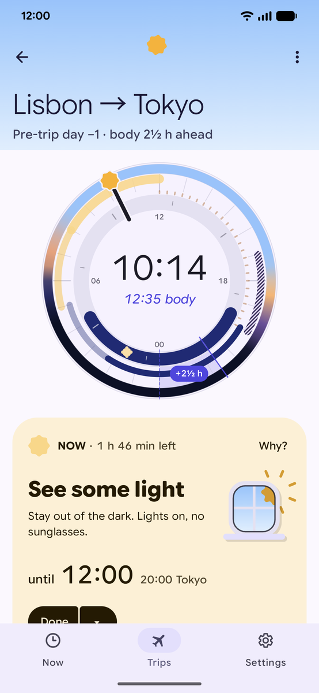
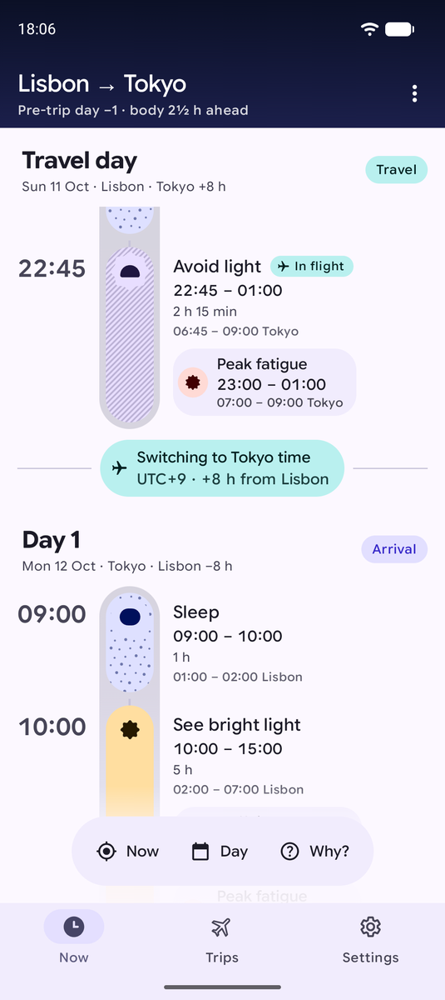
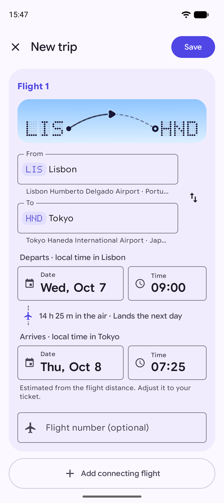
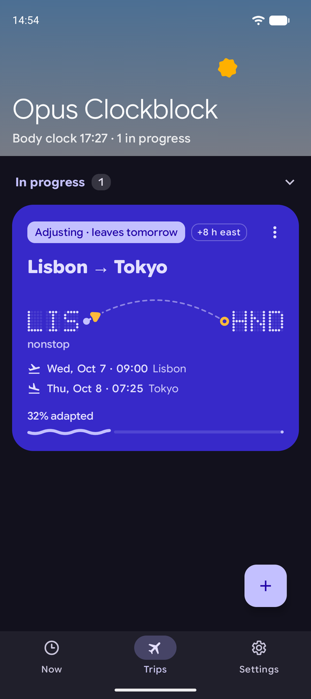
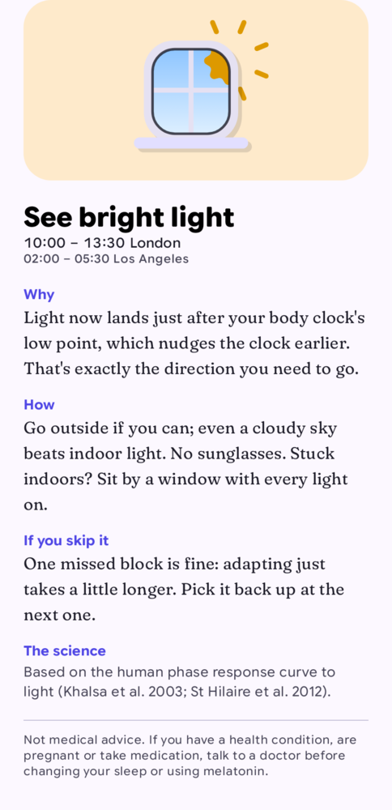
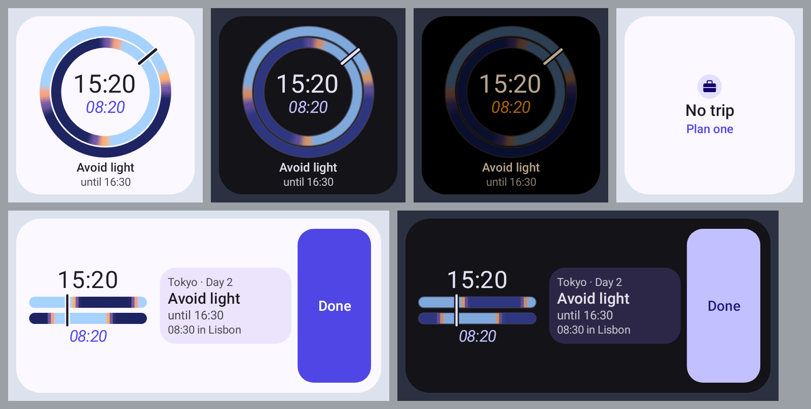
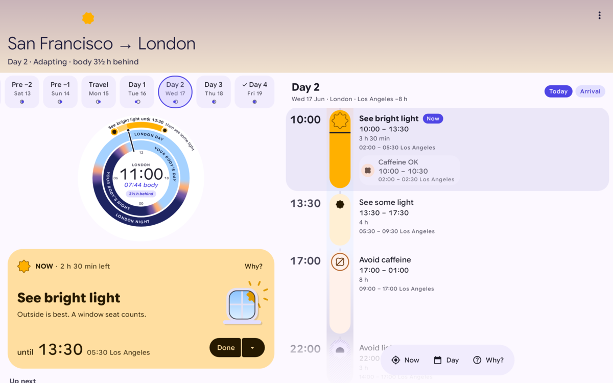

<p align="center">
  
</p>

<h1 align="center">Clockblock</h1>

<p align="center">
  <strong>A free, open-source jet lag planner for Android that works entirely offline.</strong><br />
  It tells you when to see light, avoid light, sleep and drink coffee, timed to the minute from published
  circadian science. No account, no network, no tracking.
</p>

<p align="center">
  <a href="https://github.com/rock3r/clockblock/actions/workflows/ci.yml"></a>
  <a href="LICENSE"></a>
  
  
  
</p>

<p align="center">
  
  
  
  
  
</p>

Jet lag is two clocks disagreeing: the one on the wall and the one in your body. Clockblock builds a plan
that moves your body clock towards your destination, then tells you what to do and until when: light, sleep, naps
and caffeine. Each piece of advice explains why it's there. Everything runs on your phone. It's a free,
transparent alternative to commercial jet lag apps.

To use the app, read the [user guide](user-guide/README.md). To understand or change the code, start with the
[documentation index](docs/README.md).

## Features

- Plans for multi-leg trips with connections. You type the flights in by hand, with an offline search for
  airports and time zones.
- The Two skies dial shows the sky where you are and the sky your body thinks it is under, so the jet lag is the
  gap between the two nights. Drag the needle to look ahead.
- The Now card always says what to do and until when, in local time with the other zone underneath. Mark advice
  as Done, Skipped or "Can't do this", with Undo.
- Every piece of advice has a "Why?" that explains it in plain language and cites the research.
- The plan adapts to you: your usual sleep, your chronotype (from early bird to night owl), how hard you want to
  push, whether you drink caffeine or sleep on planes, and whether to start adjusting before you leave. Melatonin
  stays off unless you opt in.
- Short trips can stay on home time instead of adapting. An "I'm delayed" button moves a late flight and rebuilds
  the plan.
- Reminders arrive just before each change, never while you should be asleep except to wake you. One quiet
  ongoing notification shows the current advice, and becomes a Live Update on travel days.
- Two home-screen widgets, *Two Clocks* and *Next up*, built with Remote Compose.
- Night-safe mode, so checking your plan doesn't work against it: the plan screen turns dark and dim when the
  plan says avoid light or sleep, or during your body's night when no light is planned. The widgets switch to
  dark while the plan says avoid light or sleep.
- Works on phones, foldables and tablets (with a two-pane layout), in landscape and with large fonts. Every piece
  of advice has a text label, never an icon alone, and motion keeps its meaning with "Remove animations" on.
- JSON backup and restore, and calendar (ICS) export of any plan.

<p align="center">
  
  
</p>

The *Two Clocks* widget (left) shows the dial from the app on your home screen. On a tablet (right), the plan
uses two columns: the day strip, the dial and the Now card beside the day's timeline.

## The science

The planner estimates when your body clock's low point (the core body temperature minimum) falls. Light in the
hours after that point moves the clock earlier, and light in the hours before it moves the clock later. The plan
places light and darkness on the correct side, picks a direction (earlier or later) from the distance and your
chronotype, and limits the daily shift to rates that human studies show people can manage. Sleep, naps and
caffeine are fitted around it. A published mathematical model of the human body clock (Hannay 2019) then
simulates the plan to estimate how long adapting takes, with and without it. The tests also check plans against
that model and a second one (Forger 1999).

The research is cited, the rules are written down, and the known limitations are listed. Nothing is hidden.

- [docs/science.md](docs/science.md): the research review, with references.
- [docs/algorithm.md](docs/algorithm.md): the exact rules, every parameter and the known limitations.
- [docs/planning-engine.md](docs/planning-engine.md): how the planner is wired into the app.

## Privacy

Clockblock has **no network access**: the app doesn't request the `INTERNET` permission. There are no
accounts, no analytics, no ads, no crash reporters and no third-party SDKs. Your trips and profile live in the
app's private storage. They leave the device only when you export a backup or calendar file, share a plan
summary to another app, or when Android's own device backup copies app data (if you have it turned on).

## Not medical advice

Clockblock gives general information for healthy adults, based on published research. It isn't medical
advice, it doesn't measure anything about you, and it isn't meant for flight crew on duty. If you have a health
condition, are pregnant, or take medication, talk to a doctor before changing your sleep.

Melatonin suggestions are off by default. Turning them on shows a safety note first. Melatonin is a prescription
medicine in some countries, and you should check with a pharmacist or doctor before taking it.

## Build and test

You need JDK 21 and the Android SDK with platform 37.1. Create `local.properties` with your SDK path
(`sdk.dir=/path/to/Android/sdk`), then:

```sh
./gradlew :app:assembleDebug                 # debug APK
./gradlew test                               # all JVM and Robolectric unit tests
./gradlew :core:circadian:test               # one module
./gradlew verifyRoborazziDebug               # compare screenshots with the committed goldens
./gradlew :feature:plan:recordRoborazziDebug # re-record goldens after an intended UI change
./gradlew :app:connectedDebugAndroidTest     # end-to-end tests on a device or emulator
```

The debug build needs no API keys, no backend and no signing setup. The app runs on Android 17 (API 37) and later.

The project is built test-first: about 1,100 JVM tests, 193 screenshot goldens and 22 end-to-end tests at the time
of writing. CI runs them all on every pull request. See [docs/testing.md](docs/testing.md).

## Architecture

A multi-module Gradle build. The domain types and the planner are plain JVM modules with no Android dependency;
everything else is Android.

| Module | Kind | Purpose |
|---|---|---|
| `:core:model` | JVM | Domain types (`Trip`, `UserProfile`, `JetLagPlan`, `Advice`…) |
| `:core:circadian` | JVM | The jet lag planner and the Forger99 and Hannay19 model ports |
| `:core:data` | Android | Repositories (DataStore), offline airport search, plan cache, backup, ICS export |
| `:core:designsystem` | Android + Compose | Theme, type, colour, motion tokens, shapes, illustrations, the dial |
| `:core:notifications` | Android | Alarm scheduler, reminders, the Now notification and Live Update |
| `:core:testing` | Android | Test rules, fakes, screenshot helpers |
| `:feature:onboarding`, `:feature:trips`, `:feature:plan`, `:feature:settings` | Android + Compose | The screens |
| `:widget` | Android + Compose | Remote Compose widgets |
| `:app` | Application | Navigation 3 shell, adaptive layouts, Metro DI graph |

The stack: AGP 9 with built-in Kotlin, Kotlin 2.4, JDK 21, Jetpack Compose (alpha BOM) with Material 3
Expressive, Navigation 3, [Metro](https://github.com/ZacSweers/metro) for dependency injection, Remote Compose,
DataStore with kotlinx-serialization, and `java.time` with IANA zone ids (offsets are never stored).

Read more:

- [docs/architecture.md](docs/architecture.md): modules, data flow, DI, navigation and the time-zone rules.
- [docs/surfaces.md](docs/surfaces.md): how reminders, the Now notification and the widgets stay in step.

## Design

- [docs/design.md](docs/design.md): product research and the visual identity ("Dusk Instrument"): colour, type
  (Google Sans Flex and Fraunces), shape language, illustrations and copy voice.
- [MOTION.md](MOTION.md): the motion language, in the format of
  [rock3r/android-ux-skills](https://github.com/rock3r/android-ux-skills). Entries are agent-drafted and tagged
  `OBSERVED` until a human ratifies them.
- [docs/motion-review-1.md](docs/motion-review-1.md): the first motion review.
- The launcher icon is generated by [`tools/icon/gen_launcher_icon.py`](tools/icon/gen_launcher_icon.py).

## Easter eggs

There are a few. A dial that doesn't like being told what time it is. A version number that rewards persistence
with a performance. We won't spoil the rest. The ones on the plan screen stay hidden while your plan says sleep or
when Reduce motion is on, and none of them get in the way.

## Contributing

Issues and pull requests are welcome. See [CONTRIBUTING.md](CONTRIBUTING.md) for setup, conventions and how to
refresh the bundled airport dataset.

## Credits

- Science: the phase-response, melatonin and model literature cited in [docs/science.md](docs/science.md).
- Fonts: [Google Sans Flex](https://fonts.google.com/specimen/Google+Sans+Flex) and
  [Fraunces](https://github.com/undercasetype/Fraunces), both under the SIL Open Font License 1.1.
- Airport data: [OurAirports](https://ourairports.com/data/) (public domain) and
  [mwgg/Airports](https://github.com/mwgg/Airports) (MIT).
- Time zones: the [IANA tz database](https://www.iana.org/time-zones) (public domain), through `java.time`.
- Motion review process: [rock3r/android-ux-skills](https://github.com/rock3r/android-ux-skills) (Apache-2.0).

Full attributions are in [NOTICE](NOTICE) and in the app under About → Licences.

## Licence

Copyright 2026 Sebastiano Poggi and contributors. Licensed under the [Apache License, Version 2.0](LICENSE).
Bundled fonts and data keep their own licences; see [NOTICE](NOTICE).
