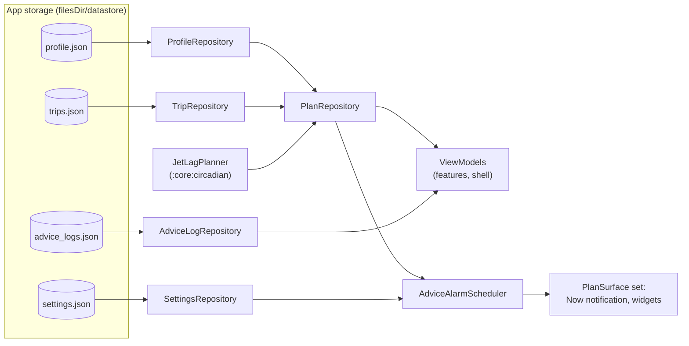

# Architecture

Clockblock is a multi-module Android app that works without a network connection. Trips, the user profile
and settings are stored as JSON files in DataStore on the device. A pure-Kotlin planner turns a trip and a
profile into a plan. Everything else reads that plan through a single repository: the screens, the two
home-screen widgets and the ongoing "Now" notification.

This page explains how the modules fit together, how data moves through the app, and the rules that keep times
correct across time zones. For the planner itself, read [planning-engine.md](planning-engine.md). For
notifications and widgets, read [surfaces.md](surfaces.md).

## Modules

The domain types and the science code are plain JVM modules with no Android dependency. That keeps the planner
fast to test and easy to reason about. Everything else is an Android library. The `:app` module puts them
together.

```mermaid
flowchart TD
    app[":app<br/>Nav3 shell, Metro graph"]
    widget[":widget<br/>Remote Compose widgets"]
    onboarding[":feature:onboarding"]
    trips[":feature:trips"]
    plan[":feature:plan"]
    settings[":feature:settings"]
    notifications[":core:notifications<br/>alarms, Now notification"]
    data[":core:data<br/>repositories, plan cache"]
    designsystem[":core:designsystem<br/>theme, motion, dial"]
    circadian[":core:circadian<br/>planner (JVM)"]
    model[":core:model<br/>domain types (JVM)"]

    app --> widget & onboarding & trips & plan & settings
    settings --> onboarding
    settings --> notifications
    onboarding --> notifications
    plan --> notifications
    onboarding & plan & trips --> circadian
    widget --> data & designsystem
    notifications --> data
    onboarding & trips & plan & settings --> data & designsystem
    data --> circadian
    circadian --> model
    designsystem --> model
    data --> model
```

The diagram shows production dependencies only, and leaves out the direct dependencies of `:app` on the core
modules. Every feature module also gets `:core:model`, `:core:designsystem`, `:core:data` and Metro from the
`clockblock.android.feature` convention plugin. `:core:testing` is a test-only dependency of the features, `:widget`,
`:core:data` and `:app`. `:feature:settings` depends on `:feature:onboarding` because the Settings editors reuse
the onboarding profile pickers (sleep dial, chronotype, tools, effort). This is the only dependency between two
features.

| Module | Kind | What lives there |
|---|---|---|
| `:core:model` | JVM | Domain types: `Trip`, `UserProfile`, `JetLagPlan`, `Advice`, plus [`DeepLinks`](../core/model/src/main/kotlin/dev/sebastiano/clockblocker/opus/core/model/DeepLinks.kt) and [`ZoneLabels`](../core/model/src/main/kotlin/dev/sebastiano/clockblocker/opus/core/model/ZoneLabels.kt) |
| `:core:circadian` | JVM | The [`JetLagPlanner`](../core/circadian/src/main/kotlin/dev/sebastiano/clockblocker/opus/core/circadian/JetLagPlanner.kt) interface, its default implementation and the Forger99 and Hannay19 model ports |
| `:core:data` | Android | Repositories backed by DataStore, offline airport search, the plan cache, backup, calendar export, the `PlanSurface` contract |
| `:core:designsystem` | Android + Compose | Theme, colour, type, shapes, motion tokens, illustrations and the Two skies dial (a pure layout spec in `dial/spec` and its Compose renderer) |
| `:core:notifications` | Android | The alarm scheduler, broadcast receivers and the Now notification (a Live Update on travel days) |
| `:core:testing` | Android | Test rules, fakes and screenshot helpers |
| `:feature:onboarding` | Android + Compose | The six setup steps |
| `:feature:trips` | Android + Compose | The trips list and the trip editor |
| `:feature:plan` | Android + Compose | The plan screen, the Now card, the timeline and the Why sheet |
| `:feature:settings` | Android + Compose | Settings, About and the licences screen |
| `:widget` | Android + Compose | The *Two clocks* and *Next up* widgets |
| `:app` | Application | The navigation shell, adaptive layouts and the dependency graph |

## How data flows

All user and domain data (profile, settings, trips and advice logs) lives in four DataStore JSON files.
Repositories expose that state as `Flow`s. The plan is never stored:
[`DefaultPlanRepository`](../core/data/src/main/kotlin/dev/sebastiano/clockblocker/opus/core/data/plan/DefaultPlanRepository.kt)
computes it from the trip and the profile when something asks for it, and keeps recent results in memory.

A fifth DataStore file, `widget_configs.json`, holds each placed widget's options (see
[surfaces](surfaces.md#widget-options)). Widget ids belong to the launcher on this device, so it isn't part of backups.

Three small SharedPreferences files hold bookkeeping state. They aren't user data and aren't part of backups:

| Store | What it keeps |
|---|---|
| [`SnoozeStore`](../core/notifications/src/main/kotlin/dev/sebastiano/clockblocker/opus/core/notifications/SnoozeStore.kt) | The running "Snooze 15 min" (end time and advice id), so it survives process death |
| [`PreferencesCelebrationStore`](../feature/plan/src/main/kotlin/dev/sebastiano/clockblocker/opus/feature/plan/PlanStores.kt) | Ids of trips whose plan celebration has already played, so it plays once |
| [`WidgetUpdater`](../widget/src/main/kotlin/dev/sebastiano/clockblocker/opus/widget/WidgetUpdater.kt) | The app version that last published the widget-picker previews |

In words: the profile and trip repositories feed the plan repository, which asks the planner for a plan. The
ViewModels and the alarm scheduler both read the plan from that repository. The scheduler then refreshes every
`PlanSurface`, so the notification and the widgets show the same advice as the app. They lag only when the
scheduler's alarm is delayed (no exact-alarm access and the device in Doze; see [surfaces](surfaces.md#the-scheduler)).

### Repositories

The interfaces are in [`Repositories.kt`](../core/data/src/main/kotlin/dev/sebastiano/clockblocker/opus/core/data/Repositories.kt).
Features depend on these interfaces only.

| Interface | Backing store | Notes |
|---|---|---|
| `ProfileRepository` | `profile.json` | Home zone, usual sleep, chronotype, tools, effort level |
| `TripRepository` | `trips.json` | Trips with one or more flight legs |
| `SettingsRepository` | `settings.json` | Theme, reminders, lead time, Night-safe |
| `AdviceLogRepository` | `advice_logs.json` | What the user marked as Done, Skipped or "Can't do this" |
| `WidgetConfigRepository` | `widget_configs.json` | Each placed widget's options, by widget id. Not backed up |
| `PlanRepository` | in memory | `plan(tripId)` and `currentPlan`, computed on demand |
| `PlaceSearch` | bundled `places.tsv` asset | Offline airport and city search, see [the places tool](#offline-airport-data) |

The DataStore setup is in [`JsonDataStores.kt`](../core/data/src/main/kotlin/dev/sebastiano/clockblocker/opus/core/data/datastore/JsonDataStores.kt)
and [`DataStoreRepositories.kt`](../core/data/src/main/kotlin/dev/sebastiano/clockblocker/opus/core/data/datastore/DataStoreRepositories.kt).
The JSON decoder ignores unknown keys and fills in defaults, so older and newer files still load. If a file is
corrupt, the serializer copies it to `<name>.corrupt-<timestamp>` and starts again from the default document,
so the app opens instead of crashing.

### The plan cache

`DefaultPlanRepository` keys each plan on the full content of the trip and the profile, not on the trip id. Any
edit to either one gives a new key, and the next read computes a fresh plan. It keeps the 32 most recent plans.

- Planning runs on the default dispatcher in the app's coroutine scope, so leaving a screen doesn't cancel it.
- Two callers that ask for the same key at the same time share one computation.
- A failed computation is not cached, so the next read tries again.

`currentPlan` picks the trip that matters right now. It re-checks once a minute through a
[`Ticker`](../core/data/src/main/kotlin/dev/sebastiano/clockblocker/opus/core/data/time/Time.kt). A trip is
active while `now` is inside its plan window: from the first plan day to the last plan day, always including the
flights. A plan never starts more than 14 days before departure or runs more than 30 days after arrival. When
several trips are active, the one that departs last wins, so the days before a return flight replace the end of
the outbound trip's plan. If no trip is active, the next upcoming trip is used. Logging advice as Done or Skipped
does not change the plan.

## Dependency injection

The app uses [Metro](https://github.com/ZacSweers/metro). The graph is
[`AppGraph`](../app/src/main/kotlin/dev/sebastiano/clockblocker/opus/AppGraph.kt), scoped to `AppScope`. It is
created in [`ClockblockApplication`](../app/src/main/kotlin/dev/sebastiano/clockblocker/opus/ClockblockApplication.kt),
which also starts the alarm scheduler.

| What | How it is wired |
|---|---|
| Repository implementations | `@ContributesBinding(AppScope::class)` and `@SingleIn(AppScope::class)` in `:core:data` |
| Shared time and threading | [`DataBindings`](../core/data/src/main/kotlin/dev/sebastiano/clockblocker/opus/core/data/di/DataBindings.kt): a UTC `Clock`, `AppDispatchers`, the app `CoroutineScope`, the `Ticker` and `DeviceZone` |
| The planner | `AppGraph.provideJetLagPlanner()` returns `DefaultJetLagPlanner()`; `:core:data` sees only the interface |
| Plain ViewModels | `@ViewModelKey` and `@ContributesIntoMap(AppScope::class)`, created with `metroViewModel()` |
| ViewModels with arguments | `PlanViewModel` (trip id, or none for the current plan) and `TripEditorViewModel` use assisted factories and `assistedMetroViewModel()` |
| Activity and receivers | Constructor-injected through Metro's `AppComponentFactory` (`@ActivityKey`, `@BroadcastReceiverKey`) |
| Plan surfaces | `@ContributesIntoSet(AppScope::class)` into a `Set<PlanSurface>` |

## Navigation and layout

Navigation uses Navigation 3. The routes are in
[`AppRoute.kt`](../app/src/main/kotlin/dev/sebastiano/clockblocker/opus/navigation/AppRoute.kt): Onboarding,
Now, Trips, Plan(tripId), TripEditor(tripId, returnOfTripId), Settings, About and Licenses. They are saved with a
closed polymorphic serializer, so the back stack survives process death.

[`AppNavigator`](../app/src/main/kotlin/dev/sebastiano/clockblocker/opus/navigation/AppNavigator.kt) keeps one
back stack per top-level destination (Onboarding, Now, Trips, Settings). Back from another tab returns to the
start tab before the app closes. The navigator also records the direction of each move, and
[`AppTransitions`](../app/src/main/kotlin/dev/sebastiano/clockblocker/opus/navigation/AppTransitions.kt) uses
it to pick the animation: fade-through between tabs, forward and backward slides inside a tab. See
[MOTION.md](../MOTION.md) for the motion rules.

The start screen depends on the stored data. With no profile, the app opens onboarding. With trips, it opens
Now. Otherwise it opens Trips.

### Deep links

[`DeepLinkParser`](../app/src/main/kotlin/dev/sebastiano/clockblocker/opus/navigation/DeepLinkParser.kt) turns a
URI into a tab and a back stack. Widgets and notifications use these links.

| URI | Opens |
|---|---|
| `clockblock://trips` | The Trips tab |
| `clockblock://trips/new` | The trip editor, on top of Trips |
| `clockblock://plan/current` | The Now tab (the current plan) |
| `clockblock://plan/{tripId}` | That trip's plan, on top of Trips |

The same links with the old `opusclockblock://` scheme (from before the app was renamed) still work, so widgets,
notifications and saved links made by older builds keep opening the app. The app only creates `clockblock://` links.

[`MainActivity`](../app/src/main/kotlin/dev/sebastiano/clockblocker/opus/MainActivity.kt) is `singleTop`. It
queues incoming links until the shell is ready. If onboarding isn't finished, the link waits and runs when setup
ends. The splash screen stays up while the shell is still loading.

### Adaptive layout

[`ClockblockShell`](../app/src/main/kotlin/dev/sebastiano/clockblocker/opus/shell/ClockblockApp.kt) uses
`NavigationSuiteScaffold`, which shows a bottom bar on phones and a navigation rail on wider windows. The
navigation is hidden during onboarding and in the trip editor. When the window has room for two panes, a
`ListDetailSceneStrategy` shows the trips list and a plan side by side.

During the user's body night (by the plan, or by the usual sleep window when there is no plan), the shell
switches the whole app to calmer motion. Separately, the plan screen switches to the dark, dim Night-safe theme
when "Night-safe automatically" is on and the plan says to rest or avoid light, or it is body night and no light
advice is running
([`PlanMoment.kt`](../feature/plan/src/main/kotlin/dev/sebastiano/clockblocker/opus/feature/plan/PlanMoment.kt)).

## Time rules

Jet lag apps break easily on time zones, so the code follows a few strict rules:

- Instants are stored in UTC. Zones are stored as IANA ids such as `Europe/Rome`, never as fixed offsets, so
  daylight-saving changes are always handled by `java.time`.
- The injected `Clock` is UTC. Code never uses the clock's zone as "where the user is". It asks
  [`DeviceZone`](../core/data/src/main/kotlin/dev/sebastiano/clockblocker/opus/core/data/time/DeviceZone.kt),
  which reads the device zone again on every call, or it uses the zones of the trip.
- Plan times are shown in the plan's local zone, not the device's: `JetLagPlan.localZoneAt` (the zone of the
  plan day at that instant) and `secondaryZoneFor` (the other zone) in
  [`PlanZones.kt`](../core/circadian/src/main/kotlin/dev/sebastiano/clockblocker/opus/core/circadian/PlanZones.kt).
  The plan screen, the widgets and the notifications all use them, so they always agree.
- [`ZoneLabels`](../core/model/src/main/kotlin/dev/sebastiano/clockblocker/opus/core/model/ZoneLabels.kt) is the
  only place that turns a zone into text for the UI.
- Advice times are shown in local time, with the other zone underneath.

## Persistence beyond the app

| Feature | Code | Format |
|---|---|---|
| Backup and restore | [`Backup.kt`](../core/data/src/main/kotlin/dev/sebastiano/clockblocker/opus/core/data/backup/Backup.kt) | Versioned JSON (`"format": "clockblock"`, version 1) with the profile, settings, trips and advice logs. Plans are left out because they can be recomputed. |
| Calendar export | [`IcsExporter.kt`](../core/data/src/main/kotlin/dev/sebastiano/clockblocker/opus/core/data/export/IcsExporter.kt) | iCalendar (RFC 5545) with a `TZID` and `VTIMEZONE` for each zone the plan uses. Event UIDs come from the positional advice ids, so a second import of an unchanged or lightly changed plan updates events. Re-plans that shift card positions can remap or orphan events. |

Import has two modes, implemented in `BackupManager.restore`:

- **Replace** deletes trips that aren't in the backup. It then writes the backup's profile (if the file has one;
  otherwise the device keeps its profile, because without one the app would restart onboarding), its settings
  and its trips, and sets each trip's advice log to exactly the backup's entries
  (`AdviceLogRepository.replaceAll`), so entries made on the device that aren't in the backup are removed.
- **Merge** only adds. It keeps the device's settings, and its profile when it has one (the backup's profile is
  written only if the device has none). It adds the backup's trips whose id isn't on the device, and the
  advice-log entries whose trip and advice id aren't logged on the device (`AdviceLogRepository.logIfAbsent`,
  one atomic write, so a check-in made meanwhile from a notification wins). Trips and entries already on the
  device are not changed. Advice ids are positional (see [planning-engine.md](planning-engine.md)), so log
  entries are added only for trips that end up identical to the backup's, and only when the device ends up
  with the backup's profile. Otherwise the same id could point at a different block.

Deleting a trip keeps its advice log, so Undo can restore both. When either mode adds a trip whose id isn't on
the device, it first sets that trip's log to exactly the backup's entries (`AdviceLogRepository.replaceAll`;
Merge with a different profile sets it to none), so entries left by a deleted trip never attach to the imported
one.

The whole file is decoded before anything is written, so a bad file changes nothing. Files from a newer app
version are refused. Files from before the app was renamed (`"format": "opus-clockblock"`) still import.
Exported files are named `clockblock-backup-YYYY-MM-DD.json`.

## Offline airport data

Trip entry needs an airport or city and its time zone, without a network. The
[`tools/places`](../tools/places/README.md) script builds `core/data/src/main/assets/places.tsv` from
OurAirports and mwgg/Airports data. It checks every zone against `java.time`. The current file has about 4,100
airports and is about 318 KB.
[`AssetPlaceSearch`](../core/data/src/main/kotlin/dev/sebastiano/clockblocker/opus/core/data/places/AssetPlaceSearch.kt)
searches it in memory.

## Build setup

- Versions are in [`gradle/libs.versions.toml`](../gradle/libs.versions.toml).
- Module setup is in convention plugins in [`build-logic`](../build-logic/convention/src/main/kotlin):
  `clockblock.jvm.library`, `clockblock.android.library`, `clockblock.android.application`, `clockblock.android.compose` and
  `clockblock.android.feature`. Android namespaces come from the module path, for example
  `dev.sebastiano.clockblocker.opus.feature.plan`.
- AGP 9 with built-in Kotlin (the `org.jetbrains.kotlin.android` plugin is not applied), Kotlin 2.4, JDK 21.
- compileSdk 37.1, targetSdk 37, minSdk 37 (Android 17).
- Compose uses an alpha BOM to get the public Material 3 Expressive APIs.
- Project accessors are type-safe (`projects.core.data`).

For tests and CI, read [testing.md](testing.md).
