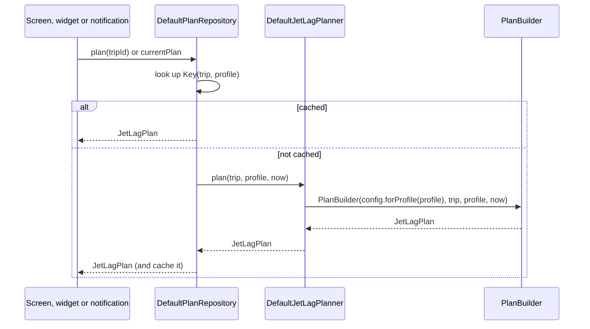
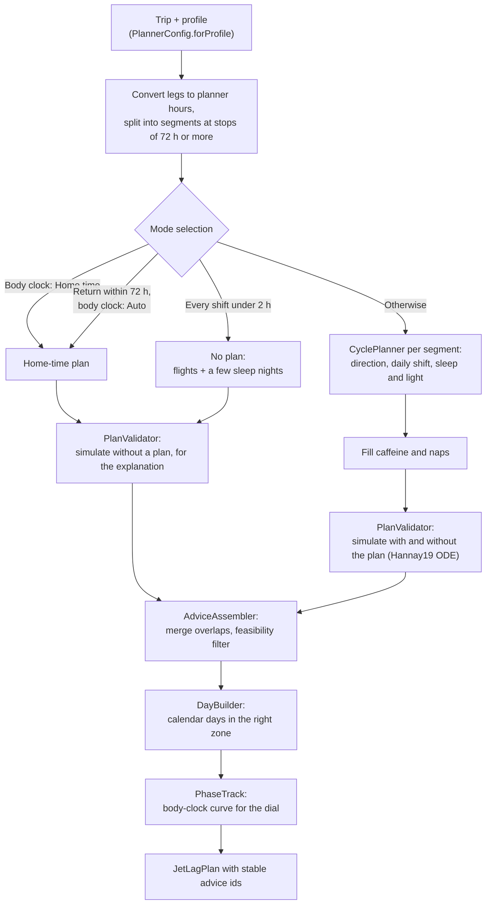

# The planning engine

The planner turns one trip and one user profile into a complete jet lag plan: what to do about light, sleep,
naps, caffeine and (if the user opted in) melatonin, from a few days before departure until the body clock has
caught up. It is plain Kotlin in `:core:circadian`, with no Android code, no I/O and no clock reads. The same
trip and profile always give the same plan.

This page covers how the engine is wired into the app and what each stage does. The rules themselves (every
threshold, every formula, every known limitation) are in [algorithm.md](algorithm.md). The research behind them
is in [science.md](science.md).

## Where it sits

The app talks to the planner through one interface,
[`JetLagPlanner`](../core/circadian/src/main/kotlin/dev/sebastiano/clockblocker/opus/core/circadian/JetLagPlanner.kt).
`AppGraph` binds it to
[`DefaultJetLagPlanner`](../core/circadian/src/main/kotlin/dev/sebastiano/clockblocker/opus/core/circadian/DefaultJetLagPlanner.kt).
Only [`DefaultPlanRepository`](../core/data/src/main/kotlin/dev/sebastiano/clockblocker/opus/core/data/plan/DefaultPlanRepository.kt)
calls it. Screens, widgets and notifications all read plans from that repository, never from the planner.

The cache key is the whole trip and the whole profile, so any change to either gives a new plan. `now` is only
recorded as the plan's `generatedAt` time and doesn't change the advice. See
[architecture.md](architecture.md#the-plan-cache) for how the cache shares and limits work.

## When a plan is recomputed

| Event | New plan? | Why |
|---|---|---|
| The user edits a trip (legs, times, return flight, body clock choice) | Yes | The trip is part of the cache key |
| The user taps "I'm delayed" in the editor | Yes | The delay moves the flight times, so the trip changes |
| The user changes the profile (home zone, sleep, chronotype, tools, effort, melatonin) | Yes | The profile is part of the cache key |
| The user marks advice as Done, Skipped or "Can't do this" | No | Logs are stored separately and only change what the UI shows |
| The user changes theme, reminders or other settings | No | Settings are not planner inputs |
| Time passes, or the user lands in a new zone | No | The plan already covers every day; `currentPlan` just picks the right trip and moment |

## The stages

[`PlanBuilder`](../core/circadian/src/main/kotlin/dev/sebastiano/clockblocker/opus/core/circadian/engine/PlanBuilder.kt)
runs the stages below in order. The first step picks one of three modes. Only "adapt" runs the full cycle
planner.

In words: the builder first converts the trip into hours and splits long stopovers into separate segments. It
then picks a mode, checking in this order. A trip set to "Home time" gets a home-time plan. Otherwise, a trip
where no segment shifts the clock by 2 hours or more gets no real plan, only flight markers and a few sleep
nights. Otherwise, a short trip with a return flight within 72 hours (body clock on Auto) gets a home-time plan.
Every other trip goes through the cycle planner. All three modes end in the same assembly steps.

| Stage | Code | What it does | Rules in algorithm.md |
|---|---|---|---|
| Configuration | [`PlannerConfig.kt`](../core/circadian/src/main/kotlin/dev/sebastiano/clockblocker/opus/core/circadian/PlannerConfig.kt) | Turns effort level and tools into planner parameters | [§5](algorithm.md#5-parameters), [§5.1](algorithm.md#51-intensity-and-preferences-plannerconfigforprofile) |
| Mode selection | `PlanBuilder.build()` | Home time, no plan, or adapt | [§3](algorithm.md#3-mode-selection) |
| Cycle planning | [`CyclePlanner.kt`](../core/circadian/src/main/kotlin/dev/sebastiano/clockblocker/opus/core/circadian/engine/CyclePlanner.kt) | Picks advance or delay, shifts sleep and light windows day by day around the body-clock low point | [§4](algorithm.md#4-decision-procedure-adapt-mode) |
| Validation | [`PlanValidator.kt`](../core/circadian/src/main/kotlin/dev/sebastiano/clockblocker/opus/core/circadian/engine/PlanValidator.kt), [`ode/`](../core/circadian/src/main/kotlin/dev/sebastiano/clockblocker/opus/core/circadian/ode) | Simulates the light schedule with a published model to estimate days to adapt, with and without the plan | [§6](algorithm.md#6-estimates-and-validation-13) |
| Card assembly | [`AdviceAssembler.kt`](../core/circadian/src/main/kotlin/dev/sebastiano/clockblocker/opus/core/circadian/engine/AdviceAssembler.kt) | Merges overlapping advice, resolves conflicts, drops or trims advice that is impractical | [§4.1](algorithm.md#41-card-assembly-and-the-feasibility-filter) |
| Calendar days | [`DayBuilder.kt`](../core/circadian/src/main/kotlin/dev/sebastiano/clockblocker/opus/core/circadian/engine/DayBuilder.kt) | Splits the plan into days, each in the zone the user is in that day | [§4](algorithm.md#4-decision-procedure-adapt-mode) |
| Phase track | [`PhaseTrack.kt`](../core/circadian/src/main/kotlin/dev/sebastiano/clockblocker/opus/core/circadian/engine/PhaseTrack.kt) | The body-clock curve that the dial and the "body 3½ h behind" header read | [§4.2](algorithm.md#42-phase-trajectory) |

Each piece of advice gets an id from `PlanBuilder.stableId`: the first 8 bytes of a SHA-256 hash of the trip id,
the advice type, the day index and the card's position among cards of the same type that day. The id is
positional, not a hash of the content. So:

- If the plan is computed again with the same inputs, every card gets the same id. That keeps check-ins, snoozes
  and reminder de-duplication attached to the right card, and lets a second calendar export update events
  instead of duplicating them.
- If only a card's time or reason changes, it keeps its id, along with its advice log and its calendar event, as
  long as it stays on the same day and in the same order among same-type cards (cards are counted in start-time
  order).
- If a re-plan adds or removes a card of the same type earlier that day, the later cards of that type shift
  position. Their ids, and the logs attached to them, then belong to a different card.

## Body clock choice

The trip editor's "Body clock" setting maps to `Trip.strategyOverride`:

| Editor choice | Override | Effect |
|---|---|---|
| Auto | none | The planner decides. A return within 72 hours of arrival means home time. |
| Adapt | `Adapt` | Always adapt, even on a short trip (unless every shift is under 2 hours) |
| Home time | `StayOnHomeTime` | Always stay on home time |

## Testing the engine

The planner is a port of a Python reference implementation. Its tests compare the Kotlin cycle planner byte for
byte with reference printouts, check both model ports against published fixtures, and run property tests over
hundreds of generated itineraries (extreme zones, half-hour offsets, daylight-saving changes). The properties
include "never throws", "ids are unique and stable" and "conflicting advice never overlaps", such as sleep and a
light window. The 67 tests in `:core:circadian` run on the JVM in seconds. See
[algorithm.md §6.1](algorithm.md#61-test-coverage) for the full list and [testing.md](testing.md) for how to
run them.
