# Device QA pass 1

Exploratory QA on a physical device. It ran alongside the first green run of the e2e suite in `app/src/androidTest`.

## How this pass was run

- **Device:** Pixel 11 Pro, 1280 × 2856, Android 17 (API 37), Gboard, Europe/Rome.
- **Build:** debug APK from `feat/e2e` after merging `main` (13d0ead), installed with `adb install -r`.
- **Data:**
  - Fresh onboarding, then a Lisbon → Tokyo (LIS → HND) trip.
  - The empty state was exercised too.
  - Notifications were granted.
- **Variations:**
  - Light and dark theme.
  - Dynamic colour on and off.
  - Font scale 1.0 and 1.5.
  - Portrait and landscape.
  - The Gboard IME for every text field.
- **Screenshots:** `adb exec-out screencap`, downscaled to at most 1200 px on the tall side (`sips -Z 1200`). Images live in [`img/`](img/). Device screenshots of the main screens are in [`../screenshots/device/`](../screenshots/device/).
- **Restored afterwards:** font scale (1.0), user rotation (0) and the owner's app data.

Severity: **High** means it blocks or breaks a core task. **Medium** means visibly wrong, or it hurts a task. **Low** means polish.

## Summary

| # | Finding | Screen | Severity | Status |
|---|---|---|---|---|
| 1 | Enter in an airport field after Gboard's autocorrect leaves "Hand" in the field | Trip editor | High | **Fixed** |
| 2 | Home-zone search results hidden under the keyboard and the Back/Next bar | Onboarding · home zone | Medium | **Fixed** |
| 3 | Home zone shown as "Z" | Onboarding · home zone | Medium | **Fixed** (on `main`, `DeviceZone`) |
| 4 | Test reminder notification does nothing when tapped | Settings → test reminder | Medium | **Fixed** |
| 5 | Date and time fields in one leg row have different heights | Trip editor | Low | **Fixed** |
| 6 | Unselected Theme and reminder-lead options have no visible container | Settings | Low | **Fixed** |
| 7 | Trips section count not pluralised ("1 trips") | Trips | Low | **Fixed** |
| 8 | In-progress trip card glares bright cyan in dark theme with dynamic colour | Trips | Medium | Open |
| 9 | Adaptation headline wraps badly at large font | Plan · Now | Medium | Open |
| 10 | Collapsed plan header subtitle truncates the body offset at large font | Plan | Medium | Open |
| 11 | TalkBack reads "about about 1 day to go to go" | Plan · adaptation | Medium | Open |
| 12 | Plan sky header stays bright in dark theme | Plan | Low | Open |
| 13 | Now card header starts a new line with "· 3 h 58 min left" at large font | Plan · Now | Low | Open |
| 14 | Up next dividers are inset at the start but run to the card's end edge | Plan · Now | Low | Open |
| 15 | Trips top bar has a settings gear that duplicates the Settings destination | Trips | Low | Open |
| 16 | The system autogroups our notifications, and tapping the bundle opens the launcher activity | Notification shade | Low | Open |

Infrastructure issues found while getting the suite green are listed at the end. They do not affect users.

---

## Fixed

### 1. Enter in an airport field leaves Gboard's autocorrection in the field — High

**Screen:** Trip editor, *From* / *To* airport fields.

**Steps:**
1. Open a new trip.
2. In *To*, type `hnd`. The results list shows Tokyo Haneda.
3. Press Enter (the IME action).

**Result:** The field ends up showing **"Hand"** with no airport picked.

**Expected:** The row on screen (Haneda) is picked.

**Root cause:**
- Gboard autocorrects the composing word when Enter is pressed. This happens even though the field sets `autoCorrectEnabled = false`: Compose 1.10.6 never sets `InputType.TYPE_TEXT_FLAG_NO_SUGGESTIONS`, so Gboard ignores the flag.
- The commit changes the query to "Hand", which starts a new search.
- `TripEditorViewModel.pickTopResult` refused to pick while `searching` was true, so the Enter that followed was swallowed.

**Fix:**
- `pickTopResult` now picks the row the user can see, whether or not a newer search is running.
- See [`TripEditorViewModel.kt`](../../feature/trips/src/main/kotlin/dev/sebastiano/clockblocker/opus/feature/trips/editor/TripEditorViewModel.kt) (`pickTopResult`).
- Covered by a new test in `TripEditorViewModelTest`, and verified on the device.

**Follow-up:** Suppressing suggestions properly needs `KeyboardOptions(autoCorrectEnabled = false)` to reach the IME as `NO_SUGGESTIONS`. Re-check when Compose is upgraded.

| Before | After |
|---|---|
| 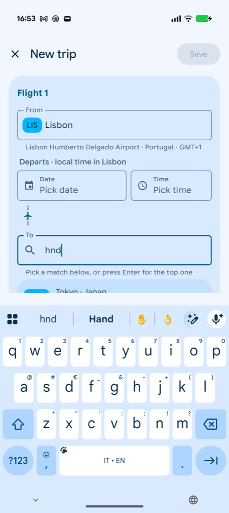 | 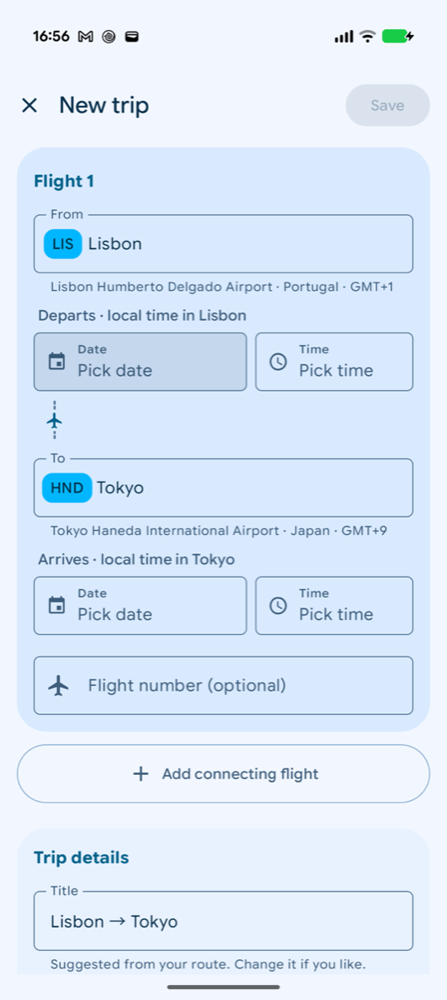 |

### 2. Home-zone search results hidden under the keyboard — Medium

**Screen:** Onboarding → *Home time zone* → *Change*.

**Steps:**
1. Tap the search field.
2. Type `tok`.

**Result:** The results render below the fold. The IME and the Back/Next bar cover them, and nothing shows that results exist. You have to dismiss the keyboard and scroll to find them.

**Fix:**
- `HomeZoneControls` brings the first result, or the "no results" text, into view whenever the query changes.
- It uses a `BringIntoViewRequester` and a `LaunchedEffect`.
- See [`OnboardingSteps.kt`](../../feature/onboarding/src/main/kotlin/dev/sebastiano/clockblocker/opus/feature/onboarding/OnboardingSteps.kt) (`HomeZoneControls`).

| Before | After |
|---|---|
| 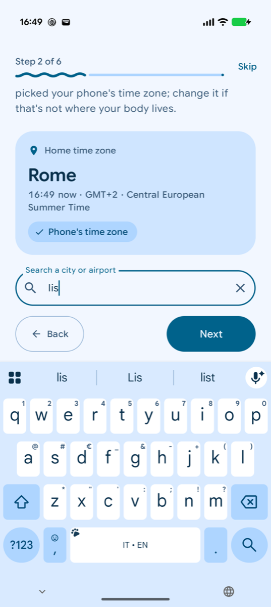 | 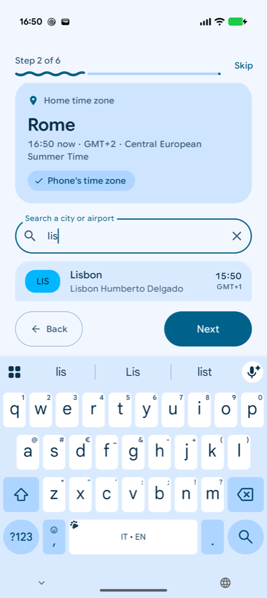 |

### 3. Home zone shown as "Z" — Medium

**Screen:** Onboarding → *Home time zone*.

**Result:** On a device whose zone resolves to `Z` / UTC-style ids, the detected home zone label was just "Z".

**Fix:** Fixed on `main` with `DeviceZone`, merged in 13d0ead. I had found and fixed this independently on this branch and dropped my version in favour of `main`'s.

### 4. Test reminder notification does nothing when tapped — Medium

**Screen:** Settings → *Send a test reminder*, then the notification shade.

**Result:** The notification had no content intent, so tapping it only dismissed it.

**Fix:**
- The notification now opens the current plan (8a4eb0e).
- See [`NotificationFactory.kt:129`](../../core/notifications/src/main/kotlin/dev/sebastiano/clockblocker/opus/core/notifications/NotificationFactory.kt#L129).
- Covered by `NotificationsTest.b_testReminderAppearsInTheShadeAndOpensThePlan`.

### 5. Date and time fields in a leg row have different heights — Low

**Screen:** Trip editor, leg card, *Departs* / *Arrives* rows.

**Result:** The date field and the time field sit side by side but with different heights. The gap is clearest once one of them shows supporting or error text.

**Fix:**
- `TimeRow` measures at `IntrinsicSize.Min` and both `PickerField`s `fillMaxHeight()`.
- See [`LegCard.kt`](../../feature/trips/src/main/kotlin/dev/sebastiano/clockblocker/opus/feature/trips/editor/LegCard.kt) (`TimeRow`).
- Roborazzi goldens are unchanged.

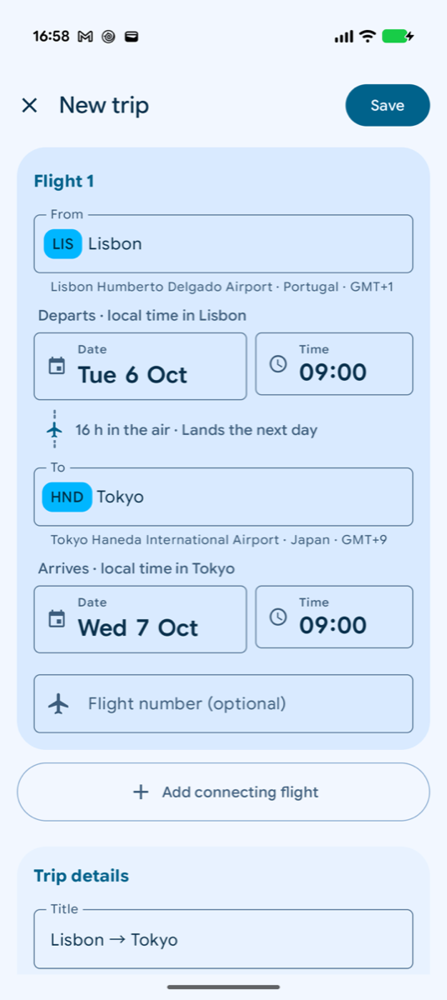

### 6. Unselected Theme / reminder-lead options have no visible container — Low

**Screen:** Settings → *Appearance → Theme*, and *Reminders → lead time*.

**Result:**
- `ConnectedChoice` sits on a `surfaceContainer` card. The M3 `ToggleButton`'s default unchecked container is also `surfaceContainer`, so the unselected options looked like bare text next to one filled pill.
- *How hard the plan pushes* sits on the screen background, where the same component shows all its containers. The two rows looked like different components, and the contrast in dark theme was poor.

**Fix:**
- The unchecked container is now `surfaceContainerHighest`.
- See [`SettingsScreens.kt`](../../feature/settings/src/main/kotlin/dev/sebastiano/clockblocker/opus/feature/settings/SettingsScreens.kt) (`ConnectedChoice`).

| Before (portrait) | After (landscape) |
|---|---|
| 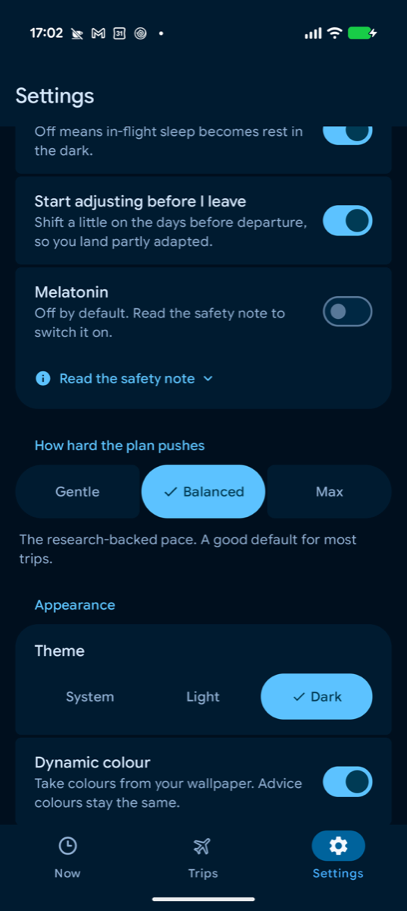 | 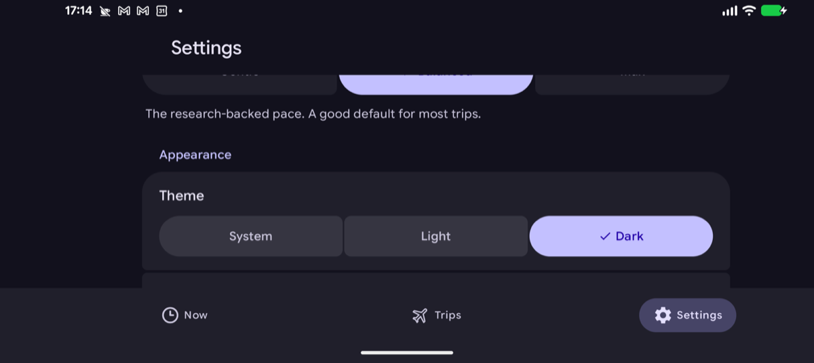 |

### 7. Trips section count not pluralised — Low

**Screen:** Trips list section headers.

**Result:** The header said "1 trips".

**Fix:** The count now uses a plurals resource.

---

## Open (documented, not fixed here)

These are in `feature/plan` internals, theme decisions, or cross-module behaviour. Per the brief, they are left to their owners.

### 8. In-progress trip card glares bright cyan in dark theme with dynamic colour — Medium

**Screen:** Trips list (and the FAB). Dark theme, dynamic colour **on**.

**Steps:**
1. Settings → Theme *Dark*, Dynamic colour *on*. This Pixel uses the Expressive wallpaper scheme.
2. Open Trips with a trip in progress.

**Result:**
- On this scheme, dark `primaryContainer` is a light, saturated cyan. The in-progress card and the FAB glare against the dark surface.
- The wavy progress track inside the card is almost invisible on the cyan.
- With dynamic colour off, the Opus palette looks right.

**Proposed fix:** In dark theme, give the in-progress card `surfaceContainerHigh` with a `primary` accent (outline, stripe or progress colour) instead of `primaryContainer`. Alternatively, tone-clamp dynamic containers in the theme.

**Where:** [`TripCard.kt:87`](../../feature/trips/src/main/kotlin/dev/sebastiano/clockblocker/opus/feature/trips/list/TripCard.kt#L87), or the theme in `:core:designsystem`.

| Dynamic colour (glare) | Opus palette |
|---|---|
| 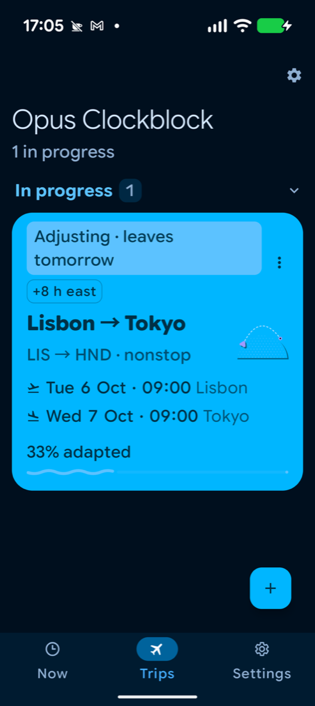 | 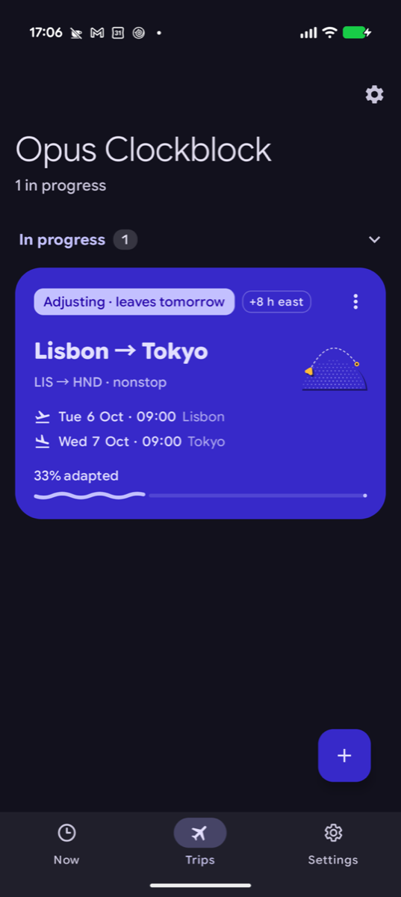 |

### 9. Adaptation headline wraps badly at large font — Medium

**Screen:** Plan → Now, adaptation card. Font scale 1.5.

**Result:**
- "33% adapted" and " · about 3 days to go" are two `Text`s in a bottom-aligned `Row`.
- At 1.5× the second one wraps inside its own slot, so it floats as a narrow block beside the headline, and the bullet dangles.

**Proposed fix:** Use one `Text` with an `AnnotatedString` (a `SpanStyle` for the secondary part) so it wraps as a sentence, or use a `FlowRow` with the separator attached to the second part.

**Where:** [`PlanCards.kt:118-130`](../../feature/plan/src/main/kotlin/dev/sebastiano/clockblocker/opus/feature/plan/PlanCards.kt#L118-L130).

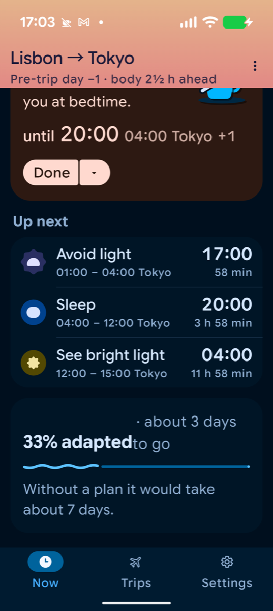

### 10. Collapsed plan header subtitle truncates the body offset at large font — Medium

**Screen:** Plan, header collapsed (scroll down). Font scale 1.5.

**Result:**
- The subtitle "Day 1 · Adapting · body 2½ h ahead" is `maxLines = 1` with an ellipsis.
- At 1.5× it truncates to "… body 2½ h ahe…", which loses the most important number and its direction.

**Proposed fix:** Allow 2 lines in the expanded state, or drop the stage label first when it doesn't fit (keep "body 2½ h ahead"). Another option is to put the offset in its own line.

**Where:** [`PlanHeader.kt:114-119`](../../feature/plan/src/main/kotlin/dev/sebastiano/clockblocker/opus/feature/plan/PlanHeader.kt#L114-L119).

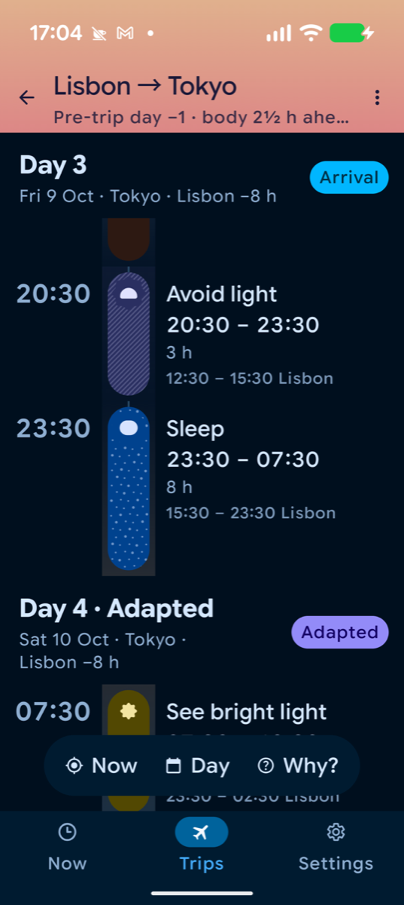

### 11. TalkBack reads "about about 1 day to go to go" — Medium (a11y)

**Screen:** Plan → Now, adaptation card, with TalkBack on.

**Result:**
- `AdaptationCard` passes `remaining = toGo` to `WavyAdaptationIndicator`. `toGo` is already the full phrase ("about 1 day to go", from `plan_days_to_go`).
- The indicator wraps it again in `adaptation_description_remaining` ("%1$d%% adapted, about %2$s to go").

**Proposed fix:** Choose one of these:
- Pass a bare duration ("1 day").
- Change the designsystem string to `"%1$d%% adapted, %2$s"`.

The KDoc at `WavyAdaptationIndicator.kt:39` documents the bare-duration contract, so the caller is the one in the wrong.

**Where:**
- [`PlanCards.kt:135`](../../feature/plan/src/main/kotlin/dev/sebastiano/clockblocker/opus/feature/plan/PlanCards.kt#L135)
- [`core/designsystem/.../strings.xml:43`](../../core/designsystem/src/main/res/values/strings.xml#L43)

### 12. Plan sky header stays bright in dark theme — Low

**Screen:** Plan header, dark theme, daytime body clock.

**Result:** The body-clock sky gradient is the same peach and blue in dark theme. It is the brightest thing on screen and clashes with the dark surfaces below.

**Proposed fix:** Add a dimmed or night-tinted variant of `OpusTheme.sky` for dark theme. Keep the hue so the meaning (body time of day) survives, and lower the luminance.

**Where:** [`PlanHeader.kt:106-111`](../../feature/plan/src/main/kotlin/dev/sebastiano/clockblocker/opus/feature/plan/PlanHeader.kt#L106-L111) (`OpusTheme.sky`, `BodyClockSky` in `:core:designsystem`).

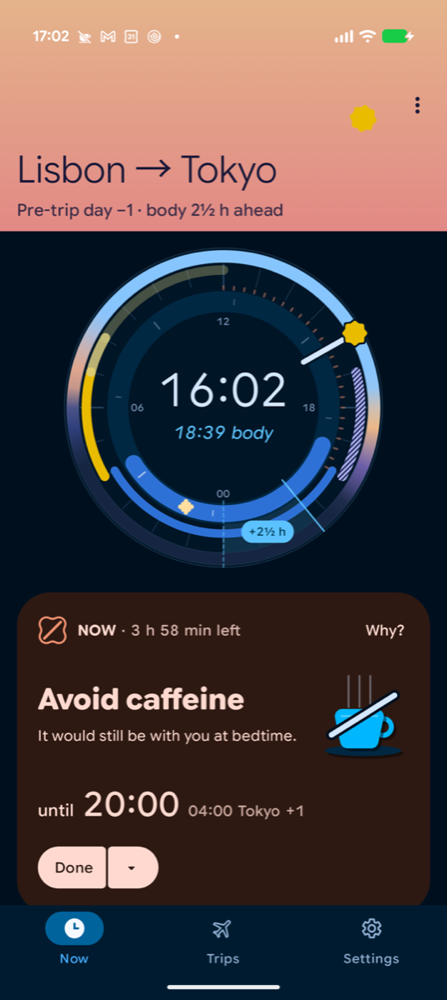

### 13. Now card header wraps "· 3 h 58 min left" onto its own line at large font — Low

**Screen:** Plan → Now card. Font scale 1.5.

**Result:**
- The header is a `FlowRow` of "NOW" and " · 3 h 58 min left".
- At 1.5× the second item wraps to its own line, which then starts with the bullet.

**Proposed fix:** When wrapped, drop the separator. For example, render the remaining time as its own item with no leading " · ", and space the items with the FlowRow's horizontal arrangement. Alternatively, put the remaining time under the title.

**Where:** [`NowCard.kt:106-118`](../../feature/plan/src/main/kotlin/dev/sebastiano/clockblocker/opus/feature/plan/NowCard.kt#L106-L118).

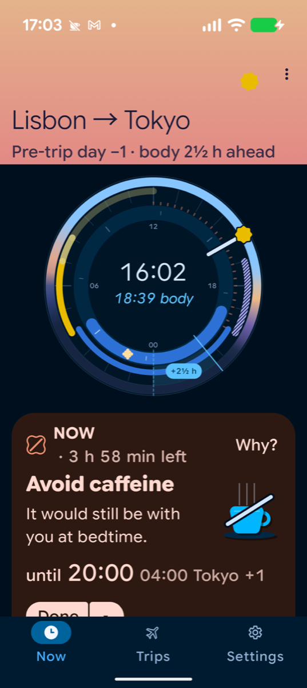

### 14. Up next dividers run to the card's end edge — Low

**Screen:** Plan → Now, *Up next* card.

**Result:** The dividers have a 72 dp start inset that aligns with the text, but they run to the card's end edge. This looks unbalanced inside a rounded card.

**Proposed fix:** Add a matching end inset, e.g. `padding(start = 72.dp, end = 20.dp)`.

**Where:** [`PlanCards.kt:66`](../../feature/plan/src/main/kotlin/dev/sebastiano/clockblocker/opus/feature/plan/PlanCards.kt#L66).

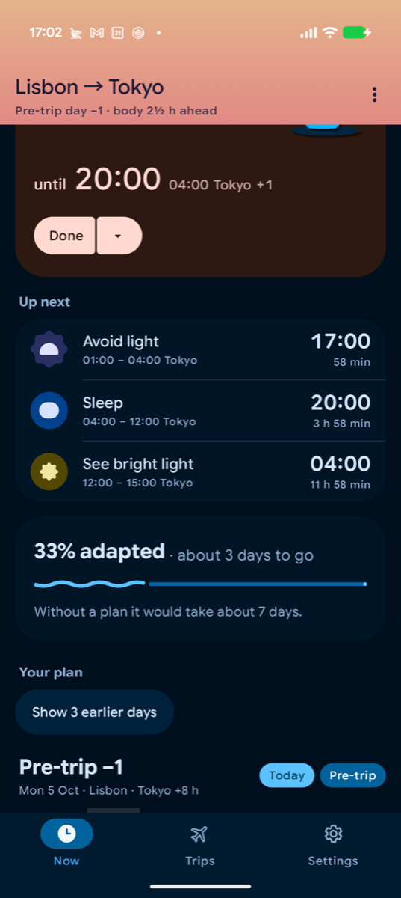

### 15. Trips top bar duplicates the Settings destination — Low

**Screen:** Trips (the list and the empty state), on a phone with the navigation bar.

**Result:** The top app bar has a settings gear, and the navigation suite has a *Settings* destination right below. There are two routes to the same place. The gear also pushes Settings onto the Trips stack instead of switching tabs.

**Proposed fix:** Hide the gear whenever the navigation suite shows a Settings item, and keep it only for layouts without one, if any exist.

**Where:** [`TripsContent.kt:118`](../../feature/trips/src/main/kotlin/dev/sebastiano/clockblocker/opus/feature/trips/list/TripsContent.kt#L118).

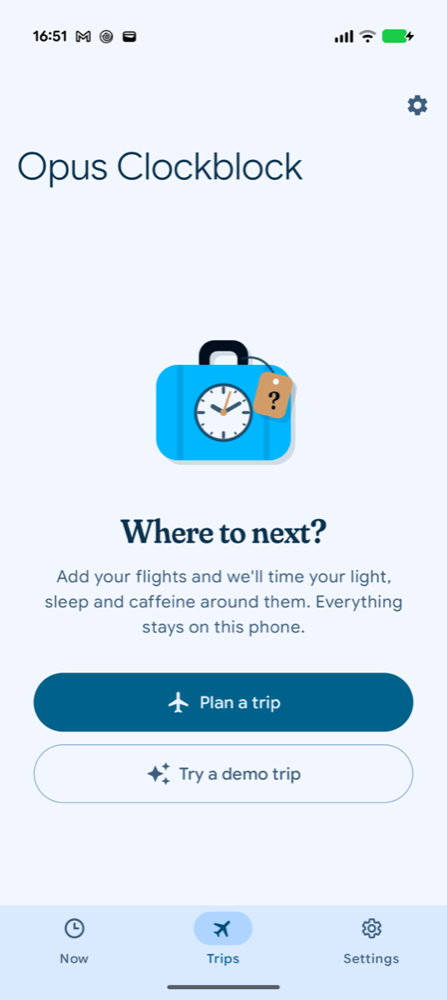

### 16. The system autogroups our notifications; tapping the bundle opens the launcher — Low

**Screen:** Notification shade, with the ongoing Now notification and a reminder both posted.

**Result:**
- Android autogroups them into one bundle.
- Tapping the collapsed bundle's header fires the system's group intent, which is the app's launcher activity, instead of the plan.
- Each child opens the plan correctly.
- The e2e test expands the bundle first for this reason.

**Proposed fix:** Post the notifications in an explicit group and add a summary notification whose content intent is `openCurrentPlan`. Alternatively, keep Now and reminders in separate groups.

**Where:** [`NotificationFactory.kt`](../../core/notifications/src/main/kotlin/dev/sebastiano/clockblocker/opus/core/notifications/NotificationFactory.kt) (no `setGroup` today).

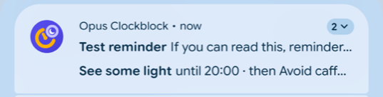

---

## Also checked, no issue

- **Plan toolbar peek:** the floating toolbar no longer peeks over the last item (polish merge); I could not reproduce the earlier report.
- **Landscape trips list and editor:** content keeps edge-to-edge insets and nothing is clipped.
- **Editor state:** survives rotation and a font-scale change (covered by `EditorConfigChangesTest`).
- **Pre-trip plan times:** the plan shows the home-origin (Lisbon) time before departure, with the secondary zone. This is intended.

**Not covered:** night-safe mode. It needs an active avoid-light block, and none fell within the session.

## Infrastructure (test-only)

- **Robolectric on the androidTest classpath:** it came in through `:core:testing` and broke instrumentation. It was dropped from androidTest dependencies (fef2385).
- **Resetting app data:**
  - The instrumentation shares the app process, so `pm clear` / `pm revoke` would kill the test. Each test resets in-process instead: `AppDataReset` puts every repository's DataStore back to defaults, clears prefs and cancels notifications, and `Activities.finishAll()` closes any open activities.
  - AGP does not install with `-g`, and connected runs uninstall afterwards, so the permission-dialog test always sees a fresh install. If the permission is already granted, it is skipped through an assumption.
