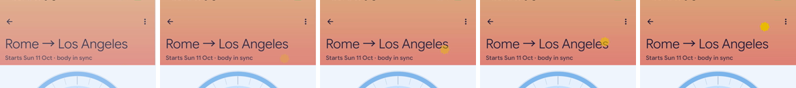

# UX polish pass 1

Device walk on the Pixel (Android 17, 1280×2856, dynamic colour from the owner's wallpaper) plus Robolectric
goldens. Settings covered: light and dark theme, font scale 1.0, 1.3 and a spot check at 2.0, portrait and
landscape. QA data: the owner's trip plus three fixture trips (in progress, in flight, past). The owner's data
and the device settings were restored afterwards.

Scope: small UX problems (layout shifts on state change, colour pairs that are hard to read, wrapping at large
font, landscape) and a little rare, frequency-gated delight. No redesigns.

Branch `feat/ux`, commits `3f11bcc` → HEAD. Images are on-device captures (status bar cropped or masked so no
other apps' icons show), ≤1200 px.

## Findings

| # | Category | Where | Severity | Status | Before / after |
|---|---|---|---|---|---|
| 1 | Colour / contrast | Whole app, dynamic dark theme: wallpaper-derived `primaryContainer` (#00B6FF on this device) glared behind white-ish text; in-progress trip cards and Today/Arrival chips were neon | High | Fixed (`3f11bcc`): `withQuietDarkContainers` tones dark containers down to a computed contrast floor; `ContrastAuditTest` checks every theme | [dark-dynamic-trips](ux-polish-1/dark-dynamic-trips.png) |
| 2 | Colour | Trips FAB (`primaryContainer` on `primaryContainer`) vanished over in-progress cards | High | Fixed (`8bde031`): FAB uses `primary`/`onPrimary` in both states | [dark-dynamic-trips](ux-polish-1/dark-dynamic-trips.png) (bottom right) |
| 3 | Colour | Plan sky header in dark theme used the light-theme day sky: a bright block above a dark screen | Medium | Fixed (`3f11bcc`): `SkyPalette.forDarkTheme` mutes the sky in dark themes; ink contrast still AA | [dark-sky-header](ux-polish-1/dark-sky-header.png) |
| 4 | Contrast | Night-safe ink, Now card and trip card secondary text were just under AA | Medium | Fixed (`3f11bcc`): `NightInkVariant`, secondary alpha raised; covered by the audit test | — |
| 5 | Layering | Plan floating toolbar sat directly on rail rows, so rows sliding underneath read as toolbar content | Medium | Fixed (`e7e3700`): surface gradient scrim behind the toolbar that fades with it (one event) | [toolbar-scrim](ux-polish-1/toolbar-scrim.png) |
| 6 | Status bar | Night sky header in light theme kept dark status-bar icons on navy | Medium | Fixed (`b17684b`): `SkyStatusBarIcons` follows the sky ink while the header owns the status bar; restores on leave | [status-bar-night-sky](ux-polish-1/status-bar-night-sky.png) |
| 7 | Large font | Rail/Up next two-part lines ("16:00 – 22:00 · 6 h", stage + offset) wrapped mid-pair at 1.3–2.0 | Medium | Fixed (`e7e3700`): `AdaptiveLines` keeps a pair inline or stacks it whole; lowest-priority part goes first | [font2-now](ux-polish-1/font2-now.png) |
| 8 | Large font | Now card: "until" orphaned from "21:00", "+1" day suffix orphaned on its own line | Medium | Fixed (`8997754`): `DualTimeText` takes a `prefix` and flows as units; NBSP before the day suffix; spoken text includes the prefix | [font2-now](ux-polish-1/font2-now.png) |
| 9 | Large font | Trips summary ("2 in progress · 1 upcoming · 1 past") broke inside parts | Low | Fixed (`8997754`): NBSP inside parts, breaks only between them | [font2-trips](ux-polish-1/font2-trips.png) |
| 10 | Typography | Headings (display/headline/titleLarge, editorial) broke greedily, leaving a short ragged last line on two-line titles | Low | Fixed (`8bde031`): `LineBreak.Heading` (balanced) for styles ≥22 sp | goldens |
| 11 | Landscape | Phone landscape: bottom bar plus a large collapsing header left ~120 dp of content; the plan stayed single pane at ~790 dp wide (left cutout + rail) | High | Fixed (`166b278`): `suiteTypeFor` → collapsed rail when height < 480 dp; one-row pinned header; plan splits into dial + rail in short windows ≥600 dp; tighter toolbar zone | [landscape-now](ux-polish-1/landscape-now.png), [landscape-plan](ux-polish-1/landscape-plan.png) |
| 12 | Landscape | Settings sleep editor: dial pushed Save below the fold | Medium | Fixed (`6733191`): dial size follows window height | [landscape-sleep-editor](ux-polish-1/landscape-sleep-editor.png) |
| 13 | Large font | Onboarding sleep dial centre readout clipped ("8 h 15 m of sleep") | Medium | Fixed (`6733191`): wider readout box, auto-size steps down instead of clipping | goldens (`sleep_dial_fontscale_1_5`) |
| 14 | Visual | Rail body-sky band had hard square ends at the first/last block | Low | Fixed (`166b278`): pill-rounded ends; `RailRow.Block.last` | — |
| 15 | Copy | Flight rows repeated the route ("MXP → SIN · MXP→SIN") when there is no flight number | Low | Fixed (`166b278`): `flightDetails` drops the planner's duplicate (rail, Now card, Why? sheet). The bottom half of [landscape-plan](ux-polish-1/landscape-plan.png) was shot before this fix | — |
| 16 | Accessibility | TalkBack read durations twice ("6 h, 6 hours") | Low | Fixed (`e7e3700`): bare duration in semantics | — |
| 17 | Visual | Up next divider ran under the trailing time column | Low | Fixed (`e7e3700`): end inset | — |
| 18 | Duplication | Trips screen showed a settings gear while Settings is already a top-level destination | Low | Fixed (`e7e3700`) | — |
| 19 | Notifications | Now notification and reminders were auto-grouped by the system under a generic summary | Low | Fixed (`e7e3700`): own group + summary (opens the current plan) | — |
| 20 | Docs | `docs/screenshots/widgets-on-device.png` showed an old build (wrong offset sign, clipped 2×2 caption) | Low | Fixed (`d6eec6f`): re-shot from the current build | — |

### Deferred (minor, not worth churn in a polish pass)

- Pre-trip day title "Pre-trip −4" plus a "Pre-trip" chip says the same thing twice. Needs a copy decision.
- Free time card "Next: …" repeats the first Up next row. Harmless; removing it changes the card's meaning
  when Up next is scrolled away.
- Pre-trip header "about 1 day to go" is vague near the boundary. Copy decision.
- `ModalBottomSheet` keeps dark status-bar icons over its dark scrim (M3 default; would need per-sheet window
  handling).
- Light dynamic theme: in-progress cards are a vivid wallpaper cyan. Readable (passes the audit), just loud.
- Past trip capsules at 0.55 alpha look slightly muddy in dark. Left as is; the dimming means "past".
- Cold start from `adb am start` with a deep link right after `adb install` lands on Now: the system's
  post-update relaunch (`PackageUpdateActivity`) restarts `MainActivity` without the intent. Platform
  behaviour, not reproducible from a normal tap on a link.

## Delight (frequency-gated)

| Moment | Frequency tier | What | Reduce motion |
|---|---|---|---|
| "First light" | Rare (a few times a month: a trip saved ≤90 s ago) | The new plan's header sun or moon rises from below the header's bottom edge into place, `artEntrance()`, once per entry (saveable) | Already in place (static carrier) |
| Trip saved | Rare (same moment) | `CONFIRM` haptic on the editor's `Saved` event | Haptic only, unaffected |

Everything that already exists was left alone (welcome Two Clocks, celebration, moon/rewind/24.2/Konami eggs,
one-shot glyph ambient). Both new rows are in `MOTION.md`, tagged OBSERVED.

## Verification

- TDD for the logic: `SuiteTypeTest` (landscape rail), `PlanMomentTest` (band ends, flight line, first-light
  window including the minute-resolution plan clock), `ContrastAuditTest`.
- `build-brief ./gradlew test :app:assembleDebug`: 733 tests passed. `recordRoborazziDebug` +
  `verifyRoborazziDebug` (all modules): 503 passed, 62 goldens re-recorded. `:app:connectedDebugAndroidTest` on
  the Pixel: 22 tests, 0 failures.
