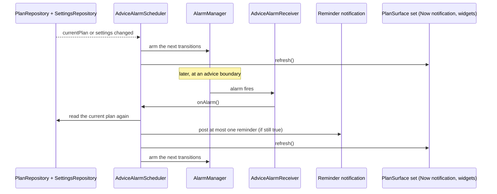
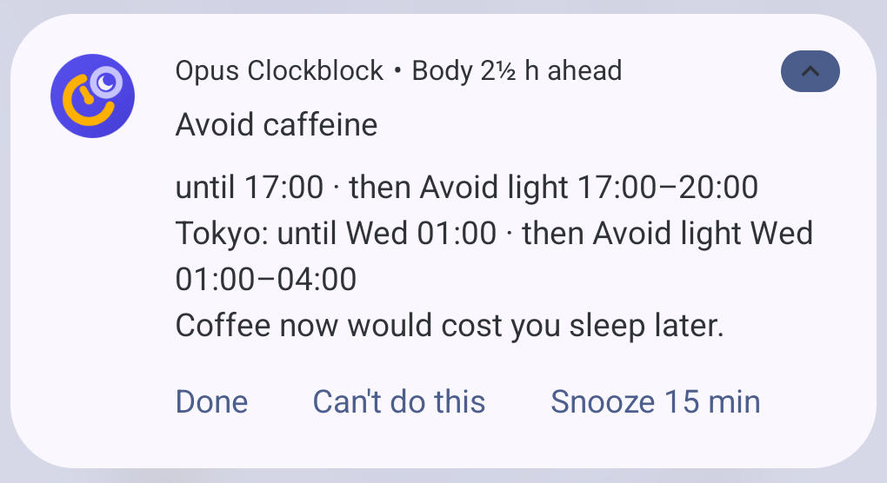
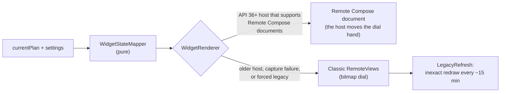
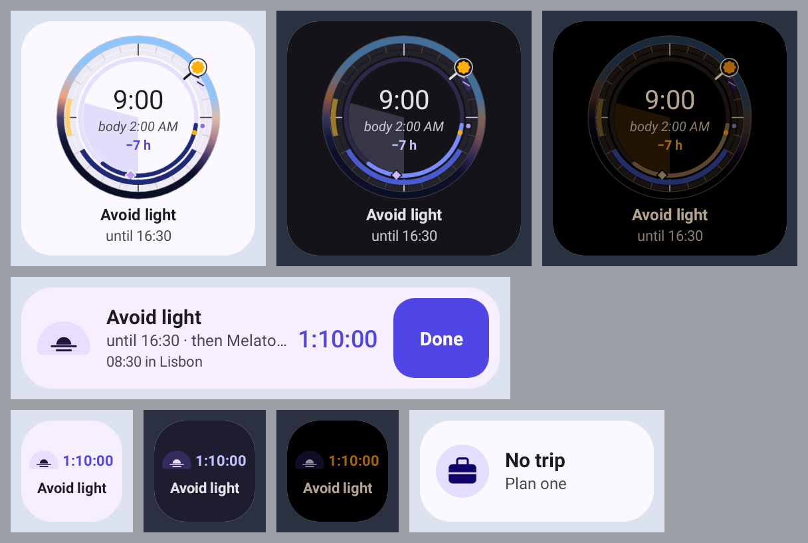

# Surfaces: notifications and widgets

Outside the app, the plan appears in three places: one ongoing "Now" notification, short reminders before advice
starts, and two home-screen widgets (*Two Clocks* and *Next up*). One scheduler controls all of them. It wakes up
at each advice boundary, reads the current plan, posts at most one reminder and redraws every surface from the
same plan at the same moment, so right after each refresh they all agree. Between
refreshes they can drift: a delayed scheduler wake-up (see [The scheduler](#the-scheduler)) leaves them behind
the app, and the fallback widget's own redraw (see [How widgets render](#how-widgets-render)) updates only the
*Two Clocks* widget.

The code is in `:core:notifications` and `:widget`. The shared contract,
[`PlanSurface`](../core/data/src/main/kotlin/dev/sebastiano/clockblocker/opus/core/data/PlanSurface.kt), is in
`:core:data` and has one method: `suspend fun refresh()`.

## The scheduler

[`AdviceAlarmScheduler`](../core/notifications/src/main/kotlin/dev/sebastiano/clockblocker/opus/core/notifications/AdviceAlarmScheduler.kt)
starts from `OpusApplication`. It watches `currentPlan` and the settings. When either changes, it re-arms its
alarms and refreshes every surface.

In words: whenever the plan or the settings change, the scheduler arms alarms for the next few boundaries and
redraws the surfaces. When an alarm fires, the scheduler does not trust what it planned earlier. It reads the
current plan again, decides whether a reminder is still correct, redraws everything and arms the next alarms.

A few details matter:

- It arms the next 8 alarm times at most (each may carry several transitions), plus a pending snooze, a
  15-minute progress tick while a Live Update is showing, and (with reminders on) the next change of the Now
  notification's body-clock header.
- When the user allows exact alarms (`SCHEDULE_EXACT_ALARM`), it uses `setExactAndAllowWhileIdle`. Without that
  permission, it uses a 10-minute `setWindow`. That is not allow-while-idle, so in Doze the alarm can wait for the
  next maintenance window, well past 10 minutes.
- Reminders show absolute times ("until 16:30"), so a late alarm never shows something false.
  [`ReminderSelector`](../core/notifications/src/main/kotlin/dev/sebastiano/clockblocker/opus/core/notifications/schedule/ReminderSelector.kt)
  drops any reminder that is no longer true when it fires.

### Which boundaries get an alarm

[`TransitionPlanner`](../core/notifications/src/main/kotlin/dev/sebastiano/clockblocker/opus/core/notifications/schedule/TransitionPlanner.kt)
is a pure function that turns a plan into a list of transitions. All the timing rules are there, with unit
tests.

| Transition | When | Makes a sound? |
|---|---|---|
| Upcoming | The reminder lead time ("How early" in Settings, 15 minutes by default) before a window starts | Yes |
| Start | A window starts | No, surfaces switch silently |
| End | A window ends | No |
| WakeUp | A Sleep or Nap window ends | Yes |
| Moment | A one-off advice is due (melatonin) | Yes |
| Flight take-off or landing | The flight times | No, they refresh the surfaces silently (and drive the travel-day Live Update) |

The rules that protect sleep and keep things quiet:

- Nothing fires strictly inside a Sleep or Nap window. A window that starts while the user should be asleep gets
  no reminder. The sleeper is woken once, by the WakeUp transition.
- Optional naps ("Nap if you're tired") don't silence anything, because they can be skipped.
- With reminders turned off, only the silent transitions remain, so widgets still update.
- Duplicate advice and transitions at the same instant are merged into one alarm.
- Only one reminder is visible at a time. It reuses one notification id. If several reminders are due at once,
  the most important one leads and the others are listed on an extra line ("Also: …").

### What resets the schedule

The system clears alarms on reboot and the plan's meaning changes when the clock or zone changes.
`ScheduleResetReceiver` in
[`Receivers.kt`](../core/notifications/src/main/kotlin/dev/sebastiano/clockblocker/opus/core/notifications/receiver/Receivers.kt)
listens for these broadcasts and re-syncs everything:

| Broadcast | Why |
|---|---|
| `BOOT_COMPLETED` | Alarms don't survive a reboot |
| `TIMEZONE_CHANGED`, `TIME_SET` | The user landed, or the clock was corrected |
| `MY_PACKAGE_REPLACED` | The app was updated |
| `LOCALE_CHANGED` | Notification text and channel names must change language |
| `SCHEDULE_EXACT_ALARM_PERMISSION_STATE_CHANGED` | Switch between exact and windowed alarms |

## The Now notification

[`NowNotificationSurface`](../core/notifications/src/main/kotlin/dev/sebastiano/clockblocker/opus/core/notifications/NowNotificationSurface.kt)
shows one quiet, ongoing notification with what to do right now and until when. It replaces many separate
pings.

The screenshot shows the app's notifications grouped in the shade. The second line is the Now notification: the
current advice, when it ends and what comes next. The first line is the test reminder from Settings.

It is hidden when reminders are off, notifications are blocked, no plan is in progress, or the user snoozed it.
[`NowState.kt`](../core/notifications/src/main/kotlin/dev/sebastiano/clockblocker/opus/core/notifications/now/NowState.kt)
picks the headline:

1. Sleep beats everything, then Nap, then "Nap if you're tired".
2. Otherwise, the active window with the highest priority (bright light comes before caffeine, and so on).
3. A flight is the headline only when nothing else is active.

Melatonin is never the headline. It gets its own reminder.

The Now notification has three actions: Done, "Can't do this" and "Snooze 15 min". It shows them only while the
headline isn't a flight and hasn't been answered yet. Once the headline has an outcome, it shows a single Undo
action instead, which clears that outcome (`AdviceLogRepository.clear`) and refreshes every surface, widgets
included. Reminders get a set of actions that depends on their kind (`NotificationFactory.reminder`):

| `ReminderKind` | Actions |
|---|---|
| `Upcoming`, `Snoozed` | "Can't do this", "Snooze 15 min" |
| `Moment` (melatonin) | Done, "Snooze 15 min" |
| `WakeUp` | none |

`AdviceActionReceiver` logs the action and refreshes the surfaces. Snoozing hides the Now notification for 15
minutes, then posts a `Snoozed` reminder, but only if the advice is still running then
(`ReminderSelector.snoozed` returns `null` once the block has ended; for melatonin, once its reminder window has
passed). The snooze state is kept in
[`SnoozeStore`](../core/notifications/src/main/kotlin/dev/sebastiano/clockblocker/opus/core/notifications/SnoozeStore.kt).

The notification's subtext (the header line) shows the body-clock offset relative to the local zone, rounded to
the half hour: "Body 3½ h behind", "Body 2 h ahead", or "Body clock in sync" under 30 minutes. It shows the offset
rather than a body time of day, which would change every minute. The offset itself drifts along the plan's phase
trajectory, so the scheduler arms one extra alarm at the next instant the rounded reading changes
(`BodyClockHeader.nextChange`, scanned in 10-minute steps up to 36 hours ahead) and re-renders the notification
there ([`NotificationTextFormatter.bodyClock`](../core/notifications/src/main/kotlin/dev/sebastiano/clockblocker/opus/core/notifications/text/NotificationTextFormatter.kt)).

### Lock-screen redaction

Every Now notification and reminder carries a public version, built by the same formatter with `redact = true`:
no flight number, no route, no secondary-zone line, tips or "also", melatonin shown as "Plan step" with a neutral
icon, and moments as "Unlock to see details". Times and the kind of block stay. The public version has no
actions, because their set alone can name the advice (Done with Snooze is melatonin). When the user turns on
`AppSettings.hideLockScreenDetails` ("Hide details on the lock screen"), the notification's visibility becomes
`VISIBILITY_PRIVATE`, so Android shows the public version on a secure lock screen whenever the user's system
setting hides sensitive content. With the setting off (the default), visibility stays public and the full text
shows, as before. Turning the setting on also withdraws a reminder that is already showing, since it was posted
without a public version. Lock-screen widgets don't honour the setting yet
([#18](https://github.com/rock3r/clockblock/issues/18)).

### Live Update on travel days

On Android 16 (API 36) and later, the Now notification becomes a Live Update during the travel day. It uses
`Notification.ProgressStyle`, with coloured segments for advice blocks and points for take-off and landing.
[`TravelPlanner.kt`](../core/notifications/src/main/kotlin/dev/sebastiano/clockblocker/opus/core/notifications/now/TravelPlanner.kt)
defines the travel window as 3 hours before the first departure to 2 hours after the last arrival.

Android's rules say a Live Update must be ongoing, started by the user and time-sensitive. So the app shows it
only inside the travel window and only while a real plan window is active, not just a flight marker. At other
times the normal ongoing notification is used. Both use the same notification id, so the change happens in
place.

Its subtext adds the route and the phase of the day before the body-clock offset:
"LHR → HND · Departs 11:30 · Body 8 h behind", then "Next flight HH:MM" between legs, "Lands HH:MM" in the air and
"Landed" after the last arrival (`NotificationTextFormatter.travelSubText`). Phases use absolute times, not
countdowns, because no refresh fires inside sleep windows to keep a countdown current. The route comes from the
trip's origin and destination codes (`TripRoute`, looked up through `TripRepository`) and is dropped from the
public version.

### Channels

Users can control each channel in Android settings. The channels are created in
[`NotificationChannels.kt`](../core/notifications/src/main/kotlin/dev/sebastiano/clockblocker/opus/core/notifications/NotificationChannels.kt).

| Group | Channel | Sound | Used for |
|---|---|---|---|
| Reminders | Light | Yes | When to seek bright light and when to avoid it |
| Reminders | Sleep & energy | Yes | Bedtime, naps, wake-ups and low-energy warnings |
| Reminders | Supplements & caffeine | Yes | Melatonin (only if turned on) and caffeine timing |
| Ongoing | Travel day (live) | No | The travel-day Live Update |
| Ongoing | Now | No | The ongoing Now notification |

## Widgets

The `:widget` module provides two widgets. Both can be placed on the home screen. Both declare the `keyguard`
category too, which matters on tablets and in hub mode. On phones, the lock-screen view of the plan is the Now
notification.

The *Two Clocks* widget shows local time and the body clock on one dial ("body 08:20, −7 h"). The outer ring
follows the sky over the local day. Inside it, two lanes show light advice and rest advice. The body ring marks
biological night and the body-temperature minimum. With no trip, the dial says "No trip" and "Plan one".

The *Next up* widget shows the current advice with a countdown. The 1×1 tile shows only the countdown and a
short label. When the plan has no advice left, it shows "Clockblocked".

### Sizes

Each widget picks a layout for the space it gets. On API 31+ the launcher picks from the size map and swaps
layouts while the user resizes. On older launchers the app picks the largest layout that fits the reported size.
Both backends have the same layouts. Every "Up next" entry shows its start time in the other zone too, like every
other time on the widgets.

| Cells | Two Clocks | Next up |
|---|---|---|
| 1×1 | Dial with local time and the jet lag offset | Glyph, countdown and label |
| 2×1 | — | Glyph, label and "until" line |
| 4×1 | — | Row with the countdown, the other zone's time and Done |
| 2×2 | Dial and a two-line caption | Countdown, label, "until / then", the other zone and Done |
| 4×2 | Dial, a now card ("Tokyo · Day 2", label, times) and Done | The 4×1 row plus three "Up next" capsules |
| 2×3 | Dial, now card and Done | The 2×2 stack plus two "Up next" rows |
| 4×3 | The 4×2 layout plus two "Up next" rows and the adaptation bar | The 2×3 stack, wider |

### Done

The larger layouts have a Done button (48 dp tall) for the current advice. It sends the same broadcast as the
notification's Done action
([`NotificationIntents.widgetDone`](../core/notifications/src/main/kotlin/dev/sebastiano/clockblocker/opus/core/notifications/NotificationIntents.kt)),
so the advice log, notifications and widgets all update the same way. Once something is logged for that advice,
the button turns into a chip in the same spot: "✓ Done", or "Skipped" for skipped and can't-do. Free time,
flights and the empty state have no Done button.

The button and the rest of the widget are separate tap targets that don't overlap, so each tap has one target. On
Remote Compose the button is a second host action; on classic `RemoteViews` it is its own
`setOnClickPendingIntent`.

### Themes

Widgets follow the app's theme setting (light, dark or system). When "Night-safe automatically" is on and the
current advice is avoid light or sleep, they switch to night-safe: true black, dim amber text and buttons, no
tinted cards, and dimmed advice colours and sky.

### How widgets render

In words: [`WidgetUpdater`](../widget/src/main/kotlin/dev/sebastiano/clockblocker/opus/widget/WidgetUpdater.kt)
reads the plan and settings.
[`WidgetStateMapper`](../widget/src/main/kotlin/dev/sebastiano/clockblocker/opus/widget/state/WidgetStateMapper.kt)
turns them into plain widget state, with no Android code, so it is easy to test.
[`WidgetRenderer`](../widget/src/main/kotlin/dev/sebastiano/clockblocker/opus/widget/WidgetRenderer.kt) then
picks a backend. On API 36+ hosts that support Remote Compose, it sends a Remote Compose document, and the host
animates the dial hand itself. Otherwise it falls back to classic `RemoteViews` with a bitmap dial.
[`LegacyRefresh`](../widget/src/main/kotlin/dev/sebastiano/clockblocker/opus/widget/legacy/LegacyRefresh.kt)
redraws that bitmap about every 15 minutes with an inexact alarm that doesn't wake the device.

The fallback looks almost the same. The countdown is a system `Chronometer` instead of a drawn number, and the
clocks are system `TextClock`s. The goldens `legacy_two_clocks_buckets.png` and `legacy_next_up_buckets.png` cover
every size.

Other widget behaviour:

- Widgets refresh when the scheduler refreshes `PlanSurface`s, and also on their own system broadcasts (update,
  resize, time set, zone change, locale change). `updatePeriodMillis` is 0: there is no polling.
- Tapping a widget opens the plan through a deep link. In the empty state, it opens the trip editor.
- On API 35 and later, the widget picker shows generated previews built from a demo plan
  ([`DemoPlans.kt`](../widget/src/main/kotlin/dev/sebastiano/clockblocker/opus/widget/preview/DemoPlans.kt)).
  They are published again when the app version or the system night mode changes, so the picker matches the
  current theme.

Settings can also pin a widget directly: its Widgets card calls the `WidgetPinning` interface in `:core:data`
(`isSupported()`, `requestPin(PinnableWidget)`), which `:app` implements with
`AppWidgetManager.requestPinAppWidget` against the two providers, so `:feature:settings` never depends on
`:widget`. The card is hidden when the launcher can't pin.

The widget goldens are in [`widget/src/test/screenshots`](../widget/src/test/screenshots). The images on this page
are copies of them.

## Permissions

Onboarding asks for notifications and exact timing ("Reminders that actually arrive"). Settings shows the current
state under "What Android allows": a one-line summary that expands to a row per permission, each with a button to
fix it. The summary starts (and re-opens) expanded whenever `NotificationPermissionState.isReliable` is false;
Live Updates and battery optimisation are optional extras and never force it open; below API 36
(`liveUpdatesSupported` false) the Live Updates row is left out, since there is nothing to fix. Everything still works
without them, with fewer or less punctual reminders.

| Permission | Why | Who controls it | Without it |
|---|---|---|---|
| `POST_NOTIFICATIONS` | Reminders and the Now notification | The user, at runtime | No notifications; widgets still work |
| `SCHEDULE_EXACT_ALARM` | Reminders on the minute | The user, in "Alarms & reminders" | Reminders use a 10-minute window, and Doze can defer them further |
| `POST_PROMOTED_NOTIFICATIONS` | The travel-day Live Update | Granted at install; the user can turn Live Updates off | A normal ongoing notification |
| `RECEIVE_BOOT_COMPLETED` | Re-arm alarms after a reboot | Granted at install | (always available) |

Settings also shows whether the app is exempt from battery optimisation, because some devices delay alarms for
optimised apps. The app has no `INTERNET` permission.
