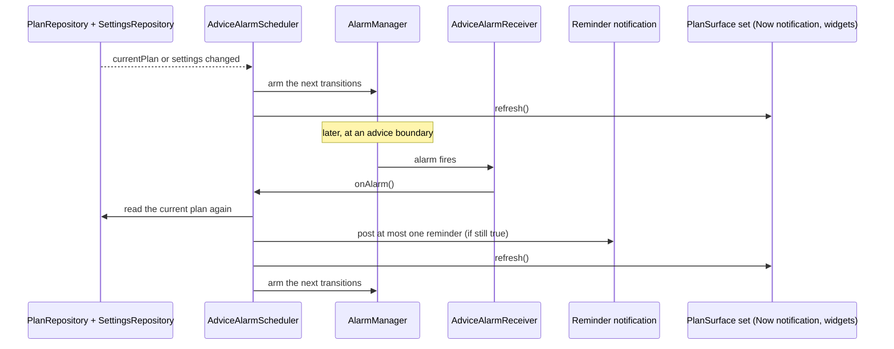
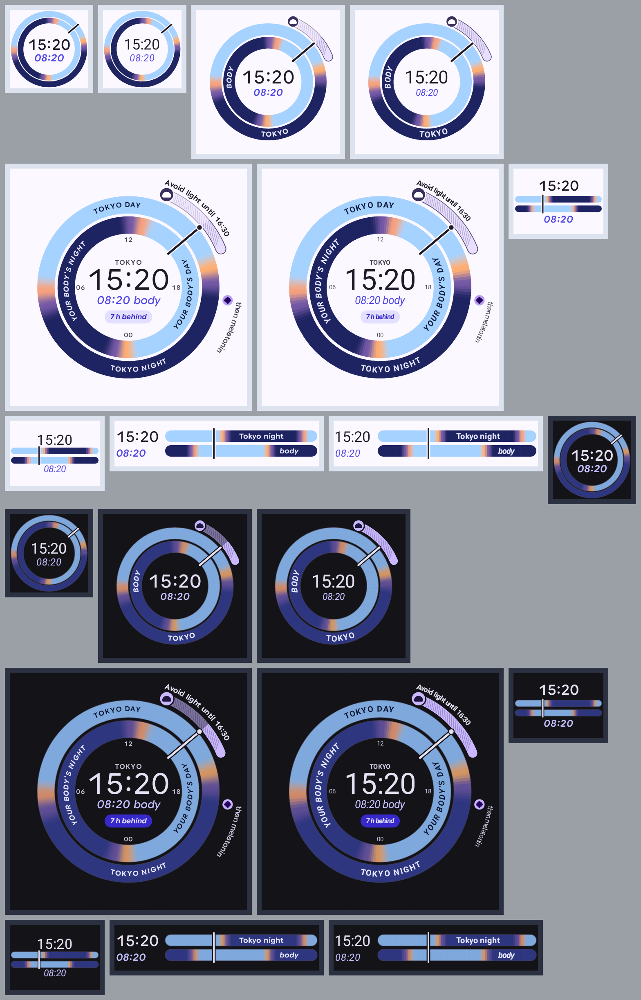
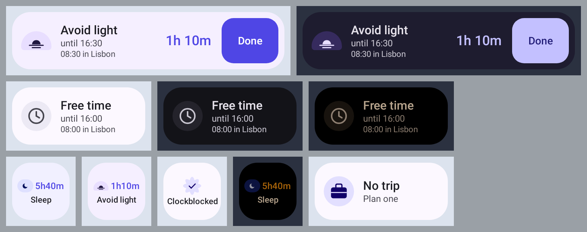
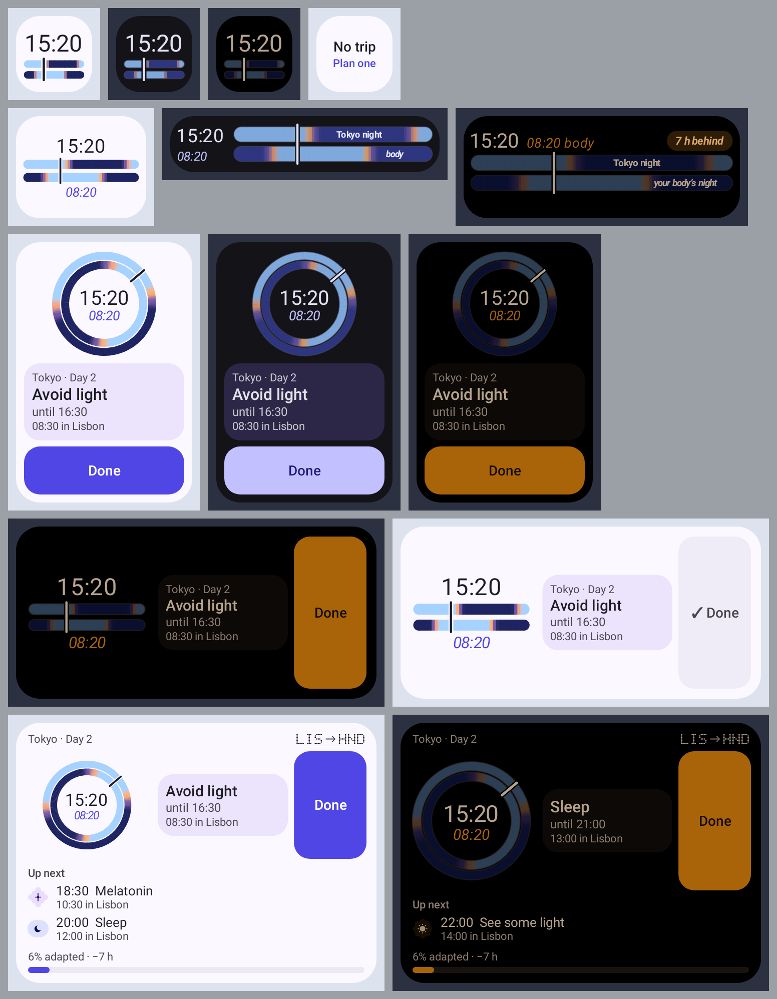
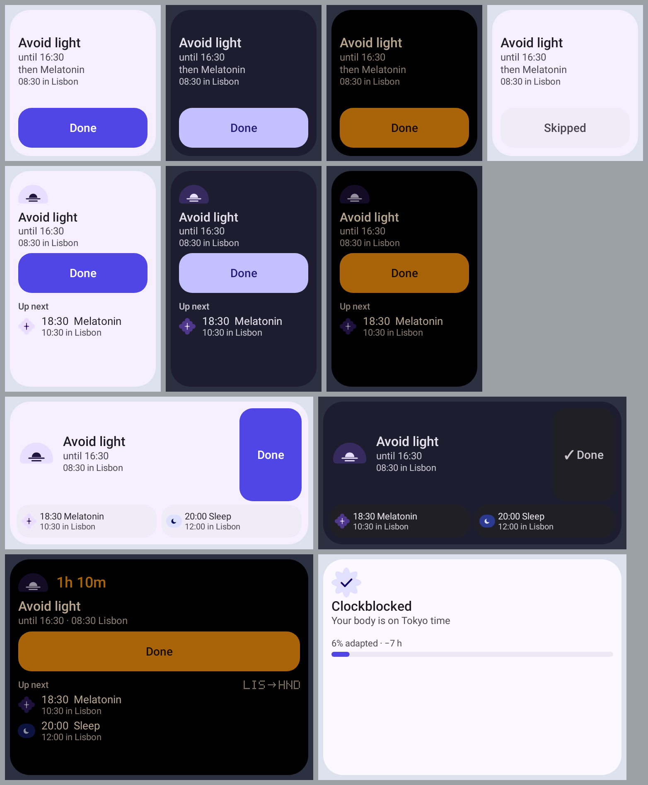
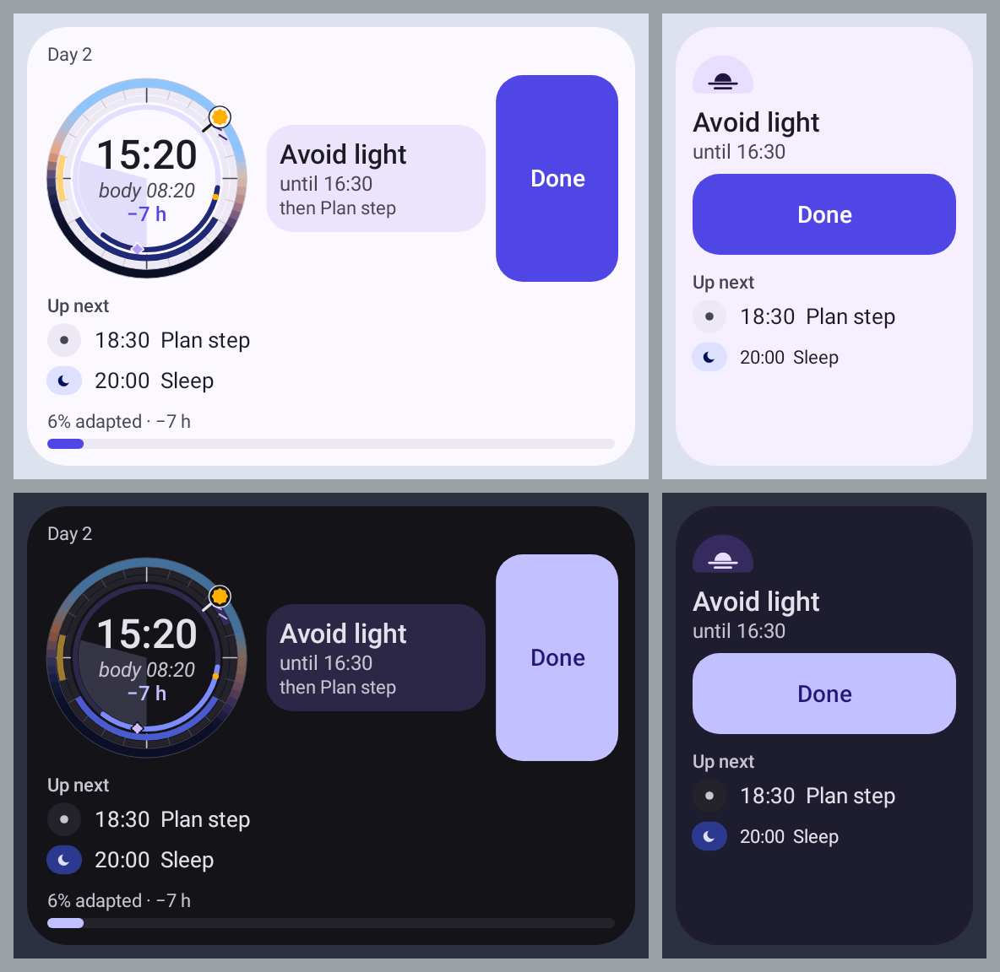
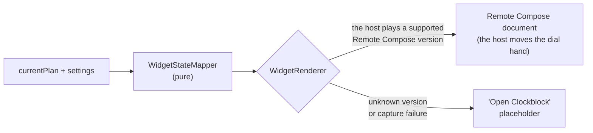

# Surfaces: notifications and widgets

Outside the app, the plan appears in three places: one ongoing "Now" notification, short reminders before advice
starts, and two home-screen widgets (*Two Clocks* and *Next up*). One scheduler controls all of them. It wakes up
at each advice boundary, reads the current plan, posts at most one reminder and redraws every surface from the
same plan at the same moment, so right after each refresh they all agree. Between
refreshes they can drift: a delayed scheduler wake-up (see [The scheduler](#the-scheduler)) leaves them behind
the app.

The code is in `:core:notifications` and `:widget`. The shared contract,
[`PlanSurface`](../core/data/src/main/kotlin/dev/sebastiano/clockblocker/opus/core/data/PlanSurface.kt), is in
`:core:data` and has one method: `suspend fun refresh()`.

## The scheduler

[`AdviceAlarmScheduler`](../core/notifications/src/main/kotlin/dev/sebastiano/clockblocker/opus/core/notifications/AdviceAlarmScheduler.kt)
starts from `ClockblockApplication`. It watches `currentPlan` and the settings. When either changes, it re-arms its
alarms and refreshes every surface.

In words: whenever the plan or the settings change, the scheduler arms alarms for the next few boundaries and
redraws the surfaces. When an alarm fires, the scheduler does not trust what it planned earlier. It reads the
current plan again, decides whether a reminder is still correct, redraws everything and arms the next alarms.

A few details matter:

- It arms the next 8 alarm times at most (each may carry several transitions), plus a pending snooze, a
  15-minute progress tick while a Live Update is showing, and (with reminders on) the next change of the Now
  notification's body-clock header.
- When the user allows exact alarms (`SCHEDULE_EXACT_ALARM`), it uses `setExactAndAllowWhileIdle`. Without that
  permission, it uses a 10-minute `setWindow`. That is not allow-while-idle, so in Doze the alarm can wait for the
  next maintenance window, well past 10 minutes.
- Reminders show absolute times ("until 16:30"), so a late alarm never shows something false.
  [`ReminderSelector`](../core/notifications/src/main/kotlin/dev/sebastiano/clockblocker/opus/core/notifications/schedule/ReminderSelector.kt)
  drops any reminder that is no longer true when it fires.

### Which boundaries get an alarm

[`TransitionPlanner`](../core/notifications/src/main/kotlin/dev/sebastiano/clockblocker/opus/core/notifications/schedule/TransitionPlanner.kt)
is a pure function that turns a plan into a list of transitions. All the timing rules are there, with unit
tests.

| Transition | When | Makes a sound? |
|---|---|---|
| Upcoming | The reminder lead time ("How early" in Settings, 15 minutes by default) before a window starts | Yes |
| Start | A window starts | No, surfaces switch silently |
| End | A window ends | No |
| WakeUp | A Sleep or Nap window ends | Yes |
| Moment | A one-off advice is due (melatonin) | Yes |
| Flight take-off or landing | The flight times | No, they refresh the surfaces silently (and drive the travel-day Live Update) |

The rules that protect sleep and keep things quiet:

- Nothing fires strictly inside a Sleep or Nap window. A window that starts while the user should be asleep gets
  no reminder. The sleeper is woken once, by the WakeUp transition.
- Optional naps ("Nap if you're tired") don't silence anything, because they can be skipped.
- With reminders turned off, only the silent transitions remain, so widgets still update.
- Duplicate advice and transitions at the same instant are merged into one alarm.
- Only one reminder is visible at a time. It reuses one notification id. If several reminders are due at once,
  the most important one leads and the others are listed on an extra line ("Also: …").

### What resets the schedule

The system clears alarms on reboot and the plan's meaning changes when the clock or zone changes.
`ScheduleResetReceiver` in
[`Receivers.kt`](../core/notifications/src/main/kotlin/dev/sebastiano/clockblocker/opus/core/notifications/receiver/Receivers.kt)
listens for these broadcasts and re-syncs everything:

| Broadcast | Why |
|---|---|
| `BOOT_COMPLETED` | Alarms don't survive a reboot |
| `TIMEZONE_CHANGED`, `TIME_SET` | The user landed, or the clock was corrected |
| `MY_PACKAGE_REPLACED` | The app was updated |
| `LOCALE_CHANGED` | Notification text and channel names must change language |
| `SCHEDULE_EXACT_ALARM_PERMISSION_STATE_CHANGED` | Switch between exact and windowed alarms |

## The Now notification

[`NowNotificationSurface`](../core/notifications/src/main/kotlin/dev/sebastiano/clockblocker/opus/core/notifications/NowNotificationSurface.kt)
shows one quiet, ongoing notification with what to do right now and until when. It replaces many separate
pings.

The notification is a `DecoratedCustomViewStyle` with our own content
([`NowNotificationViews`](../core/notifications/src/main/kotlin/dev/sebastiano/clockblocker/opus/core/notifications/NowNotificationViews.kt),
layouts `notif_now_collapsed` / `notif_now_expanded`). The system still draws the icon, the header with the
body clock, the expand button and the actions. Our part reads top to bottom:

| | Collapsed (48 dp) | Expanded |
|---|---|---|
| Glyph | — (the label needs the room at large font sizes) | The headline's glyph on its colour chip |
| Label and time | "See some light" … "until 19:00" | "See some light", then "until 19:00 · 11:00 Los Angeles" |
| Progress | A bar from the block's start to its end | Same |
| Alongside | — | "Also now: Avoid caffeine until Wed 02:00 · 18:00 Los Angeles", up to two blocks, each with its own end |
| Next | — | "Next: Avoid light at 23:30 · 15:30 Los Angeles" |
| Tip | — | The headline's tip, in italics |

"until" is always the headline's **own** end, the same time the app's Now card and the widgets show (#43).
Blocks that overlap it are never folded into that time: ones already running are listed under "Also now" with
their own end, and the one that starts next gets the "Next" line, even when it starts before the headline ends.
In a gap, the title is "Nothing right now" and the line says what's next; the expanded view shows a neutral clock
chip and neither view has a bar. The collapsed view shows local times only; in the expanded one every time
(until, also, next) is followed by the other zone as a short tail, kept on one line with no-break spaces.

Newer shades show the app icon where the small icon used to be, so in the shade the expanded chip is what names
the advice; the small icon (status bar, AOD) is still the advice glyph. Chips and bars use the design system's advice
colours, light and dark (copied into
[`NotificationPalette`](../core/notifications/src/main/kotlin/dev/sebastiano/clockblocker/opus/core/notifications/NotificationPalette.kt),
kept in step by `NotificationPaletteTest`), and the shade picks the pair for its theme. Text uses the shade's own
notification text appearances, so it follows dark mode and the font size. Every glyph sits next to its text
label and is hidden from TalkBack, which reads the labels; the bar is hidden too, since "until" says the same.

The bar only moves when the notification is rebuilt. Plan boundaries rebuild it anyway; in between, an inexact,
**non-wakeup** alarm (`AlarmManager.RTC`, every 5 minutes, `NotificationIntents.progressTick`) re-renders it. A
sleeping phone isn't woken for it: the alarm is delivered the next time the phone wakes up, so the bar (and an
"Also now" line that changed inside a sleep window) is current when you look. The tick is cancelled whenever the
Now notification is hidden, its channel is blocked in system settings, or it becomes the travel-day Live Update. There is no countdown or `setWhen` time: the
shade would show the device's zone, not the plan's, and a ticking chronometer is noise on a surface you see all
day.

The redacted lock-screen version uses the standard big-text template with the same text (headline, "until"
line, "Also now", "Next", tip) and the advice chip as its large icon.

It is hidden when reminders are off, notifications are blocked, no plan is in progress, or the user snoozed it.
[`NowState.kt`](../core/notifications/src/main/kotlin/dev/sebastiano/clockblocker/opus/core/notifications/now/NowState.kt)
picks the headline:

1. Sleep beats everything, then Nap, then "Nap if you're tired".
2. Otherwise, the active window with the highest priority (bright light comes before caffeine, and so on).
3. A flight is the headline only when nothing else is active.

Melatonin is never the headline. It gets its own reminder.

The Now notification has three actions: Done, "Can't do this" and "Snooze 15 min". It shows them only while the
headline isn't a flight and hasn't been answered yet. Once the headline has an outcome, it shows a single Undo
action instead, which clears that outcome (`AdviceLogRepository.clear`) and refreshes every surface, widgets
included. Reminders get a set of actions that depends on their kind (`NotificationFactory.reminder`):

| `ReminderKind` | Actions |
|---|---|
| `Upcoming`, `Snoozed` | "Can't do this", "Snooze 15 min" |
| `Moment` (melatonin) | Done, "Snooze 15 min" |
| `WakeUp` | none |

`AdviceActionReceiver` logs the action and refreshes the surfaces. Snoozing hides the Now notification for 15
minutes, then posts a `Snoozed` reminder, but only if the advice is still running then
(`ReminderSelector.snoozed` returns `null` once the block has ended; for melatonin, once its reminder window has
passed). The snooze state is kept in
[`SnoozeStore`](../core/notifications/src/main/kotlin/dev/sebastiano/clockblocker/opus/core/notifications/SnoozeStore.kt).

Every time in a notification (Now, the travel-day Live Update and its status chip, reminders) is in the plan's
local zone, never the device's: `JetLagPlan.localZoneAt` in
[`PlanZones.kt`](../core/circadian/src/main/kotlin/dev/sebastiano/clockblocker/opus/core/circadian/PlanZones.kt)
returns the zone of the plan day containing the instant. The travel day keeps the departure zone until the last
landing, then switches to the next day's zone, even after an evening arrival whose travel day runs to midnight.
Before the plan it returns the first day's zone, after it the last day's. The secondary-zone line uses `secondaryZoneFor`:
the destination, or home once local time is the destination's, left out when it has the same UTC offset right
now. The plan screen (`PlanMoment`, the rail) and the widgets (`WidgetStateMapper`) call the same two functions,
so all three surfaces agree on what "local" means even when the phone's zone is elsewhere. `NotificationClock`
has no zone on purpose.

The notification's subtext (the header line) shows the body-clock offset relative to that local zone, rounded to
the half hour: "Body 3½ h behind", "Body 2 h ahead", or "Body clock in sync" under 30 minutes. It shows the offset
rather than a body time of day, which would change every minute. The offset itself drifts along the plan's phase
trajectory, so the scheduler arms one extra alarm at the next instant the rounded reading changes
(`BodyClockHeader.nextChange`, scanned in 10-minute steps up to 36 hours ahead, with the local zone read at each
step, so moving to the next plan day's zone counts as a change) and re-renders the notification there ([`NotificationTextFormatter.bodyClock`](../core/notifications/src/main/kotlin/dev/sebastiano/clockblocker/opus/core/notifications/text/NotificationTextFormatter.kt)).

### Lock-screen redaction

Every Now notification and reminder carries a public version, built by the same formatter with `redact = true`:
no flight number, no route, no secondary-zone line, tips or "also", melatonin shown as "Plan step" with a neutral
icon, and moments as "Unlock to see details". Times and the kind of block stay. The public version has no
actions, because their set alone can name the advice (Done with Snooze is melatonin). It is always the plain
big-text template, never the custom views (they would carry the private text), with the advice chip as its large
icon. When the user turns on
`AppSettings.hideLockScreenDetails` ("Hide details on the lock screen"), the notification's visibility becomes
`VISIBILITY_PRIVATE`, so Android shows the public version on a secure lock screen whenever the user's system
setting hides sensitive content. With the setting off (the default), visibility stays public and the full text
shows, as before. While the setting is on, `AdviceAlarmScheduler` checks on every plan or settings emission (so
also on the first one after a restart) for a reminder on screen without a public version. Under the same lock as
reminder posts, `ReminderNotifier.redactShowing` rebuilds it redacted without alerting again, keeping its timeout.
A reminder left over from an earlier process is withdrawn instead, because what it said is no longer known.
Lock-screen widgets honour the same setting (see [Lock-screen widgets](#lock-screen-widgets)).

### Live Update on travel days

The Now notification becomes a Live Update during the travel day. It uses
`Notification.ProgressStyle`, with coloured segments for advice blocks and points for take-off and landing.
[`TravelPlanner.kt`](../core/notifications/src/main/kotlin/dev/sebastiano/clockblocker/opus/core/notifications/now/TravelPlanner.kt)
defines the travel window as 3 hours before the first departure to 2 hours after the last arrival.

Android's rules say a Live Update must be ongoing, started by the user and time-sensitive. So the app shows it
only inside the travel window and only while a real plan window is active, not just a flight marker. At other
times the normal ongoing notification is used. Both use the same notification id, so the change happens in
place.

Its subtext adds the route and the phase of the day before the body-clock offset:
"LHR → HND · Departs 11:30 · Body 8 h behind", then "Next flight HH:MM" between legs, "Lands HH:MM" in the air and
"Landed" after the last arrival (`NotificationTextFormatter.travelSubText`). Phases use absolute times, not
countdowns, because no refresh fires inside sleep windows to keep a countdown current. The route comes from the
trip's origin and destination codes (`TripRoute`, looked up through `TripRepository`) and is dropped from the
public version.

### Channels

Users can control each channel in Android settings. The channels are created in
[`NotificationChannels.kt`](../core/notifications/src/main/kotlin/dev/sebastiano/clockblocker/opus/core/notifications/NotificationChannels.kt).

| Group | Channel | Sound | Used for |
|---|---|---|---|
| Reminders | Light | Yes | When to seek bright light and when to avoid it |
| Reminders | Sleep & energy | Yes | Bedtime, naps, wake-ups and low-energy warnings |
| Reminders | Supplements & caffeine | Yes | Melatonin (only if turned on) and caffeine timing |
| Ongoing | Travel day (live) | No | The travel-day Live Update |
| Ongoing | Now | No | The ongoing Now notification |

## Widgets

The `:widget` module provides two widgets. Both can be placed on the home screen. Both declare the `keyguard`
category too, which matters on tablets and in hub mode. On phones, the lock-screen view of the plan is the Now
notification.

The *Two Clocks* widget draws the app's own dial from the shared spec
([design.md §A](design.md#a-two-skies-dial--hero-of-plan-screen-widget-celebration)): the *Two skies* dial in the
2×2, 2×3 and 4×3 layouts, and the *Two strips* in the 1×1, the 2×1 and 4×1 rows and the 2×2 landscape layout,
where a round dial would get too small to read. Both show local time on the outer sky (or the top strip) and the
body clock on the inner one, with the needle (or the now line) at local time. With no trip, every size says "No
trip" and "Plan one".

[`WidgetDial`](../widget/src/main/kotlin/dev/sebastiano/clockblocker/opus/widget/rc/WidgetDial.kt) lays the spec out
at capture time for the dial's region at the layout's minimum size, and
[`drawDialSpec`](../widget/src/main/kotlin/dev/sebastiano/clockblocker/opus/widget/rc/RemoteDialSpec.kt) replays it
into the Remote Compose canvas, scaled to the real size. The level of detail (glance, simple, full) follows that
region in dp, the same rule the app uses: most widget dials are glances (the two skies, the needle and both
times), and the wide rows are simple (with the bars' labels and the jet lag). The dial uses the widget's face
colour and the system font, since Remote Compose can't load the app's font. Text on the dial is never smaller than
7 dp: the AM/PM marker and the ring labels hold that size and the digits give way.

The launcher's clock keeps the dial live between captures: the needle turns (or the now line slides), and both
times are written from the launcher's clock. Labels that stepped aside for the needle stay put until the next
capture, at the next advice boundary. The wash over the part of the current block that has passed is left out,
since it can't follow the needle. The body ring is the simple one; the precise one becomes a per-widget option
in #52.

Remote Compose has a few gaps, and the widget falls back:

- No shaders from Kotlin: the sky gradients are drawn as short segments of constant colour.
- No letter spacing: tracked and curved text is set glyph by glyph (curved text turns per glyph rather than using
  `drawTextOnCircle`, which can't be checked on a real launcher yet).
- Four typeface styles only: weights round to regular or bold, so the body time is regular italic.

The *Next up* widget shows the current advice with a countdown. The 1×1 tile shows only the countdown and a
short label. When the plan has no advice left, it shows "Clockblocked".

### Sizes

Each widget picks a layout for the space it gets: the launcher picks from the size map and swaps layouts while the
user resizes. Every "Up next" entry shows its start time in the other zone too, like every other time on the
widgets. The table shows the layout on a typical portrait home screen.

| Cells | Two Clocks | Next up |
|---|---|---|
| 1×1 | Two strips with local time | Glyph, countdown and label |
| 2×1 | Two strips with local and body time | Glyph, label, "until" line and the other zone's time |
| 4×1 | Two strips with both times, the bars' labels and the jet lag | Row with the countdown, the other zone's time and Done |
| 2×2 | Two skies and a two-line caption | Countdown, label, "until / then", the other zone and Done |
| 4×2 | The 4×3 layout | The 4×1 row plus up to three "Up next" capsules |
| 2×3 | Two skies, a now card ("Tokyo · Day 2", label, times) and Done | The 2×2 stack plus two "Up next" rows, with the route |
| 4×3 | A header strip with the route, Two skies, the now card, Done, two "Up next" rows and the adaptation bar | The 2×3 stack, wider |

Landscape cells are wide and short. There, a 2×1 Next up is a short 4×1 row next to Done: the label, and the
"until" line with the other zone's time joined on ("until 4:30 PM · 11:30 PM SFO"). A 1×1 and a 2×1 Two Clocks
get the short, wide Two strips with the bars' labels. A 2×2 Two Clocks gets the Two strips, the now card and Done
side by side, and a 2×2 Next up gets the 4×2 capsules.

[`WidgetSizes`](../widget/src/main/kotlin/dev/sebastiano/clockblocker/opus/widget/rc/WidgetSizes.kt) lists every
layout with its minimum size in dp. The launcher plays the layout whose minimum is closest to the widget's size
among those that fit. A layout can have a short and a taller entry: the taller one has room for the "until" line or
a second "Up next" row.

| Layout | Next up minimums | Two Clocks minimums |
|---|---|---|
| 1×1 | 57×51 | 57×51 |
| 2×1 row | 117×80, 117×100 | 117×51, 117×84 |
| 4×1 row | 250×46, 250×84 | 250×51, 250×84 |
| 2×2 | 111×146 | 101×121 |
| Dial (or strips) and card side by side | 250×110 (capsules) | 269×108 |
| 2×3 | 111×240, 120×330, 250×240 | 123×248 |
| 4×3 | — | 269×220 |

The minimums sit at or below the cells of the Android docs' example device, so each common cell gets the layout
it was designed for. A portrait n×m cell is (73n − 16) × (118m − 16) dp; a landscape one is (142n − 15) × (66m − 15)
dp.

### Labels never clip

No label is cut off or ends in "…" at any size from 57×51 dp (a 1×1 cell) up, at font scales up to 1.3×. Both
widgets declare that size as their smallest (`minResizeWidth` / `minResizeHeight`), so a launcher can't shrink one
below it. The launcher can't measure text, so
[`LabelFit`](../widget/src/main/kotlin/dev/sebastiano/clockblocker/opus/widget/rc/LabelFit.kt) decides at capture
time what each layout shows, measuring the text the way the player draws it
([`TextFit`](../widget/src/main/kotlin/dev/sebastiano/clockblocker/opus/widget/text/TextFit.kt)). It fits each
layout at the smallest size the launcher can give it: its minimum less 1 dp, because the launcher rounds the
widget's size up before it compares. The launcher only ever stretches a layout, so text that fits there fits at
every larger size. The fit depends on the font scale, the display density and Bold text (which makes every glyph
wider, and which the captured text bakes in), so `WidgetUpdater` captures the widgets again when any of them
changes, as it does for a light/dark switch. Android sends no broadcast for these changes,
so if the app isn't running at the time, the next widget update or advice boundary re-renders every widget.

- Text shrinks down to a floor: 13 sp for the label, 11 sp for the "until" line, 10 sp for the other zone's time
  and for Done.
- The label and the "until" line take two lines where the height allows; the other zone's time stays on one. The
  offset ("−7 h") never splits across lines.
- What matters most: the label, then the local "until" line, then the other zone's time, then "then …". The
  label always shows, and local time is the primary one, so the "until" line stays as long as the label does.
- When text doesn't fit, parts go in this order:
  1. "then …";
  2. the other zone's place gets shorter: first the name up to the first "/", " - " or "(", then the airport code
     ("11:30 PM in YSQ");
  3. the other zone's time joins the "until" line: "until 4:30 PM · 11:30 PM SFO";
  4. the label shrinks;
  5. "Up next" rows, the last one first;
  6. the countdown, then the glyph or the now card's header;
  7. as a last resort the other zone's time drops to 9 sp and the label to 11 sp;
  8. the other zone's time, only at the tightest minimums at 1.3×: "Avoid light / until 4:30 PM". The "until" line
     may then drop to 9 sp too.
- Screen readers always hear everything: both times and the full place name.
- The 4×2 Next up shows only the capsules whose label fits whole: two at most font sizes. Like the rows, they go
  before the now row loses anything else.
- The 1×1 Next up shows only the label, never the other zone. Its label may shrink until it is 7 dp tall on
  screen (6 sp at 1.3×), so "Clockblocked" fits a 57 dp cell.

[`WidgetLabelFitTest`](../widget/src/test/kotlin/dev/sebastiano/clockblocker/opus/widget/rc/WidgetLabelFitTest.kt)
checks every label in every layout at that size, at 0.85×, 1× and 1.3×, with 12 h times, the four longest
city names in the bundled places list, and two longer fixed names that only fit when shortened. It runs at five densities, from mdpi to xxxhdpi, because text rounds to
whole pixels differently on each. It also checks that the "until" line never drops, that the other zone's time
drops only at 1.3×, that "Up next" never keeps a row the now block needs, and that each docs cell gets a layout no
larger than itself. The `remote_labels_*` goldens show every real label, and the `remote_minimums_*` goldens show
each layout at its minimum size with the longest texts.

The route ("LIS → HND") uses the same dot-matrix IATA codes as the app's trip cards
([`RouteStrip`](../widget/src/main/kotlin/dev/sebastiano/clockblocker/opus/widget/draw/RouteStrip.kt) draws the
designsystem's `DotMatrixFont` cells). It shows only where it has room without crowding the times: in the 4×3 Two
Clocks header strip, next to "Tokyo · Day 2", and at the end of the "Up next" title on the 2×3 and 4×3 Next up.
Screen readers read the codes letter by letter.

Places are named after the trip, so the header and the other-zone times match the route. An SFO trip reads "San
Francisco · Day 2", not "Los Angeles" (the city of its `America/Los_Angeles` zone).
`WidgetStateMapper.placeNames` takes each zone's city from the trip's airports, and the trip's origin and
destination win over a connection in the same zone. A zone the trip doesn't name, or a trip that can't be read,
falls back to the zone's city.

What a screen reader hears matches what the widget shows:

- The current block includes its end time in the other zone: "Avoid light. until 16:30 (08:30 in Lisbon) · then
  Melatonin". Two Clocks says this after both clocks and the jet lag phrase.
- Next up adds the live countdown in words, worked out by the launcher like the visible one:
  "1 hour 10 minutes left".
- Two Clocks layouts with a now card (2×3, 4×2) start with its header ("Tokyo · Day 2"). The 4×3 header strip is
  its own tap target, so its place, day and route ("L I S to H N D") reach the screen reader.
  [`RemoteSemanticsTest`](../widget/src/test/kotlin/dev/sebastiano/clockblocker/opus/widget/RemoteSemanticsTest.kt)
  plays the documents in the View player and reads back its accessibility nodes.

### Lock-screen widgets

When "Hide details on the lock screen" (`AppSettings.hideLockScreenDetails`) is on, a widget placed on the lock
screen (host category `WIDGET_CATEGORY_KEYGUARD`) shows the redacted plan, like the notification's public version:
no route, no city or other-zone times, melatonin shown as "Plan step" with a neutral glyph, and no melatonin
marks on the dial. The header keeps only the plan day ("Day 2"), and the adapted state says "Your body is on
local time". Times and the kind of block stay. Home-screen widgets keep every detail.
[`WidgetUpdater`](../widget/src/main/kotlin/dev/sebastiano/clockblocker/opus/widget/WidgetUpdater.kt) decides per
widget id from the host category (a bit mask, so keyguard may come with other bits), and
`WidgetStateMapper.redact` strips the state. If the settings can't be read in time, lock-screen widgets stay
redacted. The scheduler refreshes every `PlanSurface` when settings change, so flipping the setting re-renders
widgets straight away.

### Done

The larger layouts have a Done button (48 dp tall) for the current advice. It sends the same broadcast as the
notification's Done action
([`NotificationIntents.widgetDone`](../core/notifications/src/main/kotlin/dev/sebastiano/clockblocker/opus/core/notifications/NotificationIntents.kt)),
so the advice log, notifications and widgets all update the same way. Once something is logged for that advice,
the button turns into a chip in the same spot: "✓ Done", or "Skipped" for skipped and can't-do. Tapping the chip
opens the plan, like the rest of the widget, so that spot never ignores a tap. Free time, flights and the empty state
have no Done button.

The button and the rest of the widget are separate tap targets that don't overlap, so each tap has one target. The
button is a second host action in the Remote Compose document.

### Themes

Widgets follow the app's theme setting (light, dark or system). When "Night-safe automatically" is on and the
current advice is avoid light or sleep, they switch to night-safe: true black, dim amber text and buttons, no
tinted cards, and dimmed advice colours and sky.

### How widgets render

In words: [`WidgetUpdater`](../widget/src/main/kotlin/dev/sebastiano/clockblocker/opus/widget/WidgetUpdater.kt)
reads the plan and settings.
[`WidgetStateMapper`](../widget/src/main/kotlin/dev/sebastiano/clockblocker/opus/widget/state/WidgetStateMapper.kt)
turns them into plain widget state, with no Android code, so it is easy to test.
[`WidgetRenderer`](../widget/src/main/kotlin/dev/sebastiano/clockblocker/opus/widget/WidgetRenderer.kt) then
captures a Remote Compose document for each size and wraps it in `RemoteViews.DrawInstructions`. The launcher
plays the document and animates the dial hand and the countdown itself, without waking the app. Remote Compose is
the only renderer: every Android version the app supports (Android 17 and later) has the platform player.

If the launcher reports a document version the app can't write, or a capture fails, the widget shows a single
"Open Clockblock" tile that opens the app. This placeholder is also the providers' initial layout, which the
launcher shows until the first update arrives.

Other widget behaviour:

- Widgets refresh when the scheduler refreshes `PlanSurface`s, and also on their own system broadcasts (update,
  resize, time set, zone change, locale change). `updatePeriodMillis` is 0: there is no polling.
- Tapping a widget opens the plan through a deep link. In the empty state, it opens the trip editor.
- The widget picker shows generated previews built from a demo plan
  ([`DemoPlans.kt`](../widget/src/main/kotlin/dev/sebastiano/clockblocker/opus/widget/preview/DemoPlans.kt)).
  They are published again when the app version, the system night mode, the font scale, Bold text or the display
  density changes, so the picker matches the current theme and its labels are fitted for the current text size.

Settings can also pin a widget directly: its Widgets card calls the `WidgetPinning` interface in `:core:data`
(`isSupported()`, `requestPin(PinnableWidget)`), which `:app` implements with
`AppWidgetManager.requestPinAppWidget` against the two providers, so `:feature:settings` never depends on
`:widget`. The card is hidden when the launcher can't pin.

The widget goldens are in [`widget/src/test/screenshots`](../widget/src/test/screenshots). The images on this page
are copies of them.

## Permissions

Onboarding asks for notifications and exact timing ("Reminders that actually arrive"). Settings shows the current
state under "What Android allows": a one-line summary that expands to a row per permission, each with a button to
fix it. The summary starts (and re-opens) expanded whenever `NotificationPermissionState.isReliable` is false;
Live Updates and battery optimisation are optional extras and never force it open. Everything still works
without them, with fewer or less punctual reminders.

| Permission | Why | Who controls it | Without it |
|---|---|---|---|
| `POST_NOTIFICATIONS` | Reminders and the Now notification | The user, at runtime | No notifications; widgets still work |
| `SCHEDULE_EXACT_ALARM` | Reminders on the minute | The user, in "Alarms & reminders" | Reminders use a 10-minute window, and Doze can defer them further |
| `POST_PROMOTED_NOTIFICATIONS` | The travel-day Live Update | Granted at install; the user can turn Live Updates off | A normal ongoing notification |
| `RECEIVE_BOOT_COMPLETED` | Re-arm alarms after a reboot | Granted at install | (always available) |

Settings also shows whether the app is exempt from battery optimisation, because some devices delay alarms for
optimised apps. The app has no `INTERNET` permission.
