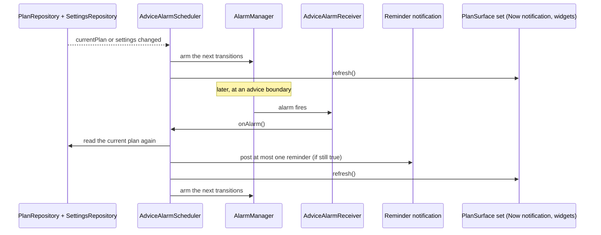
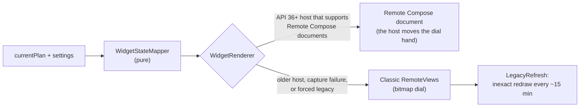

# Surfaces: notifications and widgets

Outside the app, the plan appears in three places: one ongoing "Now" notification, short reminders before advice
starts, and two home-screen widgets (*Two Clocks* and *Next up*). One scheduler controls all of them. It wakes up
at each advice boundary, reads the current plan, posts at most one reminder and redraws every surface. Because
all surfaces read the same plan at the same moment, they never disagree with each other or with the app.

The code is in `:core:notifications` and `:widget`. The shared contract,
[`PlanSurface`](../core/data/src/main/kotlin/dev/sebastiano/clockblocker/opus/core/data/PlanSurface.kt), is in
`:core:data` and has one method: `suspend fun refresh()`.

## The scheduler

[`AdviceAlarmScheduler`](../core/notifications/src/main/kotlin/dev/sebastiano/clockblocker/opus/core/notifications/AdviceAlarmScheduler.kt)
starts from `OpusApplication`. It watches `currentPlan` and the settings. When either changes, it re-arms its
alarms and refreshes every surface.

In words: whenever the plan or the settings change, the scheduler arms alarms for the next few boundaries and
redraws the surfaces. When an alarm fires, the scheduler does not trust what it planned earlier. It reads the
current plan again, decides whether a reminder is still correct, redraws everything and arms the next alarms.

A few details matter:

- It keeps at most 8 plan transitions armed at a time, plus a pending snooze and a 15-minute progress tick while
  a Live Update is showing.
- When the user allows exact alarms (`SCHEDULE_EXACT_ALARM`), it uses `setExactAndAllowWhileIdle`. Without that
  permission, it uses a 10-minute `setWindow`, which is a little less punctual.
- Reminders show absolute times ("until 16:30"), so a late alarm never shows something false.
  [`ReminderSelector`](../core/notifications/src/main/kotlin/dev/sebastiano/clockblocker/opus/core/notifications/schedule/ReminderSelector.kt)
  drops any reminder that is no longer true when it fires.

### Which boundaries get an alarm

[`TransitionPlanner`](../core/notifications/src/main/kotlin/dev/sebastiano/clockblocker/opus/core/notifications/schedule/TransitionPlanner.kt)
is a pure function that turns a plan into a list of transitions. All the timing rules are there, with unit
tests.

| Transition | When | Makes a sound? |
|---|---|---|
| Upcoming | The reminder lead time ("How early" in Settings, 15 minutes by default) before a window starts | Yes |
| Start | A window starts | No, surfaces switch silently |
| End | A window ends | No |
| WakeUp | A Sleep or Nap window ends | Yes |
| Moment | A one-off advice is due (melatonin) | Yes |
| Flight take-off or landing | The flight times | No, it only drives the travel-day Live Update |

The rules that protect sleep and keep things quiet:

- Nothing fires strictly inside a Sleep or Nap window. A window that starts while the user should be asleep gets
  no reminder. The sleeper is woken once, by the WakeUp transition.
- Optional naps ("Nap if you're tired") don't silence anything, because they can be skipped.
- With reminders turned off, only the silent transitions remain, so widgets still update.
- Duplicate advice and transitions at the same instant are merged into one alarm.
- Only one reminder is visible at a time. It reuses one notification id. If several reminders are due at once,
  the most important one leads and the others are listed as "also starting".

### What resets the schedule

The system clears alarms on reboot and the plan's meaning changes when the clock or zone changes.
`ScheduleResetReceiver` in
[`Receivers.kt`](../core/notifications/src/main/kotlin/dev/sebastiano/clockblocker/opus/core/notifications/receiver/Receivers.kt)
listens for these broadcasts and re-syncs everything:

| Broadcast | Why |
|---|---|
| `BOOT_COMPLETED` | Alarms don't survive a reboot |
| `TIMEZONE_CHANGED`, `TIME_SET` | The user landed, or the clock was corrected |
| `MY_PACKAGE_REPLACED` | The app was updated |
| `LOCALE_CHANGED` | Notification text and channel names must change language |
| `SCHEDULE_EXACT_ALARM_PERMISSION_STATE_CHANGED` | Switch between exact and windowed alarms |

## The Now notification

[`NowNotificationSurface`](../core/notifications/src/main/kotlin/dev/sebastiano/clockblocker/opus/core/notifications/NowNotificationSurface.kt)
shows one quiet, ongoing notification with what to do right now and until when. It replaces many separate
pings.

The screenshot shows the app's notifications grouped in the shade. The second line is the Now notification: the
current advice, when it ends and what comes next. The first line is the test reminder from Settings.

It is hidden when reminders are off, notifications are blocked, no plan is in progress, or the user snoozed it.
[`NowState.kt`](../core/notifications/src/main/kotlin/dev/sebastiano/clockblocker/opus/core/notifications/now/NowState.kt)
picks the headline:

1. Sleep beats everything, then Nap, then "Nap if you're tired".
2. Otherwise, the active window with the highest priority (bright light comes before caffeine, and so on).
3. A flight is the headline only when nothing else is active.

Melatonin is never the headline. It gets its own reminder.

The Now notification has three actions: Done, "Can't do this" and "Snooze 15 min". It shows them only while the
headline isn't a flight and hasn't been answered yet. Reminders get a set of actions that depends on their kind
(`NotificationFactory.reminder`):

| `ReminderKind` | Actions |
|---|---|
| `Upcoming`, `Snoozed` | "Can't do this", "Snooze 15 min" |
| `Moment` (melatonin) | Done, "Snooze 15 min" |
| `WakeUp` | none |

`AdviceActionReceiver` logs the action and refreshes the surfaces. Snoozing hides the Now notification for 15
minutes, then reminds the user again. The snooze state is kept in
[`SnoozeStore`](../core/notifications/src/main/kotlin/dev/sebastiano/clockblocker/opus/core/notifications/SnoozeStore.kt).

### Live Update on travel days

On Android 16 (API 36) and later, the Now notification becomes a Live Update during the travel day. It uses
`Notification.ProgressStyle`, with coloured segments for advice blocks and points for take-off and landing.
[`TravelPlanner.kt`](../core/notifications/src/main/kotlin/dev/sebastiano/clockblocker/opus/core/notifications/now/TravelPlanner.kt)
defines the travel window as 3 hours before the first departure to 2 hours after the last arrival.

Android's rules say a Live Update must be ongoing, started by the user and time-sensitive. So the app shows it
only inside the travel window and only while a real plan window is active, not just a flight marker. At other
times the normal ongoing notification is used. Both use the same notification id, so the change happens in
place.

### Channels

Users can control each channel in Android settings. The channels are created in
[`NotificationChannels.kt`](../core/notifications/src/main/kotlin/dev/sebastiano/clockblocker/opus/core/notifications/NotificationChannels.kt).

| Group | Channel | Sound | Used for |
|---|---|---|---|
| Reminders | Light | Yes | When to seek bright light and when to avoid it |
| Reminders | Sleep & energy | Yes | Bedtime, naps, wake-ups and low-energy warnings |
| Reminders | Supplements & caffeine | Yes | Melatonin (only if turned on) and caffeine timing |
| Ongoing | Travel day (live) | No | The travel-day Live Update |
| Ongoing | Now | No | The ongoing Now notification |

## Widgets

The `:widget` module provides two widgets. Both can be placed on the home screen. Both declare the `keyguard`
category too, which matters on tablets and in hub mode. On phones, the lock-screen view of the plan is the Now
notification.

The *Two Clocks* widget shows local time and the body clock on one dial ("body 08:20, −7 h"), with the current
advice and when it ends. The wider size adds what comes next and the time in the other zone. With no trip, it
shows "No trip" and "Plan one".

The *Next up* widget shows the current advice with a countdown. The smallest size shows only the countdown and a
short label. When the plan has no advice left, it shows "Clockblocked".

### How widgets render

In words: [`WidgetUpdater`](../widget/src/main/kotlin/dev/sebastiano/clockblocker/opus/widget/WidgetUpdater.kt)
reads the plan and settings.
[`WidgetStateMapper`](../widget/src/main/kotlin/dev/sebastiano/clockblocker/opus/widget/state/WidgetStateMapper.kt)
turns them into plain widget state, with no Android code, so it is easy to test.
[`WidgetRenderer`](../widget/src/main/kotlin/dev/sebastiano/clockblocker/opus/widget/WidgetRenderer.kt) then
picks a backend. On API 36+ hosts that support Remote Compose, it sends a Remote Compose document, and the host
animates the dial hand itself. Otherwise it falls back to classic `RemoteViews` with a bitmap dial.
[`LegacyRefresh`](../widget/src/main/kotlin/dev/sebastiano/clockblocker/opus/widget/legacy/LegacyRefresh.kt)
redraws that bitmap about every 15 minutes with an inexact alarm that doesn't wake the device.

The fallback looks almost the same. The countdown is a system `Chronometer` instead of a drawn number.

Other widget behaviour:

- Widgets refresh when the scheduler refreshes `PlanSurface`s, and also on their own system broadcasts (update,
  resize, time set, zone change, locale change). `updatePeriodMillis` is 0: there is no polling.
- Tapping a widget opens the plan through a deep link. In the empty state, it opens the trip editor.
- Widgets follow the app's theme setting. When "Night-safe automatically" is on and the plan says to avoid light
  or sleep, they turn dark.
- On API 35 and later, the widget picker shows generated previews built from a demo plan
  ([`DemoPlans.kt`](../widget/src/main/kotlin/dev/sebastiano/clockblocker/opus/widget/preview/DemoPlans.kt)).

The widget goldens are in [`widget/src/test/screenshots`](../widget/src/test/screenshots). The images on this page
are copies of them.

## Permissions

Onboarding asks for notifications and exact timing ("Reminders that actually arrive"). Settings shows the current
state under "What Android allows", with a button to fix each one. Everything still works without them, with
fewer or less punctual reminders.

| Permission | Why | Who controls it | Without it |
|---|---|---|---|
| `POST_NOTIFICATIONS` | Reminders and the Now notification | The user, at runtime | No notifications; widgets still work |
| `SCHEDULE_EXACT_ALARM` | Reminders on the minute | The user, in "Alarms & reminders" | Reminders arrive within a 10-minute window |
| `POST_PROMOTED_NOTIFICATIONS` | The travel-day Live Update | Granted at install; the user can turn Live Updates off | A normal ongoing notification |
| `RECEIVE_BOOT_COMPLETED` | Re-arm alarms after a reboot | Granted at install | (always available) |

Settings also shows whether the app is exempt from battery optimisation, because some devices delay alarms for
optimised apps. The app has no `INTERNET` permission.
