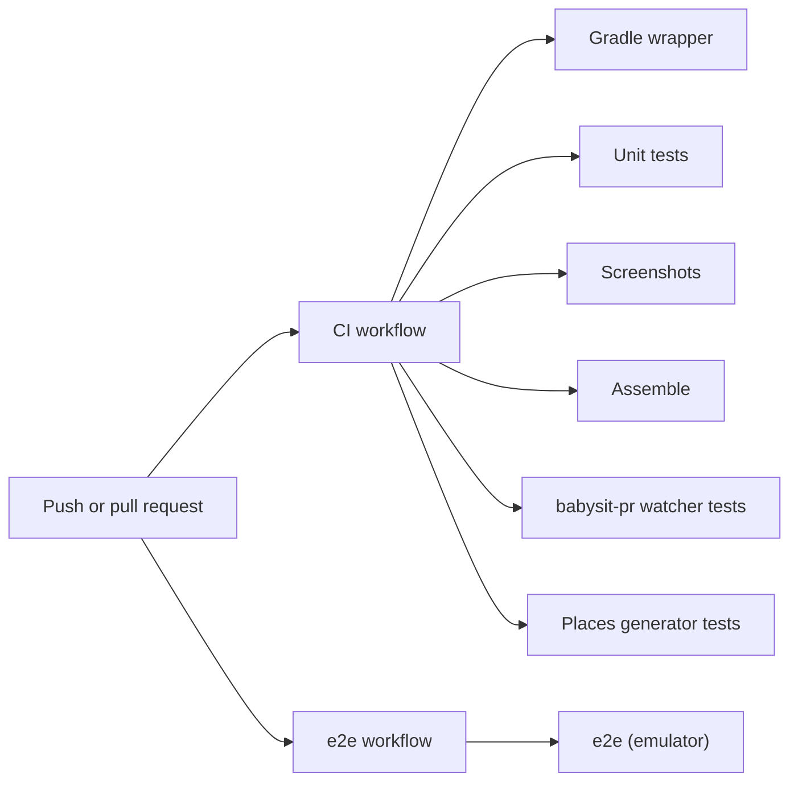
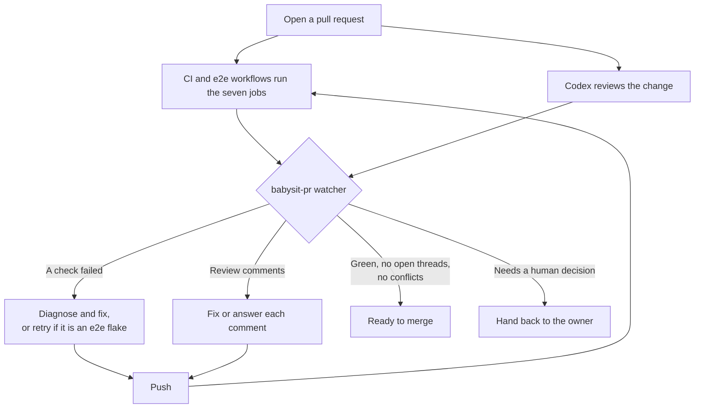

# Testing and CI

The project is built test-first. There are about 1,100 JVM tests (plain JUnit and Robolectric), 193 committed
screenshot goldens and 22 end-to-end tests that run on an emulator. Every pull request runs them in GitHub
Actions, and Codex reviews the change.

This page explains what each kind of test covers, how to run it, and how a pull request gets from "opened" to
"ready to merge".

## Test layers

| Layer | Framework | Runs on | Command |
|---|---|---|---|
| Pure logic: planner, models, mappers, schedulers | JUnit 6 Jupiter, Kotest assertions, kotest-property | JVM | `./gradlew test` |
| Android and Compose: UI tests, ViewModels, repositories | JUnit 4 on Robolectric (run through the Vintage engine) | JVM | `./gradlew test` |
| Screenshots | Roborazzi on Robolectric | JVM | `./gradlew verifyRoborazziDebug` |
| End to end | Compose test and UiAutomator 2.4 | Emulator or device | `./gradlew :app:connectedDebugAndroidTest` |

The screenshot tests are JUnit 4 tests too, so they also run in `./gradlew test`, without comparing images.
`verifyRoborazziDebug` runs the same tests and fails when an image differs from its golden.

### Tests per module

| Module | JVM tests | Screenshot goldens |
|---|---|---|
| `:app` | 90 | 12 |
| `:core:circadian` | 76 | 0 |
| `:core:data` | 190 | 0 |
| `:core:designsystem` | 289 | 79 |
| `:core:model` | 29 | 0 |
| `:core:notifications` | 201 | 9 |
| `:feature:onboarding` | 91 | 35 |
| `:feature:plan` | 188 | 31 |
| `:feature:settings` | 81 | 30 |
| `:feature:trips` | 97 | 25 |
| `:widget` | 154 | 21 |
| **Total** | **1486** | **242** |

The counts come from the JUnit reports of a full `./gradlew test` run at the time of writing. They will grow.

## Conventions

These rules come from [AGENTS.md](../AGENTS.md) and [CONTRIBUTING.md](../CONTRIBUTING.md).

- Write the failing test first, then the code.
- Pure logic uses JUnit Jupiter (`org.junit.jupiter.api.Test`) with Kotest matchers (`io.kotest.matchers.*`).
  Where an invariant exists, add a property test with `kotest-property`.
- Android and Compose tests use JUnit 4 with `@RunWith(RobolectricTestRunner::class)`,
  `@GraphicsMode(GraphicsMode.Mode.NATIVE)` and `@Config(sdk = [37])`, the app's minSdk.
- ViewModel tests use
  [`MainDispatcherRule`](../core/testing/src/main/kotlin/dev/sebastiano/clockblocker/opus/core/testing/MainDispatcherRule.kt)
  from `:core:testing` and Turbine for flows. `:core:testing` also has fakes such as
  [`FakeJetLagPlanner`](../core/testing/src/main/kotlin/dev/sebastiano/clockblocker/opus/core/testing/FakeJetLagPlanner.kt).
- Unit tests run with `user.timezone=UTC`, so a test never depends on the machine's zone. Tests that need a zone
  set it explicitly.
- Test forks run in parallel, using half the CPU cores.

## Screenshot tests

Screenshot tests call `compose.captureRoboImageInvalidated(...)` from `:core:testing` and write to
`<module>/src/test/screenshots/`. The helper redraws every view before it captures: Robolectric 4.17 at SDK 37 often
skips drawing a fresh Compose view, which records a blank golden. The goldens are committed,
so a pull request shows every pixel it changes. The base class in `:core:designsystem`,
[`ScreenshotTest`](../core/designsystem/src/test/kotlin/dev/sebastiano/clockblocker/opus/core/designsystem/ScreenshotTest.kt),
can render a component in light or dark, in Night-safe or Opus mode, at a custom font scale, and on the 12-hour
or 24-hour clock. Goldens render with reduced motion on. This makes them stable, and it also proves that every
component has a readable still state when animations are off (see [MOTION.md](../MOTION.md)).

```sh
./gradlew :feature:plan:verifyRoborazziDebug   # compare one module with its goldens
./gradlew :feature:plan:recordRoborazziDebug   # re-record after an intended UI change
./gradlew verifyRoborazziDebug                 # compare every module
```

When a comparison fails, Roborazzi writes comparison images that show the old image, the new image and the
difference under `<module>/build/outputs/roborazzi/`. CI uploads that folder as the `screenshot-diffs` artefact.

## End-to-end tests

The e2e tests are in [`app/src/androidTest`](../app/src/androidTest/kotlin/dev/sebastiano/clockblocker/opus/e2e).
They drive the real app, with real DataStore files and real notifications.

| Test class | Tests | What it covers |
|---|---|---|
| `SmokeTest` | 2 | The app starts on the right first screen, and shows the navigation after onboarding |
| `FirstRunTest` | 2 | All onboarding steps, finished without the permission prompt ("Maybe later", or "Finish" when notifications are already allowed); skipping ahead and stepping back |
| `NotificationsTest` | 2 | "Allow and finish" grants notifications through the system dialog; the test reminder appears in the shade and opens the plan |
| `TripsTest` | 3 | Creating a trip with the pickers and fixing a validation error; the demo trip; Done on the Now card logs the outcome |
| `EditorConfigChangesTest` | 1 | The trip editor keeps its input across rotation and a large font |
| `PlanInteractionsTest` | 2 | A timeline block opens the Why sheet and the toolbar jumps back to now; calendar export opens the file picker |
| `DeepLinkTest` | 5 | Every `clockblock://` link, including one sent to an already running app |
| `WidgetTest` | 2 | *Two clocks* shows the active trip and opens its plan; *Next up* with no trips opens the trip editor |
| `SettingsTest` | 3 | Dark theme repaints the app; replaying setup returns to Settings; one hidden extra |

[`ClockblockE2eTest`](../app/src/androidTest/kotlin/dev/sebastiano/clockblocker/opus/e2e/ClockblockE2eTest.kt) is the base
class. It provides a Compose test rule and a UiAutomator `UiDevice`. Tests check which screen is showing through
the navigation shell's route tags (for example `route_now`).

Each test starts from a clean state without restarting the process.
[`AppDataReset`](../app/src/androidTest/kotlin/dev/sebastiano/clockblocker/opus/e2e/AppDataReset.kt) does this
because `pm clear` would also kill the test instrumentation. It closes every activity, resets each repository's
DataStore to its default document through the `AppGraph`, clears all SharedPreferences files and cancels all
notifications. Runtime permissions stay granted between tests.

```sh
./gradlew :app:connectedDebugAndroidTest   # needs a running emulator or a connected device
```

## CI

There are two workflows. `.github/workflows/ci.yml` (CI) has six jobs, and `.github/workflows/e2e.yml` (e2e)
has the emulator job. Both run on every pull request, on every push to `main`, and on demand. A new push to a pull request
cancels the run that is still in progress. The emulator job has its own workflow so the babysit-pr watcher, which
retries failed workflows by name, can rerun an emulator flake automatically without rerunning the rest of CI.



All seven jobs run in parallel. Each one reports its own check on the pull request.

| Job | Workflow | What it runs | Artefacts |
|---|---|---|---|
| Gradle wrapper | CI | Validates `gradle-wrapper.jar` against the official checksums | none |
| Unit tests | CI | `./gradlew test --continue` | `unit-test-reports`, on failure |
| Screenshots | CI | `./gradlew verifyRoborazziDebug --continue` | `screenshot-diffs`, on failure |
| Assemble | CI | `./gradlew :app:assembleDebug :app:assembleRelease :app:assembleDebugAndroidTest` | The debug APK (`clockblock-debug`), kept 14 days |
| babysit-pr watcher tests | CI | Python 3.12 `unittest` over `.agents/skills/babysit-pr/scripts` | none |
| Places generator tests | CI | Python 3.12 `unittest` over `tools/places`: the city-name rules and the committed `places.tsv` | none |
| e2e (emulator) | e2e | `./gradlew :app:connectedDebugAndroidTest` on an API 37 Google APIs x86_64 emulator (Pixel 7 profile, animations off, KVM) | `e2e-reports`, always |

Every Gradle job sets up JDK 21 and the Android SDK through the local composite action
`.github/actions/setup-android-build`. It installs `platforms;android-37.1`, the build tools and the platform tools
with the runner's own `sdkmanager`.

The Screenshots job runs on macOS, unlike the others, which run on Linux. The goldens are recorded on macOS. On
Linux, the hatched arcs on the plan dial anti-alias slightly differently, which is enough to fail a pixel-exact
comparison. A shared runner OS keeps the comparison exact, so a one-glyph regression still fails.

## Pull requests and review

All changes reach `main` through pull requests. Before you push, run the same local gate that the PR tooling
expects:

```sh
./gradlew test :app:assembleDebug verifyRoborazziDebug
```



In words: CI and Codex both start when a pull request opens. A watcher script then follows the pull request. It
reports failed checks and new review comments, and someone (a person or a coding agent) fixes them and pushes
again. The loop ends when the pull request is ready, or when it needs the owner to decide.

The watcher is part of the babysit-pr skill (v2.2.1), vendored in `.agents/skills/babysit-pr/` from
[rock3r/babysit-pr-skill](https://github.com/rock3r/babysit-pr-skill). Its `SKILL.md` explains how to use it. The
project settings are in its `config.json`:

| Setting | Value | Meaning |
|---|---|---|
| `local_gate` | `./gradlew test :app:assembleDebug verifyRoborazziDebug` | Run this before every push |
| `required_checks` | Gradle wrapper, Unit tests, Screenshots, Assemble, babysit-pr watcher tests | These must pass before the PR counts as ready |
| `retry_eligible_workflow_keywords` | `e2e` | A failed run of the e2e workflow may be retried without a diagnosis, because emulators can be flaky. Any other failure needs a diagnosis first. |
| `review_bot_login_keywords` | `codex` | Comments from the Codex bot count as review items |
| `codex.required` | `false` | If Codex hasn't started a review 10 minutes after the checks finish, the PR doesn't wait for it |

```sh
python3 .agents/skills/babysit-pr/scripts/gh_pr_watch.py --pr auto --once      # wait until something needs attention
python3 .agents/skills/babysit-pr/scripts/gh_pr_watch.py --pr auto --snapshot  # current state, no waiting
```

The watcher needs an authenticated `gh` CLI. Don't edit the vendored skill by hand. Update it with its `sync.py`
script (the source is recorded in `.agents/skills/babysit-pr/VERSION`).
