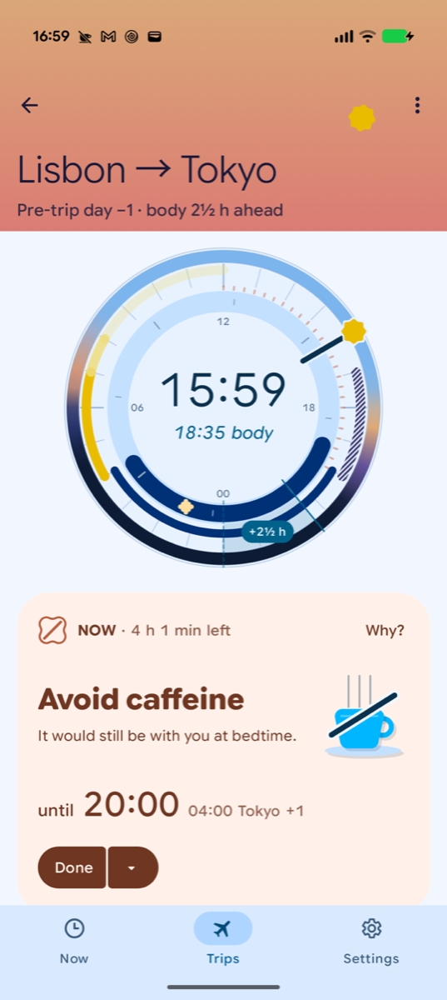
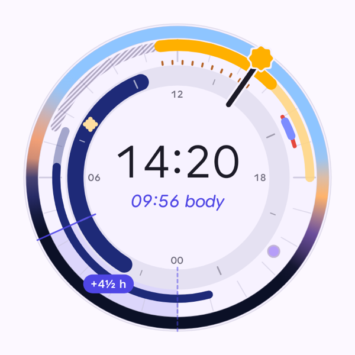
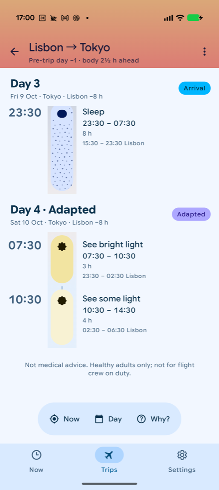
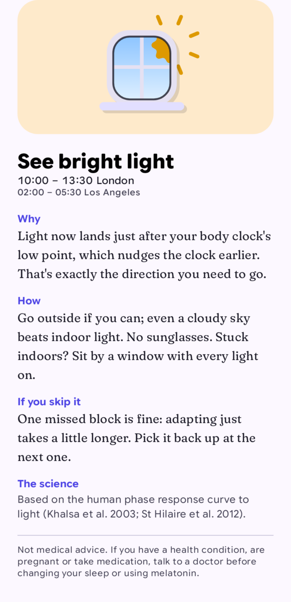
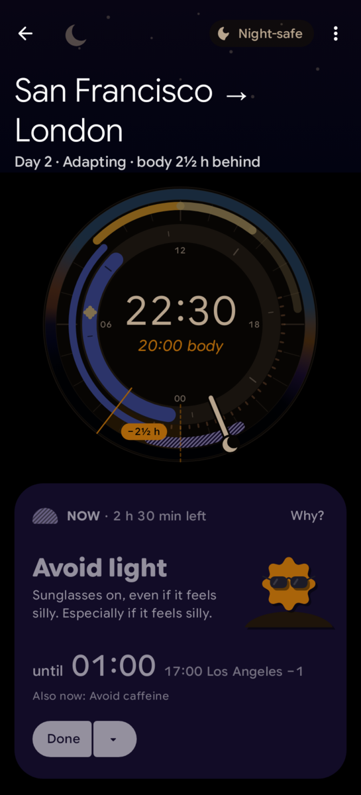
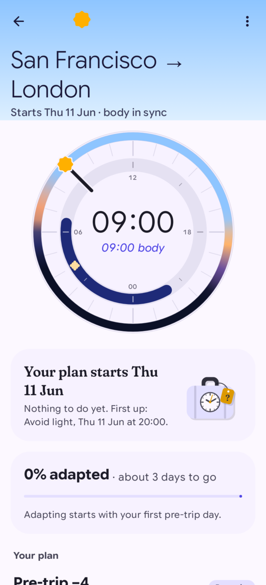
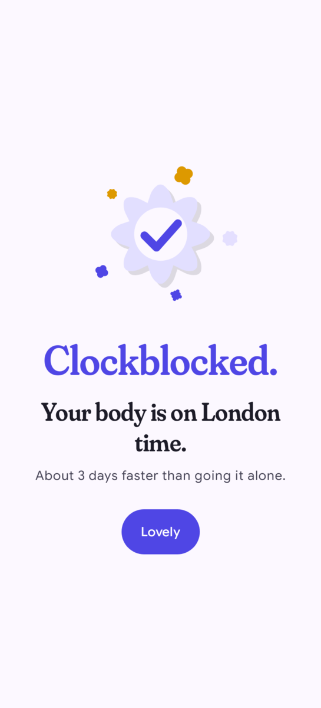

# Following your plan

Your plan is a list of short blocks: see light, avoid light, sleep, nap, coffee or no coffee. The plan screen
always shows what to do now, until when, and what comes next. You don't need to understand the science to follow
it. If you want to know why a block is there, tap **Why?**.

## Opening the plan

- The **Now** tab shows the plan for the trip that matters right now: the one in progress, or else the next one.
- On the **Trips** tab, tap any trip card to open its plan.

On a tablet or a wide screen, the trips list and the plan appear side by side.

## The plan screen

From top to bottom:

1. **The header** shows the trip, the day of the plan and how far off your body clock is, for example "Day 2 ·
   Adapting · body 3½ h behind" or "Pre-trip day −1 · body 2½ h ahead".
2. **The dial** compares two clocks (see below).
3. **The Now card** says what to do right now.
4. **Up next** shows the following block.
5. **Your plan** is the full timeline, day by day.

### The dial

The big number in the middle is the local time. The smaller italic time under it ("09:56 body") is the time your
body clock thinks it is. The badge shows the gap between them: "−8 h" means your body is 8 hours behind local
time, "+4½ h" means it is 4½ hours ahead. The arcs around the edge show the blocks of your plan.

To look ahead, drag the clock hand around the dial. The Now card changes to show what you'd be doing "At 18:30",
for example. Let go and the hand returns to now. You can also tap the centre to return. With TalkBack, the dial
offers the actions **Next block**, **Previous block** and **Back to now**.

### The Now card

The card shows:

- "NOW" and how much time is left in the block.
- What to do, in large text (for example **Sleep** or **Avoid caffeine**), and a short tip.
- When it ends: "until 15:00", with the same moment in your other time zone next to it ("07:00 Los Angeles").
- Other blocks that are also active, such as "Also now: Avoid caffeine".

When you've done it, tap **Done**. The small arrow next to Done offers **Skipped**, **Can't do this** and
**Snooze 15 min**. After Done, Skipped or Can't do this, a message appears at the bottom with **Undo**. Snooze
has no Undo: reminders stay quiet for 15 minutes, then this one comes back if its block is still going.

### The timeline

The timeline lists every day of the plan: pre-trip days, the travel day, the days after you land, and the day you're
adapted. Each block shows its local time and, underneath, the time at the other end of the trip. Earlier days are folded away; tap **Show N
earlier days** to see them. Tap any block to read why it's there.

The toolbar at the bottom jumps to **Now**, lets you pick any day of the plan (**Day**), or opens **Why?** for the
current block.

## Why is this in my plan?

Tap **Why?** on the Now card, or tap a block in the timeline. The sheet that opens has four parts:

- **Why**: what this block does for your body clock.
- **How**: practical tips.
- **If you skip it**: what happens if you miss it. Usually, one missed block is fine.
- **The science**: the research it's based on.

## What the blocks mean

Every block has a text label, so you never have to guess from an icon.

| Label | What to do |
|---|---|
| See bright light | Get outside if you can. Even a cloudy sky beats indoor light. A window seat counts. |
| See some light | Stay out of the dark. Lights on, no sunglasses. |
| Avoid light | Sunglasses on, or stay somewhere dim. |
| Sleep | Cool, dark and quiet. If sleep won't come, just stay in the dark. |
| Nap | Keep it short and set an alarm. |
| Nap if you're tired | Only if you need it. Twenty minutes is plenty. |
| Caffeine OK | Coffee or tea can help now. Little and often beats one big cup. |
| Avoid caffeine | It would still be in your body at bedtime. |
| Take melatonin | Only if you turned melatonin on. No driving afterwards. |
| Peak fatigue | Your body's low point. Take extra care, especially when driving. |
| Flight | Follow the light and sleep blocks on board. |

## When you miss something

Life happens. Tap **Skipped** or **Can't do this** and carry on with the next block. The plan doesn't change when
you skip a block: missing one block just makes adapting take a little longer.

If your flights change, edit the trip (or use [I'm delayed](planning-a-trip.md#when-your-flight-is-delayed)). The
plan is rebuilt around the new times.

## Night-safe

Looking at a bright phone screen can undo an "Avoid light" block. So when your plan says to avoid light or sleep,
or during your body's night when no light is planned, the plan screen turns dark and dim and shows a
**Night-safe** chip. You can turn this off in Settings ("Night-safe automatically").

## Other things you may see

Instead of a Now card, the plan sometimes shows a message. The picture shows a plan that starts in a few days.

| Message | What it means |
|---|---|
| Your plan starts … | The plan hasn't started yet. It shows the first block and how long adapting should take. |
| Free time | Nothing to do right now. Live your life. |
| Short trip: staying on home time | You're back before your body could settle, so the plan keeps your body on home time. |
| No jet lag expected | Home and destination keep nearly the same hours. Keep your usual sleep and get some morning daylight. |
| Trip complete | The plan is over. It shows how many blocks you did, skipped or couldn't do. |

### Clockblocked

When your body clock has caught up with your destination, the app tells you, once. It also estimates how much
time the plan saved you.

## The plan menu

The three-dot menu at the top of the plan has:

- **Edit trip**
- **Create return trip**
- **Export to calendar**: saves the plan as a calendar file that you can open in your calendar app.
- **Share summary**: shares a short text summary of the plan.

Next: [Widgets and notifications](widgets-and-notifications.md).
