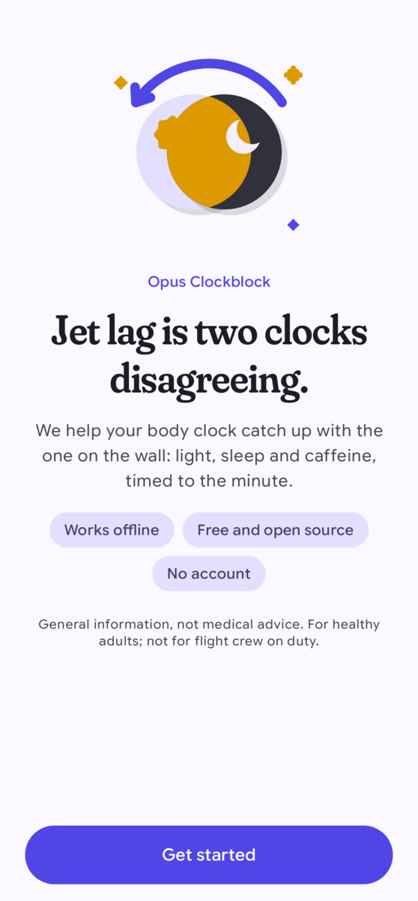
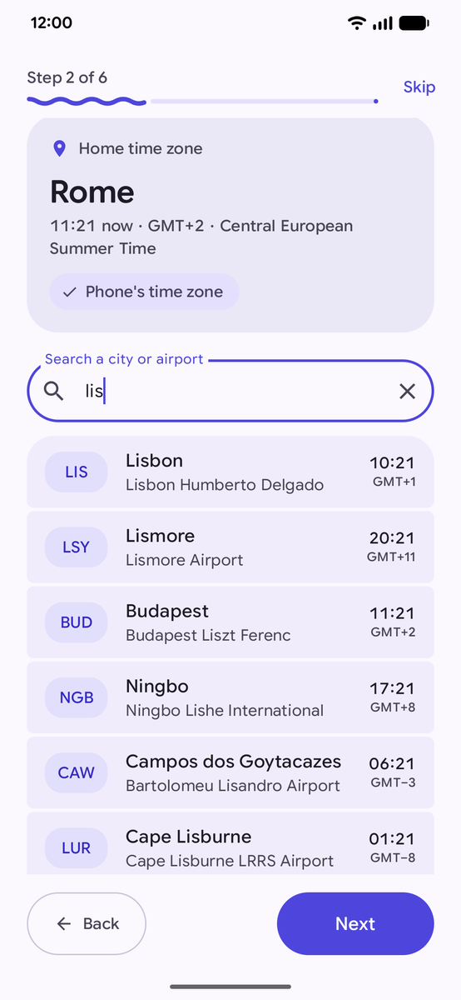
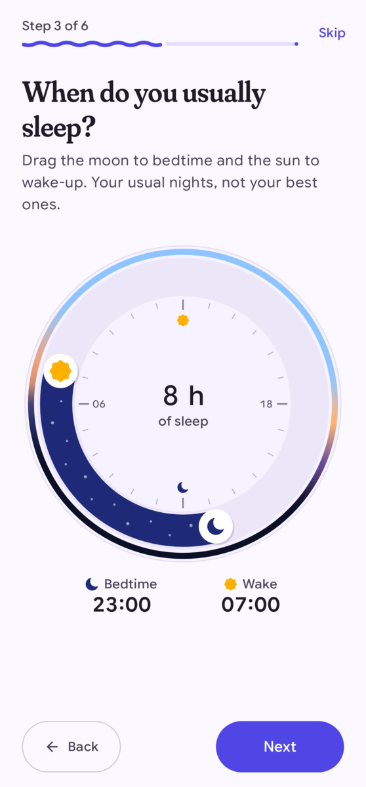
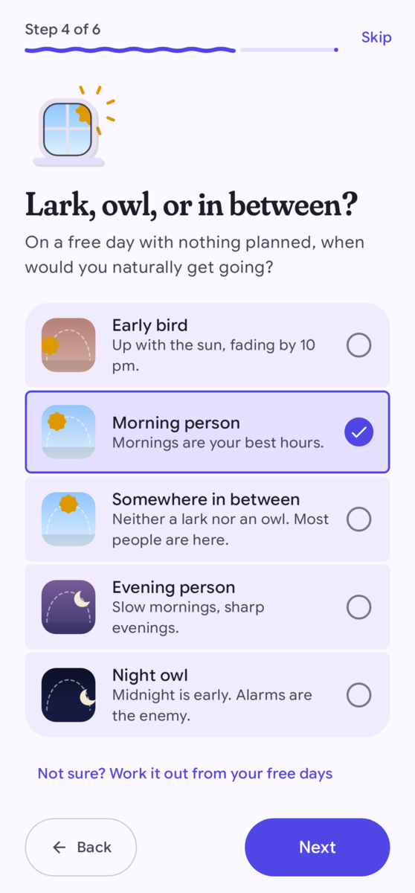
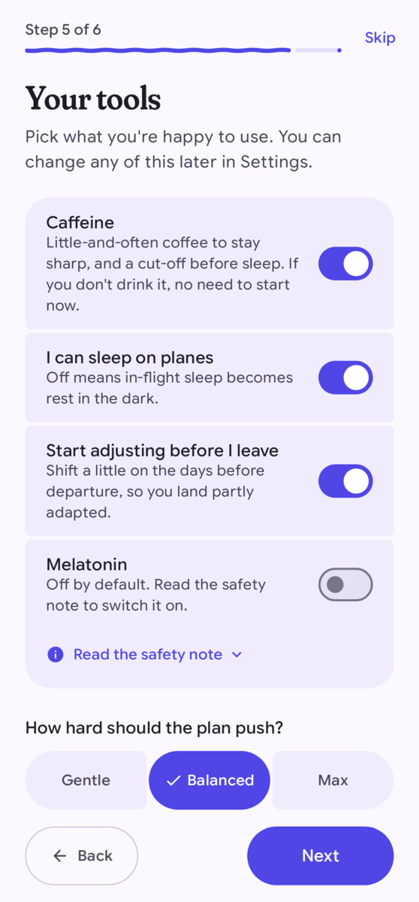
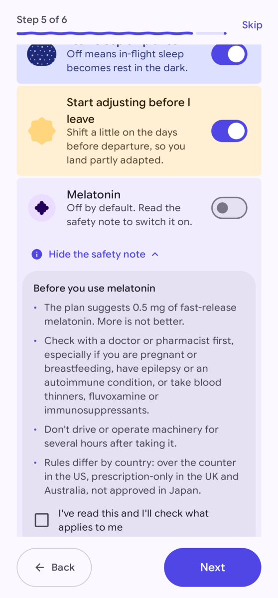
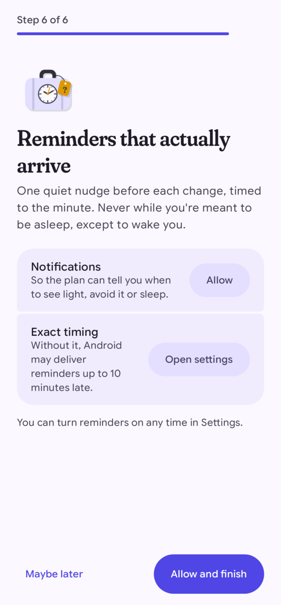

# Getting started

The first time you open Opus Clockblock, it asks six short questions. Your answers set where your body clock
starts and how hard the plan pushes. It takes about two minutes, and you can change every answer later in
Settings.

## What you need

- An Android phone or tablet with Android 10 or later.
- No account and no internet connection. The app works the same in flight mode.

Opus Clockblock isn't in an app store yet. To install it, build it from the source code (see the
[project README](../README.md#build-and-test)).

## The six setup steps

Each step shows "Step N of 6" at the top. Use **Back** to go to the previous step. **Skip** keeps the default
answers for the remaining questions and jumps to the last step.

### 1. Welcome

The first screen explains the idea: jet lag is two clocks disagreeing, the one on the wall and the one in your
body. Tap **Get started**.

### 2. Where's home?

Every plan starts from your home clock. The app picks your phone's time zone and marks it "Phone's time zone". If
your body lives somewhere else (for example, you're already travelling), search for a city or a three-letter
airport code and pick the right place.

### 3. When do you usually sleep?

Drag the moon to your usual bedtime and the sun to your usual wake-up time. Use your normal nights, not your best
ones. The app uses this to estimate where your body clock is today.

### 4. Lark, owl, or in between?

Choose the option that matches you on a free day with nothing planned: Early bird, Morning person, Somewhere in
between, Evening person or Night owl. If you're not sure, tap **Not sure? Work it out from your free days**.
The app asks when you fall asleep and wake up with no alarm, and suggests an answer.

### 5. Your tools

Pick what you're happy to use:

| Switch | What it changes |
|---|---|
| Caffeine | Suggests little-and-often coffee to stay sharp, and a cut-off before sleep. If you don't drink coffee, turn it off. |
| I can sleep on planes | When off, sleep on the plane becomes "rest in the dark" instead. |
| Start adjusting before I leave | Shifts your clock a little on the days before departure, so you land partly adapted. |
| Melatonin | Off by default. See below. |

Then choose how hard the plan should push:

- **Gentle**: smaller daily shifts and fewer early starts. It takes a little longer.
- **Balanced**: the pace the research supports. A good default for most trips.
- **Max**: every useful light window, so you adapt as fast as the science allows.

#### Melatonin

Melatonin suggestions stay off until you read the safety note and tick **I've read this and I'll check what
applies to me**. The plan only suggests a small dose (0.5 mg of fast-release melatonin), and only to shift your
clock earlier. Melatonin is a medicine in many countries. Check with a doctor or pharmacist first.

### 6. Reminders that actually arrive

The app can remind you just before each change in your plan. It never sends a reminder while you're meant to be
asleep, except the one that wakes you.

- **Notifications** lets the app show reminders at all.
- **Exact timing** lets reminders arrive on the minute. Without it, Android may deliver them up to 10 minutes
  late.

Tap **Allow and finish**, or **Maybe later** if you want to decide later. You can turn reminders on any time in
Settings.

## What's next

After setup, the app opens the Trips screen. [Plan your first trip](planning-a-trip.md), or tap **Try a demo
trip** to explore with an example.
