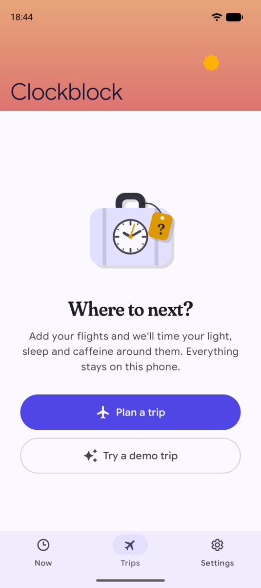
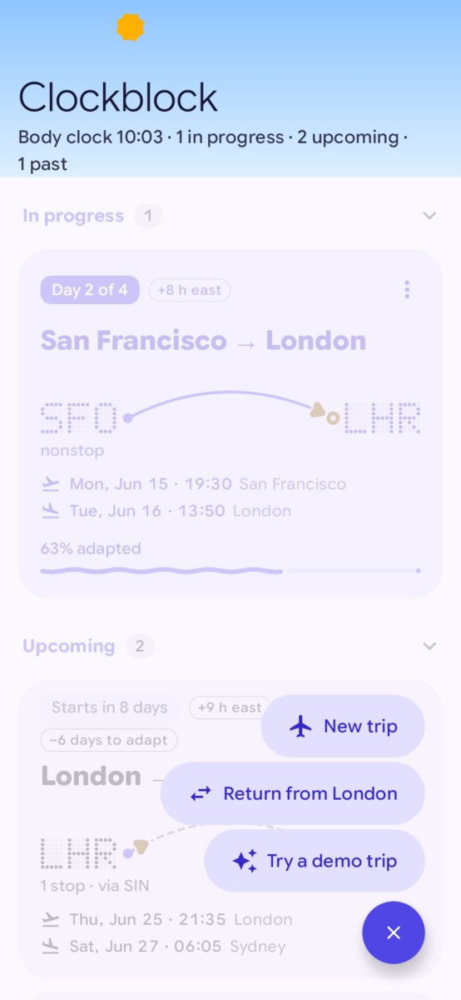
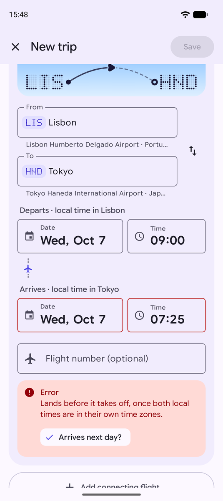
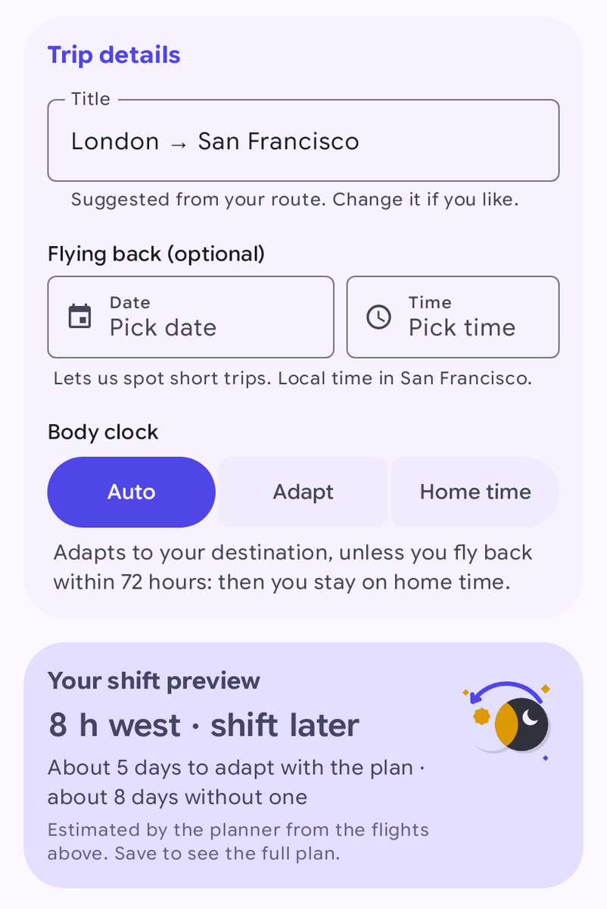
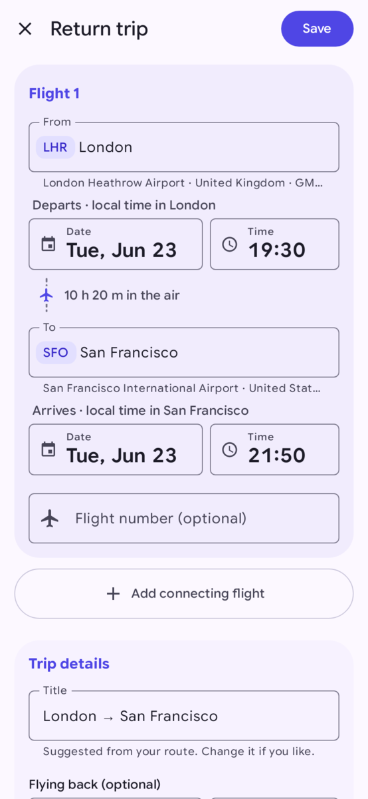
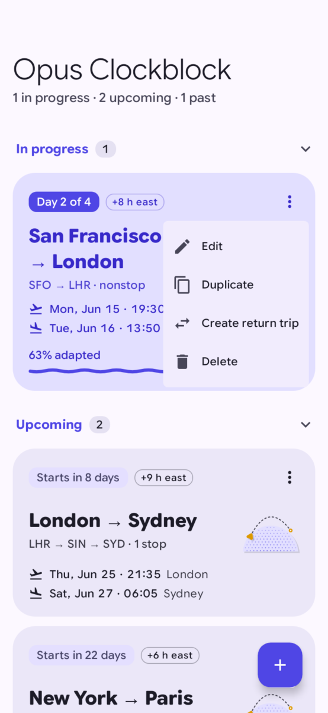
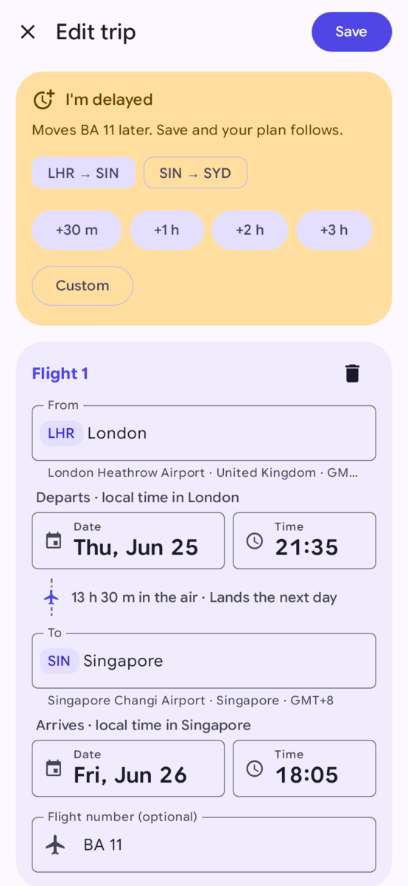

# Planning a trip

A trip is one or more flights. Add the flights with their local departure and arrival times, and the app builds
a plan straight away. You can change the trip at any time, and the plan follows.

## The Trips screen

With no trips, the screen says "Where to next?". Tap **Plan a trip** to add your own, or **Try a demo trip** to
see an example plan for a flight from San Francisco to London a few days from now.

Once you have trips, they're grouped as **In progress**, **Upcoming** and **Past**. Each card shows the airport
codes with the route drawn as an arc between them, the flight times, any stops ("1 stop · via SIN"), how many hours
the time changes ("+8 h east"), and either the day of the plan ("Day 2 of 4") or when it starts ("Starts in 8
days"). Upcoming trips also say about how many days the plan needs to adapt you ("~5 days to adapt"). Trips in
progress show how far your body clock has adapted, and while you're in the air the plane on the arc shows how far
along the flight is.

During a trip, the sky behind the screen title follows your body clock, and the subtitle shows your body clock
time.

To add another trip, tap the **+** button. It offers **New trip**, **Return from** the destination of the trip
you're on (or the last one you took), and **Try a demo trip**. On short windows, such as a phone in landscape, the
**+** button sits in the top bar instead, so it never covers a trip card.

## Adding flights

1. Under **From**, type a city, an airport name or a three-letter code (for example LIS) and pick the airport.
   The search works offline. Before you type, the list offers a few popular airports. Each result shows the
   country's flag, the airport's current local time (with a sun or moon for day or night) and its UTC offset.
2. Do the same under **To**. Picked the airports the wrong way round? Tap the swap button next to them.
3. Set the departure date and time. Use the **local time at the departure airport**, as printed on your ticket.
   The label reminds you: "Departs · local time in Lisbon".
4. Check the arrival date and time, in the **local time at the arrival airport**. Once both airports and the
   departure are set, the app fills in an estimate from the flight distance, marked "Estimated from the flight
   distance". Change it to the time on your ticket. Once you've set the arrival yourself, the app leaves it alone.
5. Add the flight number if you like. It's optional and only used as a label.
6. If you change planes, tap **Add connecting flight** and repeat for each flight.
7. Tap **Save**.

The app works out the time difference and the flight duration for you, including daylight-saving changes.

When the flights are complete, **Your shift preview** under the trip details shows what the plan will do: how
many hours you shift and in which direction, and about how many days it takes to adapt with the plan compared
with no plan. It updates as you edit. Save to see the full plan.

If you stay at a stop for three days or more, the plan treats that stop as a destination of its own and adapts
you to it before the next flight.

### When something looks wrong

The editor checks your flights as you type. Problems are marked **Error** (you can't save until you fix it),
**Check this** (probably a mistake) or **Note** (just information). Many come with a one-tap fix. For example, an
overnight flight entered with the same arrival date shows "Lands before it takes off" and offers **Arrives next
day?**.

## Trip details

Below the flights, **Trip details** has three more settings:

- **Title**: suggested from your route. Change it if you like.
- **Flying back (optional)**: the date and time of your return flight. This lets the app spot short trips.
- **Body clock**: how the plan treats your body clock.

| Choice | What happens |
|---|---|
| Auto | Adapts you to your destination, unless you fly back within 72 hours. Then you stay on home time. |
| Adapt | Moves your body clock to destination time, even for a short stay. |
| Home time | Keeps your body clock on the time of your first departure airport. Best for quick trips. |

In the plan, "home time" means the time zone of the trip's first departure airport, not the home time zone in
Settings. For a trip that starts where you live, they're the same.

If every time zone change on the trip is under two hours, Auto and Adapt don't make a body clock plan: you only
get flight advice and a few nights of sleep times.

For a short trip, staying on home time is usually easier: you're back before your body could settle anyway.

## Return trips

To plan the way home, open the trip's menu (the three dots on its card) and choose **Create return trip**, or tap
**+** and **Return from** the destination. The app reverses the route and suggests times. Check them against your
ticket before you save.

## Changing a trip

Tap a trip card to open its plan. (With TalkBack, "Open plan" is also offered as an action on the card.) The
three-dot menu on the card has:

- **Edit**: change flights, times or trip details.
- **Duplicate**: copy the trip, for example for a similar trip later.
- **Create return trip**
- **Delete**: removes the trip. Tap **Undo** in the message at the bottom if you change your mind.

## When your flight is delayed

From 48 hours before departure until you land, the **Edit trip** screen shows an **I'm delayed** card.

1. Pick the flight that's late (on a trip with connections, each flight has its own chip).
2. Tap how late it is: **+30 m**, **+1 h**, **+2 h**, **+3 h**, or **Custom** to type the minutes.
3. Tap **Save**.

The flight moves later, and the plan is rebuilt around the new times.

Next: [Following your plan](following-your-plan.md).
