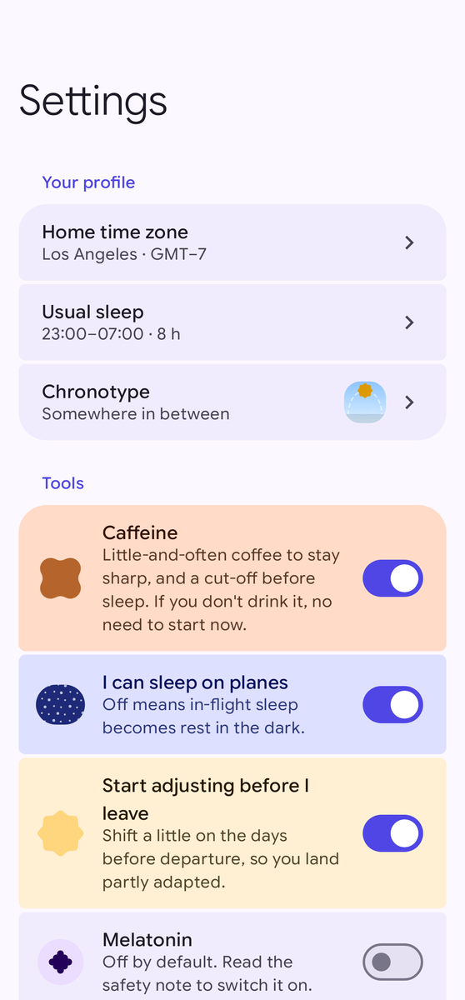
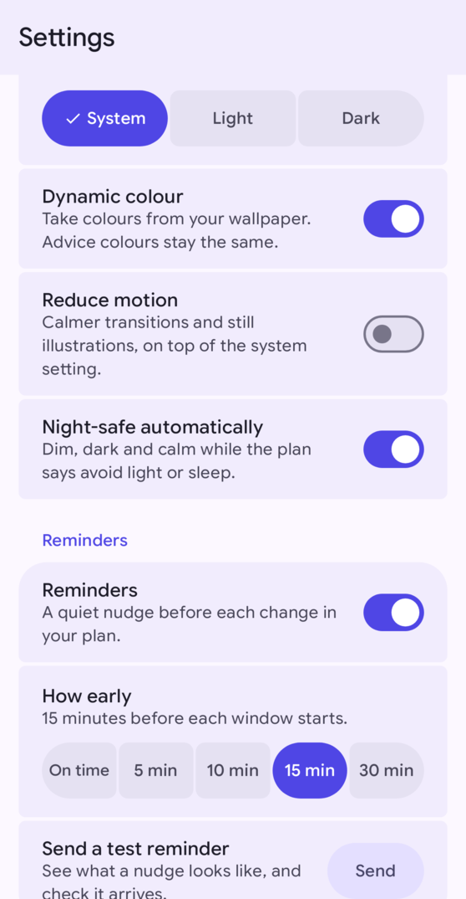
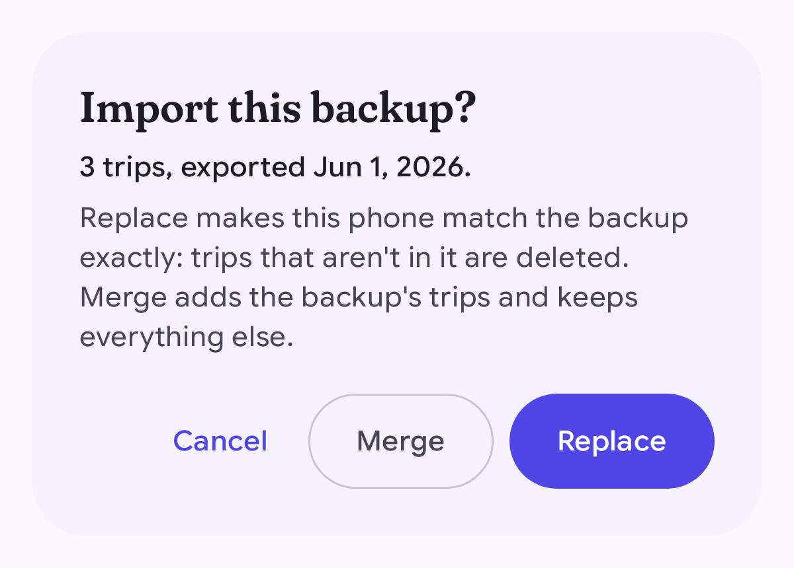

# Settings and your data

Open **Settings** from the navigation bar. Every answer from setup can be
changed here, and any change updates your plans straight away. This page also explains where your data lives and
how to back it up.

## Your profile and tools

| Setting | What it does |
|---|---|
| Home time zone | Where home is. Search for a city or airport. Plans don't use it yet: they start from the trip's first departure airport. |
| Usual sleep | Your normal bedtime and wake-up time. |
| Chronotype | Lark, owl or in between. |
| Tools | Caffeine, sleeping on planes, adjusting before you leave, and melatonin. See [Getting started](getting-started.md#5-your-tools). |
| How hard the plan pushes | Gentle, Balanced or Max. |

## Appearance and reminders

| Setting | What it does |
|---|---|
| Theme | System (follows your phone), Light or Dark. |
| Dynamic colour | Takes the app's colours from your wallpaper. The colours of the advice stay the same. |
| Reduce motion | Calmer transitions and still pictures, on top of your phone's own setting. |
| Night-safe automatically | Makes the plan screen dark and dim while your plan says avoid light or sleep, or during your body's night when no light is planned. The widgets turn dark while your plan says avoid light or sleep. |
| Reminders | Turns all reminders and the Now notification on or off. Widgets keep working. |
| How early | When reminders arrive: on time, or 5, 10, 15 or 30 minutes before a block starts. |
| What Android allows | Shows whether the app may send notifications, use exact timing, show Live Updates, and run without battery optimisation. Tap **Allow** or **Open settings** to change it. |
| Send a test reminder | Sends a sample reminder so you can check that reminders arrive. |

## Your data

All your data stays on your phone: your profile, settings, trips and the blocks you marked as done or skipped.
The app has no internet access, so it can't send your data anywhere itself. Your data leaves the phone only when
you export it, or when Android's own device backup copies app data to your backup account (if you have that turned
on in your phone's settings).

### Back up and restore

**Export a backup** saves your profile, settings, trips and their check-ins as a JSON file. Check-ins of trips
you have deleted are not included. You choose where
to save it, for example your Downloads folder or a cloud drive app. The file is named like
`opus-clockblock-backup-2026-06-01.json`.

**Import a backup** reads a file made by this app. Before anything changes, it tells you what's in the file and
asks how to import it:

- **Replace** deletes the trips on this phone that aren't in the backup, then takes the backup's profile, settings,
  trips and check-ins. Check-ins already on this phone stay, unless the backup has a check-in for the same block.
  That includes check-ins of the trips Replace deletes: they stay stored, hidden, and come back if a later
  import restores the same trip.
- **Merge** adds the backup's trips and check-ins and deletes nothing. It keeps this phone's settings and any
  trips that aren't in the backup. Three things are overwritten: a trip in both places takes the backup's
  version, a block checked in both places takes the backup's answer, and your profile (home time zone, usual
  sleep, chronotype) is replaced by the backup's profile. Plans are then worked out again from that profile.

If the file isn't a valid backup, or it comes from a newer version of the app, nothing is changed and the app
tells you why.

To move to a new phone, export a backup on the old phone, copy the file across, and import it on the new one.

### Export a plan to your calendar

In a plan, open the three-dot menu and choose **Export to calendar**. The app saves a calendar file (`.ics`) with
every block of the plan, in the right time zones. Open it with your calendar app to add the events. In most
calendar apps, exporting again updates the events whose block kept its place in the plan. Blocks that were
removed may stay in your calendar, so delete the old events after a big change.

## More

- **Replay setup** walks you through the first-run questions again.
- **About Opus Clockblock** explains how the plan works, lists the research it's based on, and shows the version
  and the open-source licences.

Next: [Questions and answers](faq.md).
