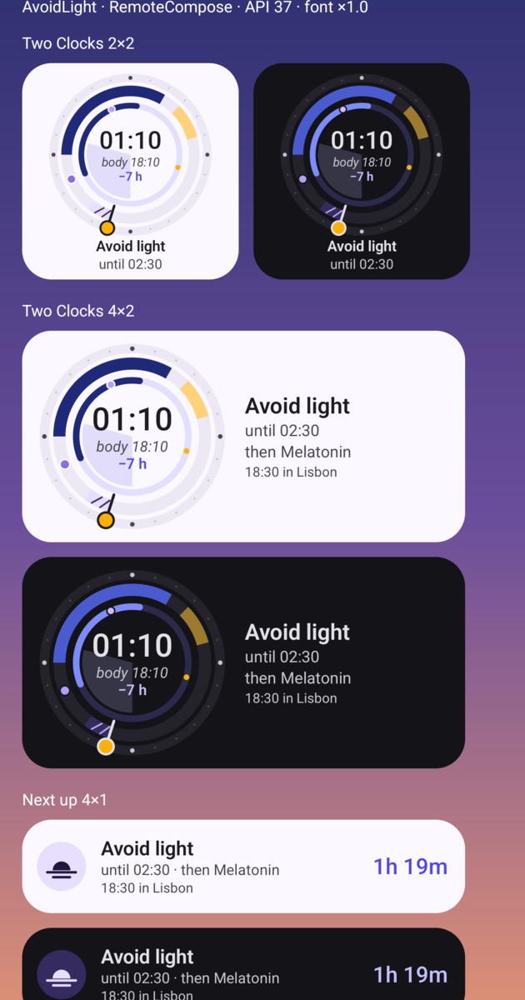
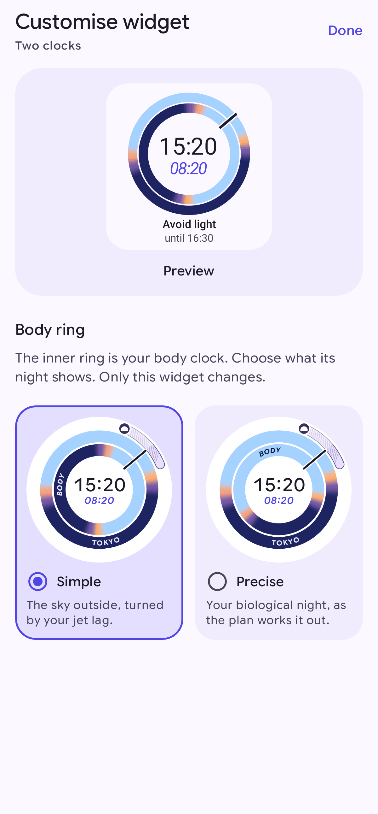

# Widgets and notifications

You don't have to open the app to follow your plan. A quiet notification shows what to do right now, a short
reminder arrives just before each change, and two home-screen widgets show your plan at a glance. They update at
each change in your plan, so they normally show the same thing as the app. If you haven't allowed exact alarms,
Android can delay an update while your phone is idle, and the widgets and notification may lag for a while.

## Reminders

A reminder arrives a few minutes before each block starts, so you have time to find a window or put your
sunglasses on. You choose how early in Settings, under **Reminders** → **How early**: on time, or 5, 10, 15 or 30
minutes before. The default is 15 minutes. A melatonin reminder comes at the dose time itself, and flights never
get a reminder.

Reminders respect your sleep. Nothing arrives while the plan says you should be asleep, except the one reminder
that wakes you up. Only one reminder shows at a time. If two blocks start together, they share one reminder.

The buttons on a reminder depend on what it's for:

| Reminder | Buttons |
|---|---|
| A block that's about to start | **Can't do this** and **Snooze 15 min** |
| A melatonin dose, if you turned melatonin on | **Done** and **Snooze 15 min** |
| The wake-up reminder | none. Tap it to open the plan |

Your answer is saved, just as if you'd tapped it in the app. The Now notification (below) has all three buttons,
**Done**, **Can't do this** and **Snooze 15 min**, until you answer. After that it shows a single **Undo** button,
so a mistaken tap is easy to take back. When the only thing happening is the flight itself, it has no buttons.

## The Now notification

While a plan is in progress, one quiet notification stays in your notification shade. It shows what to do now,
with its symbol and colour, until when, and a bar that fills up as the block goes by, for example "See some
light … until 19:00". Expand it to see the times in your other time zone too, anything else that's going on at
the same time ("Also now: Avoid caffeine until 02:00"), what comes next ("Next: Avoid light at 23:30") and a short
tip. "Until" is always when that block ends, the same time the app and the widgets show. When nothing is going
on, it says "Nothing right now" and what's next.

It updates by itself and never makes a sound. Tap it to open the plan. Its header shows how far your body clock
is from local time, for example "Body 3½ h behind", or "Body clock in sync" once you've adjusted.

Local time means the same thing in the app, the widgets and the notifications: the time zone your plan says
you're in that day. That's where you set off until you land, then your destination. Your phone's time zone
setting doesn't change it, so all three always agree, even with a demo trip or a phone set to another zone. Where
there's room, they also show the time at the other end of the trip.

**Snooze 15 min** hides it for 15 minutes, then reminds you again if the block is still going.

### On the travel day

The notification becomes a **Live Update** on your travel day: a progress bar from
about 3 hours before your first flight until about 2 hours after you land, with your plan's blocks and the
take-off and landing times on it. It also appears as a small chip in the status bar, if Android allows it. It
only shows while a light, sleep or other plan block (not just the flight) is active; otherwise you see the normal
notification. Its header shows the route and the next step of the day, for example "LHR → HND · Lands 19:00 ·
Body 8 h behind".

### On the lock screen

By default, the notification shows the same text on the lock screen as in the shade. If you'd rather keep your
travel details private, turn on **Settings** → **Reminders** → **Hide details on the lock screen**. Then, whenever
Android hides sensitive notification content on the lock screen (an Android setting), the lock screen shows only
the kind of block and its times: no places, flight numbers or supplement names, and no buttons. Unlock your
phone to see everything. Turning the setting on also hides the details of a reminder that's already showing,
without buzzing again.

The same setting covers widgets you place on the lock screen (on tablets and in hub mode). With it on, they show
the plan day, the kind of block and its times, but no route, places, other-zone times or supplement names.
Home-screen widgets still show everything.

## Widgets

The quickest way to add a widget is **Settings** → **Widgets**: tap **Add** under the widget you want, and your
home screen asks where to put it. (The section only appears if your home screen app supports this.) You can
also touch and hold an empty area of your home screen, tap **Widgets**, find Clockblock, and drag the widget
you want onto the screen. You can resize both widgets.

### Two clocks

The *Two clocks* widget draws the same two skies as the dial in the app (see
[Following your plan](following-your-plan.md)). The outer ring is the sky where you are, and the inner ring is the
sky your body thinks it is under. The needle points at the local time. In the middle are the local time and, in
italics, the time your body clock thinks it is ("08:20").

Where a round dial would be too small, the widget shows the two skies as two bars instead: the top bar is the sky
where you are, the bottom bar is your body's sky, and a line crosses both at now. That's the smallest size, the
one-row sizes, and wide sizes that are only two rows tall.

Most sizes also show the current block with its end time ("Avoid light until 16:30"). The wide rows name the
nights ("Tokyo night") and say how far behind or ahead your body is ("7 h behind"). Bigger sizes add a card with
the place and plan day ("Tokyo · Day 2"), the time in your other time zone, and a **Done** button. The biggest size
also shows your route ("LIS → HND"), lists the next blocks (with their time in your other zone) and shows how far
you've adapted.

### Next up

The *Next up* widget shows the current block with a countdown. The smallest size shows only the countdown and a
short label. Bigger sizes add the time in your other zone and a **Done** button, and the tallest and widest ones
list what's up next, next to your route ("LIS → HND"). It says "Free time" when there's nothing to do, and
"Clockblocked" when your plan is finished ("Adapted" on the smallest size).

### Customise a widget

Each *Two clocks* widget has its own options. Touch and hold the widget, then tap **Reconfigure** (on some home
screens it's a pencil or **Customise**). The **Customise widget** screen shows your widget as it is now, and
changes it as you choose:

- **Body ring**: what the inner ring's night shows. **Simple** (the default) is the sky outside, turned by your jet
  lag. **Precise** is your biological night, as the plan works it out.

Only that widget changes, so you can have one of each. Your choice is saved straight away; tap **Done** or go back
when you're finished. Removing the widget forgets its options. They aren't in the backup file you export from
Settings either, since they belong to the widgets on this phone.

### Good to know

- Tap a widget to open the plan. With no trip planned, the widgets say "No trip · Plan one", and a tap opens the
  new trip screen.
- Tap **Done** on a widget to mark the current block as done, just like the button on the notification. The button
  then turns into "✓ Done" (or "Skipped" if you skipped it elsewhere). Tapping it after that opens the plan.
- The widgets name places after your trip, the same as the route: a trip from SFO says "San Francisco", not the
  name of its time zone.
- With a screen reader, the widgets read out the times in both zones. *Next up* also says how long the current
  block has left.
- The widgets follow the app's theme. When "Night-safe automatically" is on and your plan says to avoid light or
  sleep, they switch to a black and amber look that won't light up a dark room.
- The widgets update when your plan changes and at each block boundary. They don't drain your battery by checking
  all the time.
- If a widget only says **Open Clockblock**, your launcher couldn't draw it. Tap it to open the app; the widget
  tries again at the next update.

## If reminders don't arrive

1. Open **Settings** and look at **What Android allows**. If everything needed is allowed, it shows a one-line
   summary; tap it to see each permission.
2. Make sure **Notifications** says "Allowed". If not, tap **Allow**.
3. Make sure **Exact timing** says "Allowed". Without it, reminders may arrive several minutes late, or much later while the phone is idle.
4. On some phones, turning off **Battery optimisation** for the app helps too.
5. Tap **Send a test reminder** to check.

Also check that **Remind me before each change** is turned on, and that you haven't turned off one of the app's notification
categories in Android's settings. The categories are Light, Sleep & energy, Supplements & caffeine, Travel day
(live) and Now.

Next: [Settings and your data](settings-and-your-data.md).
