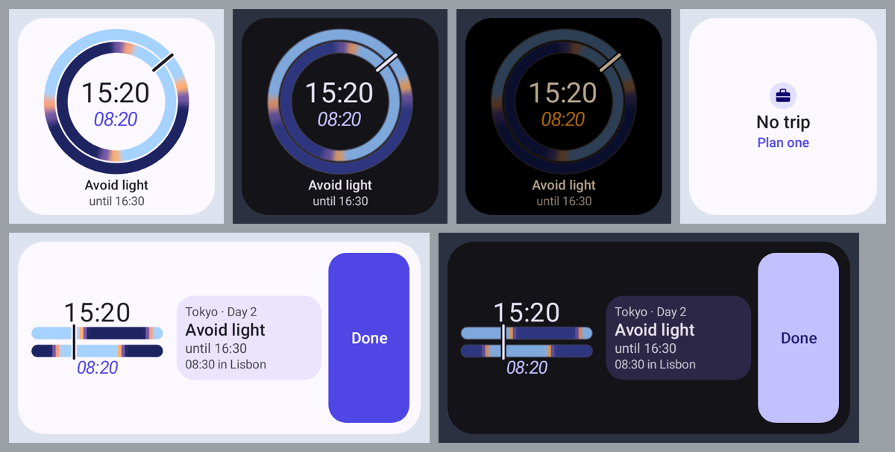
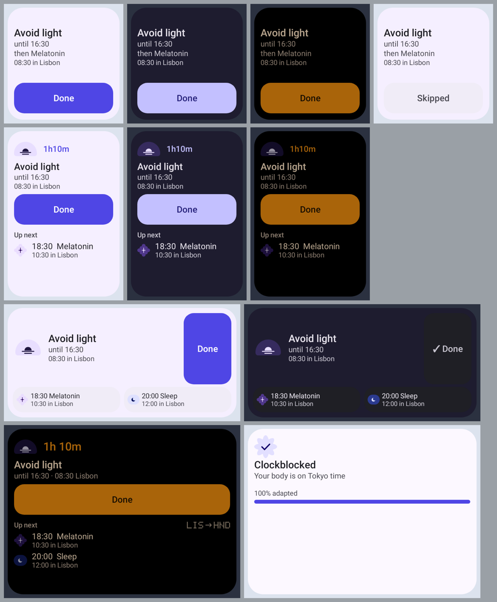

# Widgets and notifications

You don't have to open the app to follow your plan. A quiet notification shows what to do right now, a short
reminder arrives just before each change, and two home-screen widgets show your plan at a glance. They all show
the same thing as the app, at the same time.

## Reminders

A reminder arrives a few minutes before each block starts, so you have time to find a window or put your
sunglasses on. You choose how early in Settings, under **Reminders** → **How early**: on time, or 5, 10, 15 or 30
minutes before. The default is 15 minutes.

Reminders respect your sleep. Nothing arrives while the plan says you should be asleep, except the one reminder
that wakes you up. Only one reminder shows at a time. If two blocks start together, they share one reminder.

The buttons on a reminder depend on what it's for:

| Reminder | Buttons |
|---|---|
| A block that's about to start | **Can't do this** and **Snooze 15 min** |
| A melatonin dose, if you turned melatonin on | **Done** and **Snooze 15 min** |
| The wake-up reminder | none. Tap it to open the plan |

Your answer is saved, just as if you'd tapped it in the app. The Now notification (below) has all three buttons:
**Done**, **Can't do this** and **Snooze 15 min**.

## The Now notification

While a plan is in progress, one quiet notification stays in your notification shade. It says what to do now,
until when, and what comes next, for example "See some light until 20:00 · then Avoid caffeine". It updates by
itself and never makes a sound. Tap it to open the plan.

**Snooze 15 min** hides it for 15 minutes, then reminds you again.

### On the travel day

On Android 16 and later, the notification becomes a **Live Update** on your travel day: a progress bar from
about 3 hours before your first flight until about 2 hours after you land, with your plan's blocks and the
take-off and landing times on it. It also appears as a small chip in the status bar. It only shows while a block
of your plan is active; otherwise you see the normal notification.

## Widgets

To add a widget, touch and hold an empty area of your home screen, tap **Widgets**, find Opus Clockblock, and
drag the widget you want onto the screen. You can resize both widgets.

### Two Clocks

The *Two Clocks* widget is a small version of the dial in the app. It shows the local time, the time your body
clock thinks it is ("body 08:20"), the gap between them ("−7 h": your body is 7 hours behind), and the current
block with its end time. The wide version also shows what comes next and the time in your other time zone.

### Next up

The *Next up* widget shows the current block with a countdown. The smallest size shows only the countdown and a
short label. It says "Free time" when there's nothing to do, and "Clockblocked" when your plan is finished.

### Good to know

- Tap a widget to open the plan. With no trip planned, the widgets say "No trip · Plan one", and a tap opens the
  new trip screen.
- The widgets follow the app's theme. When "Night-safe automatically" is on and your plan says to avoid light or
  sleep, they turn dark too.
- The widgets update when your plan changes and at each block boundary. They don't drain your battery by checking
  all the time.

## If reminders don't arrive

1. Open **Settings** and look at **What Android allows**.
2. Make sure **Notifications** says "Allowed". If not, tap **Allow**.
3. Make sure **Exact timing** says "Allowed". Without it, reminders may arrive up to 10 minutes late.
4. On some phones, turning off **Battery optimisation** for the app helps too.
5. Tap **Send a test reminder** to check.

Also check that **Reminders** is turned on, and that you haven't turned off one of the app's notification
categories in Android's settings. The categories are Light, Sleep & energy, Supplements & caffeine, Travel day
(live) and Now.

Next: [Settings and your data](settings-and-your-data.md).
